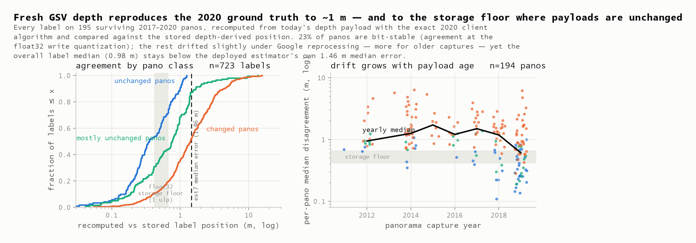
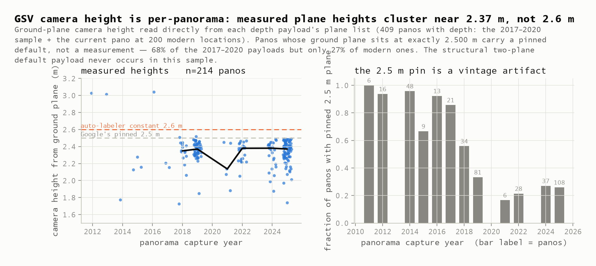

# Depth Pilot Report — streetlevel serves the depth product the ground truth came from, verified to the storage floor

**2026-08-05** · commit `f2e2ab0` · issue [#4](https://github.com/ProjectSidewalk/label-latlng-estimation/issues/4) · validates the ground truth behind [#3](https://github.com/ProjectSidewalk/label-latlng-estimation/issues/3)

Fresh GSV depth payloads, fetched through [sk-zk/streetlevel](https://github.com/sk-zk/streetlevel)'s
unofficial endpoint, were run through a bit-exact replica of the 2020 client pipeline and compared
against the recovered depth-derived label positions — plus a coverage survey of what today's
imagery serves.

| | |
|---|---|
| **0.99 m** | median disagreement between recomputed and stored label positions across all 194 surviving panos — below the deployed estimator's own 1.46 m median error |
| **24%** | of surviving panos are bit-stable: agreement at the float32 storage floor (median 0.36 m ≈ 1 ulp), i.e. the payload is the same bytes-for-purposes as in 2017–2020 |
| **200 / 200** | modern label locations with a current pano — every one serves depth, 96.5% at 16384×8192 |
| **2.37 m** | median per-pano camera height measured from the payload's plane list — the auto-labeler's hardcoded 2.6 m is above nearly every measured rig |

## §1 · Method: replicate 2020 exactly, then compare on the lattice it was stored on

The cross-check recomputes every label from its stored `sv_image_x/y` and today's depth payload
using the **exact algorithm the 2020 client ran** — recovered from SidewalkWebpage v6.0.0
(`GSVPanoPointCloud.js::computePointCloud`, `Label.js::toLatLng`,
`scaleImageCoordinate`/`latlngOffset`) and replicated in
[`python/gsv_depth.py`](../python/gsv_depth.py) down to its quirks: the float32 point cloud, the
`ceil()` pixel lookup, the silent seam wrap past x = 512, the no-plane 1e19 sentinel that produced
the absurd stored rows, and the flat-earth 111111 m/° offset. The decoder was verified against
streetlevel's independent implementation (max deviation 1.4×10⁻⁷ over 68k pixels) and anchored by a
committed real payload (`tests/fixtures/depth-pilot/`).

Two calibration facts shape every number below:

- **The agreement floor is the storage lattice, not zero.** ~84% of the recovered coordinates sit
  exactly on the float32 grid — the 2020 write path quantized them — and one float32 ulp here is
  **0.21–0.42 m of latitude / 0.57–0.80 m of longitude** depending on city. A bit-identical payload
  therefore reproduces a stored position to ~1 ulp, not to centimeters. "Consistent" below means
  ≤ 2 ulp per axis.
- **The frame is validated, not assumed.** Under the identity decode the full sample agrees at
  0.99 m median; deliberately wrong frames blow up (x-mirror 11.0 m, 180° rotation 17.1 m, row-flip
  7.7 m with 76% of labels landing in sky). The pipeline is sensitive to convention errors, so the
  agreement is not an artifact of a forgiving comparison.

Sampling: 606 pano ids drawn (seed 666) from the recovered dataset, stratified by city ×
resolution class with a separate edge-case stratum; ~1,000 throttled requests total.

## §2 · Part A: fresh payloads reproduce the 2020 ground truth

Of 576 headline-stratum ids, **196 still resolve (34%) — and every single one serves depth**.
Per-pano classification of the 194 with comparable labels:

| class | panos | meaning |
|---|---:|---|
| unchanged | 47 (24%) | every label within 2 ulp — the payload is bit-stable since labeling |
| mostly unchanged | 27 (14%) | ≥ 2/3 of labels at the floor; local plane edits |
| changed | 120 (62%) | the payload has drifted under Google reprocessing |



*Fig 7 — left: agreement by class against the float32 floor (shaded) and the estimator's 1.46 m
median error (dashed). Right: drift tracks payload age — 2019 captures sit at 0.61 m per-pano
median (n=70), 2014–2018 at 1.2–1.7 m.*

The "changed" majority is **small, partially coherent drift, not replacement**: per-pano median
1.43 m (p90 3.5 m), with within-pano shift vectors ~70% explained by a common translation —
consistent with Google re-bundling camera poses and refitting planes over the years. Two
corroborating signals: the panos themselves have been re-registered (stored vs fresh position:
median **0.77 m**), and drift is smallest for the newest captures, which have been reprocessed
least. A replication bug would not correlate with capture vintage.

**The conditional-equivalence claim** (the strongest honest one): for the panos that survive,
streetlevel's photometa endpoint serves the same synthetic depth product whose label positions the
2021 analysis measured at 1.46 m median error — bit-stable on 24% of panos, and within 0.99 m
median (67% of labels under 1.46 m) even pooling the drifted ones. Part A validates **transport
and stability**, not depth accuracy: how well GSV depth locates a physical curb is a separate
question this pilot does not touch.

Edge rows behaved in character: of 8 stored-absurd labels on surviving panos, 2 still hit the
no-plane sentinel today (the other 6 sit where reprocessing has since granted a plane); 1 label
lost its plane; the DC `sv_image_x > 13312` overflow rows recompute through the same
row-walking lookup they were stored with.

Caveats. Survivorship is not random (resolve rates range from 21% in Seattle to 46% in SPGG), so
Part A speaks for panos Google still serves under their 2017–2020 ids. The ~16% of stored
coordinates that are not float32-grid values behave the same as the rest here, but they mark a
second write path this pilot did not chase.

## §3 · Attrition is the operative constraint on any fetch-by-id design

Two-thirds of 2017–2020 pano ids no longer resolve (`gone` = response code 2 — the id, not
necessarily the imagery; GSV re-shoots mint new ids). For #3 this bounds how much *historical*
ground truth can ever be re-derived by id — but Part B shows the locations themselves remain
fully covered, so location-keyed fetching is the future-proof design.

## §4 · Part B: modern coverage is total, and depth is resolution-independent

At 200 spaced recovered-label locations (100 Seattle, 100 CDMX): a current panorama at **200/200**,
depth served at **200/200**, **96.5%** advertising 16384×8192 imagery, captures concentrated in
2022–2025. The depth payload is 512×256 and **angular**: it maps to any image resolution by angle
alone (0.7°/px), so nothing about the encoding changes at 16384-class resolutions — the pilot's
label lookup works unmodified on labels placed against modern imagery.

## §5 · Camera height is per-panorama, and the 2.5 m "default" is a pinned plane



*Fig 8 — left: measured ground-plane heights by capture year against Google's 2.5 m pin and the
auto-labeler's 2.6 m constant. Right: the fraction of payloads with the plane pinned at exactly
2.500 m collapses from ~100% (2011-era) to ~27% (modern).*

Reading height directly off the payload's plane list (ground plane `d`, tilt from its normal)
refines the issue-comment finding in three ways:

1. **The structural two-plane default payload never occurs** in 409 panos — "exactly 2.500 m" in
   the wild is a full plane set with the *ground plane pinned* at 2.5, so the filter must test the
   plane's `d`, not payload shape.
2. The pin is a **vintage artifact**: 68% of 2017–2020 payloads, 27% of modern ones.
3. Measured heights (n=214): median **2.37 m**, IQR 2.26–2.43. The auto-labeler's
   `DEFAULT_CAMERA_HEIGHT_M = 2.6` sits above nearly all of it (~10% range overestimate at the
   median), and the per-pano value is now a free column in `depth-pilot-panos.csv.gz`.

## §6 · Verdict for #3, and what is committed

**Trustworthy as held-out validation, with conditions.** Use the 47 bit-stable panos as strict
held-out truth (agreement at the storage floor); treat the full surviving sample as truth with a
~1 m uncertainty budget — comfortably below the 1.5–4.5 m separations #3's candidate ladder needs
to resolve. Fetch by location (not stored id) when extending to modern imagery, and treat the
endpoint strictly as a validation source, never a runtime dependency — which is why the raw
payloads (2 MB, 409 panos) are committed in `data/depth-pilot-payloads.jsonl.gz`: the analysis
outlives the API. Provenance and schemas: [`data/MANIFEST.md`](../data/MANIFEST.md).

## Reproducing this report

```bash
pip install -r python/requirements.txt
python python/run_depth_pilot.py build     # cache -> artifacts (offline, byte-deterministic)
python python/run_depth_pilot.py figures   # artifacts -> figures/fig7,8
pytest                                     # 160 tests incl. decoder units + pilot contract/findings
```

`fetch` re-queries the live endpoint (seeded sample, ~1,000 requests, non-idempotent — see
MANIFEST). The committed artifacts were fetched 2026-08-05; with that fetch's local cache present,
`build` reproduces them byte-for-byte, and the committed `depth-pilot-payloads.jsonl.gz` keeps the
depth evidence re-analyzable even without the endpoint or the cache.

---

*Report generated with [Claude Code](https://claude.com/claude-code) (claude-fable-5); every
headline number is asserted by `tests/test_depth_pilot_findings.py` against the committed
artifacts.*
