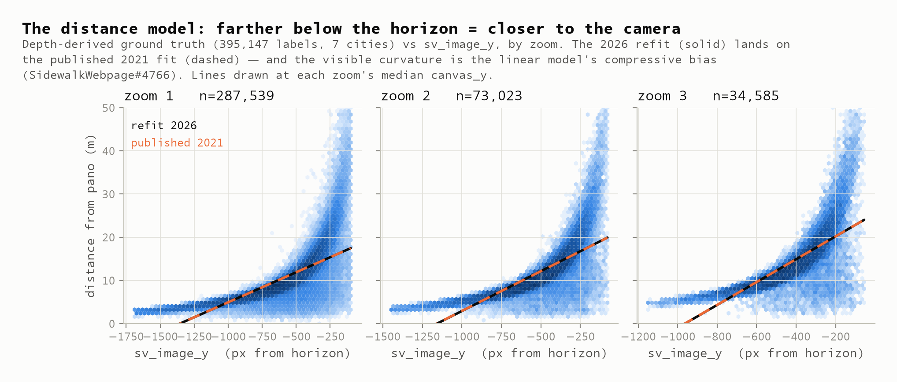
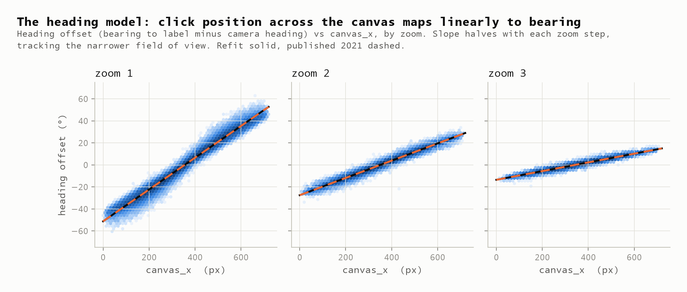
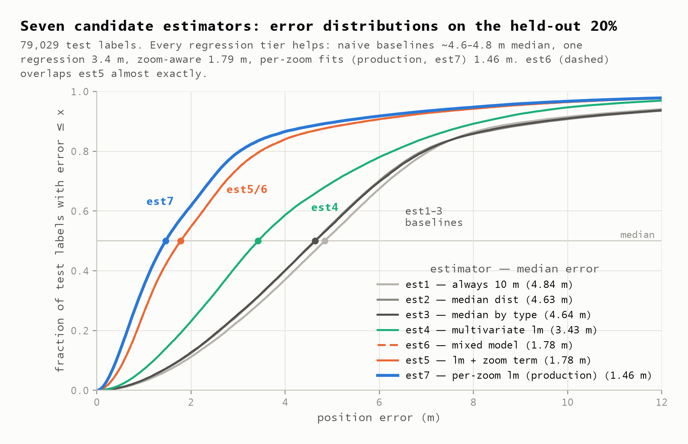
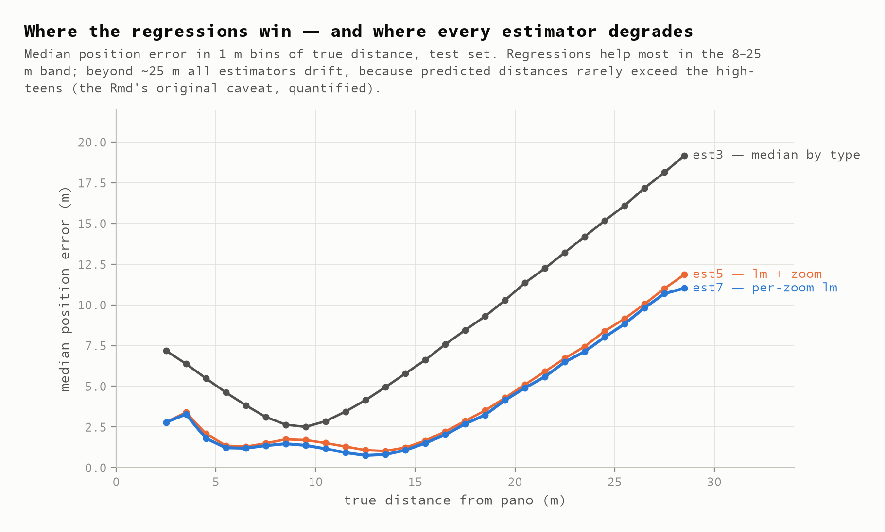
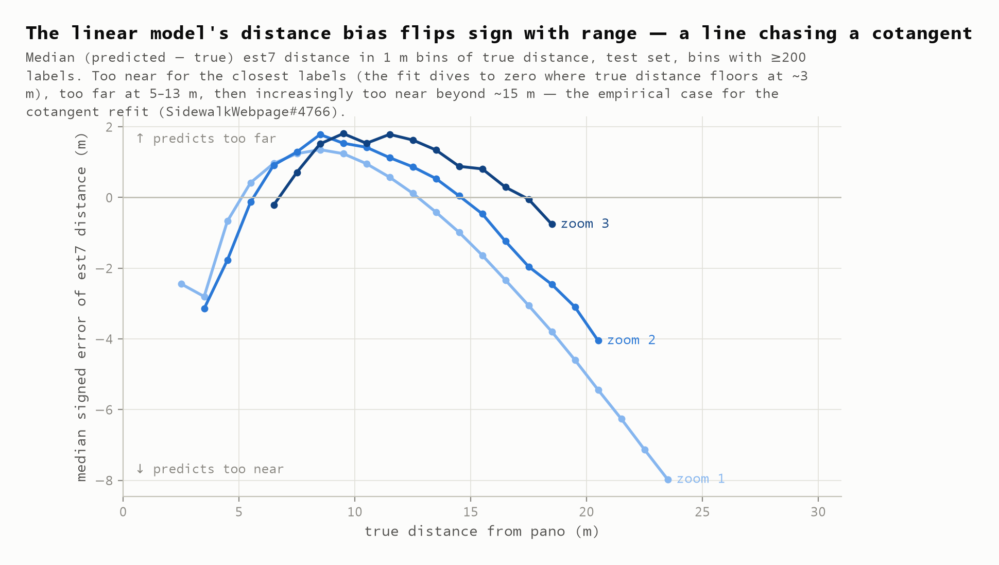
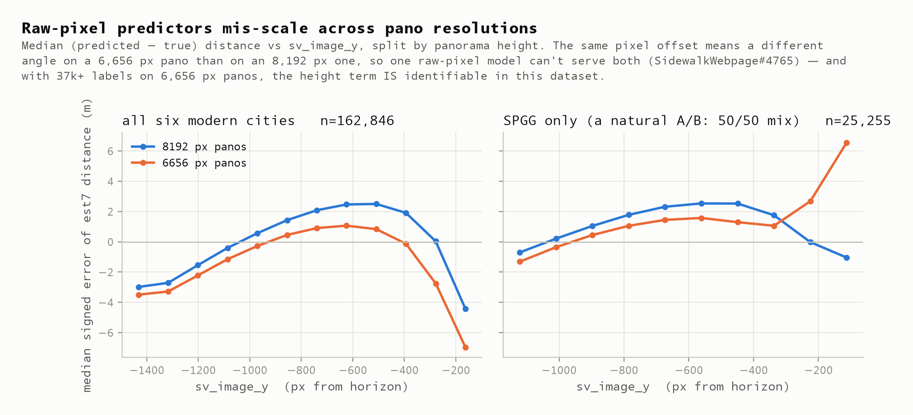

# Recovery & Verification Report — the depth dataset is back, and the 2021 findings reproduce exactly

**2026-08-05** · commits `8f73eca` · `0d9f14c` · `19bd15e` · `77da3e0` · issues [#1](https://github.com/ProjectSidewalk/label-latlng-estimation/issues/1), [#2](https://github.com/ProjectSidewalk/label-latlng-estimation/issues/2) (closed)

Recovery and verification of the lost ground-truth data behind Project Sidewalk's label position
estimator, the Python port of the analysis, and what the recovered data says about the two open
accuracy issues.

| | |
|---|---|
| **395,147** | cleaned rows — *exactly* the published 2021 count (316,118 train / 79,029 test, also exact) |
| **1.46 m** | median error of the winning estimator on the recovered data (published: 1.47 m) |
| **2×10⁻¹¹** | worst R ↔ Python coefficient deviation on identical rows |
| **102** | tests passing: data contract, cross-language equivalence, findings-vs-published |

## §1 · What was recovered, and from where

Every label position computed in Project Sidewalk since 2020 rests on six per-zoom regressions
fit in January 2021 against depth-derived ground truth. The seven CSVs behind those fits were
gitignored and lost. They have been regenerated from production: the six modern cities from
`sidewalk_prod` (the depth positions survived every migration, and the pre-2023 predictor values
survived in `old_label_metadata` — zero rows missing), and DC from the retired legacy database,
still frozen on its 2019 schema, where the original extraction query ran nearly verbatim.

| city | source | depth rows |
|---|---|---:|
| DC | legacy `sidewalk_dc` (schema frozen at evolution 19) | 270,845 |
| Seattle | `sidewalk_prod.sidewalk_seattle` | 120,094 |
| SPGG | `sidewalk_prod.sidewalk_spgg` | 31,498 |
| Columbus | `sidewalk_prod.sidewalk_columbus` | 20,526 |
| Newberg | `sidewalk_prod.sidewalk_newberg` | 17,725 |
| CDMX | `sidewalk_prod.sidewalk_cdmx` | 6,772 |
| Pittsburgh | `sidewalk_prod.sidewalk_pittsburgh` | 1,148 |
| **total** | | **468,608** |

> **The load-bearing result.** Re-running the 2021 cleaning pipeline on the regenerated files
> lands on the published numbers *exactly* — 395,147 cleaned rows, 316,118 train / 79,029 test.
> The depth population froze in production after 2021, so what was planned as a reconstruction
> is, in practice, a reproduction. Full provenance and caveats: [`data/MANIFEST.md`](../data/MANIFEST.md).

## §2 · Proof the recovered predictors are the right ones

The one uncertainty Mikey flagged on #1 was whether today's archived columns still mean what
`sv_image_y` meant in 2021. The mechanism plots answer it: refitting the published model form on
the recovered columns (solid) lands on the 2021 published coefficients (dashed) at every zoom, in
both models. Wrong semantics could not reproduce that. The same fits agree between the R re-run
(`scripts/rerun-analysis.R`) and the Python port (`python/`) to ~10⁻¹¹ on identical train/test rows.



*Fig 1 — the distance mechanism: the farther a click falls below the horizon, the closer the
object. The visible curvature is real — the linear model is chasing a cotangent.*



*Fig 2 — the heading mechanism: click position across the 720 px canvas maps linearly to bearing
offset, slope halving as zoom narrows the field of view. This half of the model is essentially
solved geometry (see [#5](https://github.com/ProjectSidewalk/label-latlng-estimation/issues/5)).*

## §3 · How the seven candidates perform

On the held-out 20% of the recovered data the published ranking reproduces: each regression tier
helps, and the production estimator (est7) wins at 1.46 m median error. Its weakness is
structural, not statistical — predicted distances rarely leave the 3–20 m band, so error grows
linearly for anything genuinely far away.



*Fig 3 — error distributions on 79,029 test labels. Reading at the 0.5 line gives each
estimator's median; the production model puts ~80% of labels within ~3 m.*



*Fig 4 — where the regressions win: the 8–25 m band. Beyond ~25 m every estimator drifts.*

## §4 · The recovered data evidences both open accuracy issues

[SidewalkWebpage#4766](https://github.com/ProjectSidewalk/SidewalkWebpage/issues/4766) argues the
linear form is wrong for what is geometrically a cotangent;
[SidewalkWebpage#4765](https://github.com/ProjectSidewalk/SidewalkWebpage/issues/4765) argues a
raw-pixel predictor cannot transfer across panorama resolutions. The recovered data shows both
directly:



*Fig 5 — the linear model's distance bias flips sign with range: too near for the closest labels
(a `pmax(0, ·)` clipping artifact — note the boundedness is also the status quo's virtue), up to
~2 m too far at 5–13 m, increasingly too near beyond 15 m. A geometry-shaped model should absorb
this entire curve.*



*Fig 6 — the same pixel offset means a different angle on a 6,656 px pano than an 8,192 px one:
the two resolution groups sit ~1 m apart across most of the range, pooled and within SPGG alone
(a natural 50/50 A/B). With 37k+ labels on 6,656 px panos, the height-normalization term is
identifiable in this dataset — issue #1's body assumed it wouldn't be.*

## §5 · New capability: depth data is scrapeable again

[sk-zk/streetlevel](https://github.com/sk-zk/streetlevel) (Python, keyless) exposes Google's
internal street-view endpoints and lists depth support for GSV — the same synthetic depth model
(terrain + building footprints) the original 2020 pipeline consumed. If it holds up, fresh ground
truth can be pulled for current imagery at current resolutions, directly covering the
cross-resolution axis the 2020-era data cannot. It is an unofficial API — the same kind that died
in 2020 and started this saga — so it complements the versioned dataset here rather than
replacing it. Pilot: [#4](https://github.com/ProjectSidewalk/label-latlng-estimation/issues/4).

## §6 · Where the work goes next

The refit itself is planned in
[#3 — geometry-shaped, horizon-saturating](https://github.com/ProjectSidewalk/label-latlng-estimation/issues/3)
(candidate ladder on the depth ground truth, robustness scoring including a click-noise sweep,
Mapillary falsification). Alongside it:

- [#4](https://github.com/ProjectSidewalk/label-latlng-estimation/issues/4) — streetlevel depth
  pilot (validate the recovered truth, extend to modern resolutions)
- [#5](https://github.com/ProjectSidewalk/label-latlng-estimation/issues/5) — replace the heading
  regression with exact POV inversion (zero fitted parameters)
- [#6](https://github.com/ProjectSidewalk/label-latlng-estimation/issues/6) — gradient-boosted
  benchmark as the accuracy ceiling for #3's closed forms

## Reproducing this report

```bash
pip install -r python/requirements.txt
python python/run_analysis.py     # the numbers
python python/make_figures.py     # the figures
pytest                            # the verification (102 tests)
```

R baseline (regenerates `tests/fixtures/r-baseline/`): `Rscript scripts/rerun-analysis.R`.

---

*Report generated with [Claude Code](https://claude.com/claude-code) (claude-fable-5); figures
rendered from the tested pipeline on the R-fixture split, so every number shown is the verified
one.*
