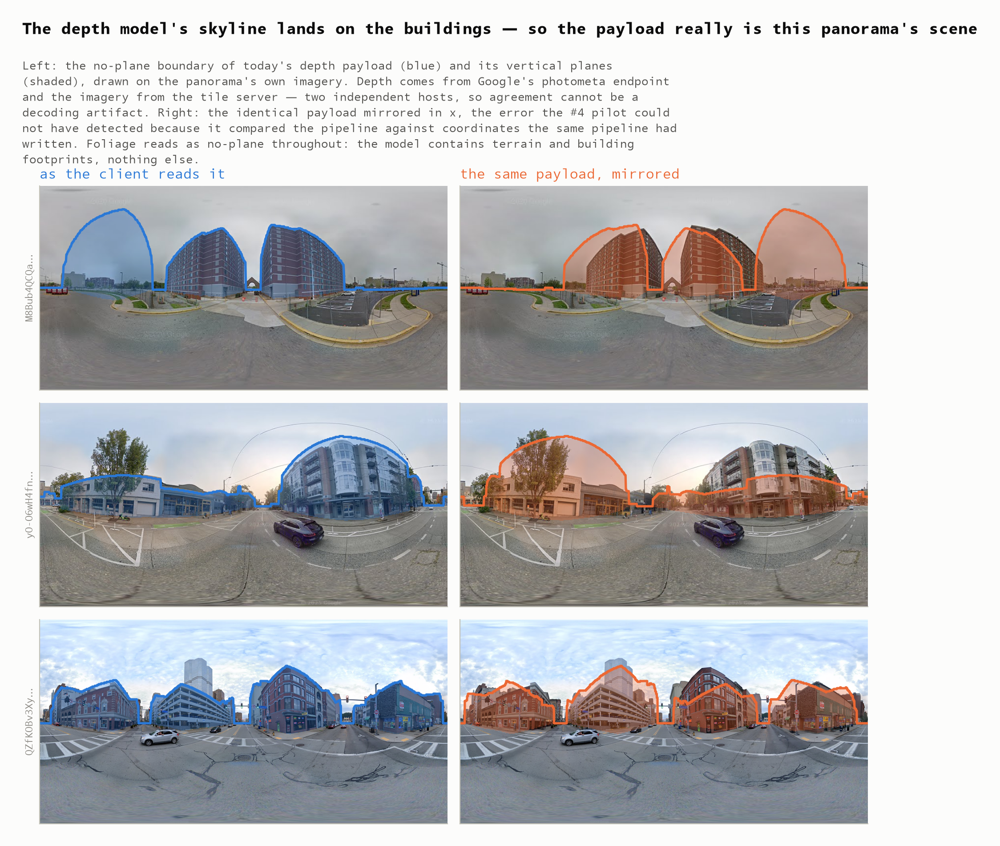
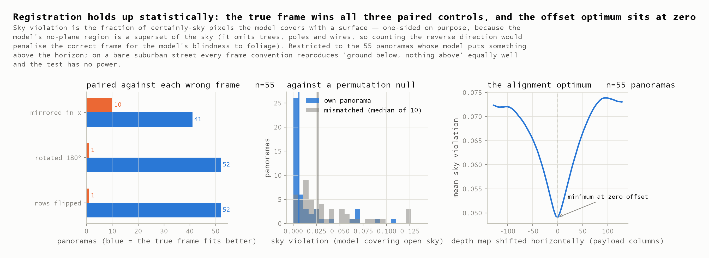
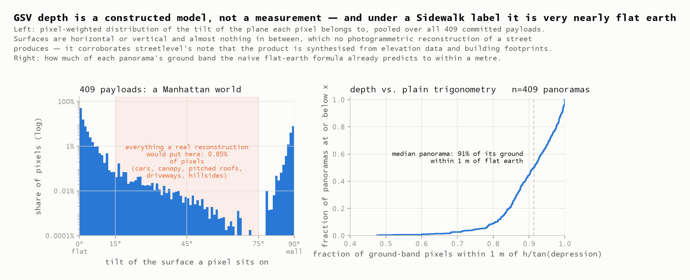
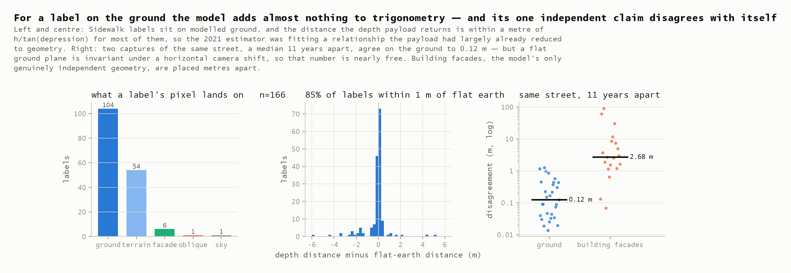

# Depth Validation Report — GSV depth is authentic, and it is a model

**2026-08-06** · issue [#9](https://github.com/ProjectSidewalk/label-latlng-estimation/issues/9) ·
follows the [#4 depth pilot](2026-08-05-depth-pilot.md) · bears on
[#3](https://github.com/ProjectSidewalk/label-latlng-estimation/issues/3)

The #4 pilot showed fresh depth payloads reproducing the stored 2017–2020 label positions to
~1 m. But both sides of that comparison come from the same Google depth product, so it validated
*transport and stability* and said so. It also could not have caught a systematic frame error in
the 2020 client — an x-mirror, say — because the pipeline was being checked against coordinates
the same pipeline had written.

This report breaks that circle with evidence the depth pipeline never touched: the panorama's own
imagery, which arrives from a **different Google host** than the depth payload does.

| | |
|---|---|
| **yes, authentic** | the model's skyline and walls land on the buildings in the imagery. The true frame beats the mirrored one on 41 of 53 panoramas, beats both vertical flips 52–1, and the pooled alignment sweep bottoms out at exactly zero offset. **No frame error in the 2020 client.** |
| **0.85%** | of depth pixels sit on a surface tilted between 15° and 75°. There are no car roofs, no tree canopy, no pitched roofs, no driveway ramps. This is a **constructed model, not a measurement** |
| **91%** | of ground-band pixels are within 1 m of naive `h/tan(depression)`. Under a Sidewalk label, the depth payload is very nearly flat earth |
| **2 of 36** | adjudicated labels sit on or behind something the model does not contain — a moving car, a hedge — so the payload returns the ground *behind* it |
| **2.7 m** | median disagreement between two captures of the same street about where a building wall is — against 0.12 m for the ground |

## §1 · Method

Sixty panoramas from the #4 sample (40 from the 2017–2020 Part A set, stratified by payload class,
plus 20 modern Part B panoramas), with their equirectangular imagery fetched at two zoom levels:
one for scoring, a larger one for 24 panoramas used in the gallery and the occlusion verdicts.
Twenty-nine panoramas were additionally paired with a **historical capture of the same location**,
a median 11 years earlier — the same street, an independently rebuilt model.

The registration claim under test is that the mapping is pure scaling with **no rotation offset**:
`13312 = 512 × 26`, so depth column *c* is equirect column 26*c*, and `sv_image_y` runs from the
horizon at payload row 128. That is asserted by the 2020 client and never verified against
anything outside it. Here it is tested against four deliberately wrong frames (mirror, 180°
rotation, row-flip) and against a permutation null of ten mismatched panoramas each.

Every number below regenerates offline from committed bytes — the #4 depth payloads plus
`data/depth-validation-tiles.jsonl.gz`, which holds the imagery tiles verbatim as served.

## §2 · Authentic: the depth is bound to this panorama's real scene



*Fig 9 — the model's no-plane boundary (blue) and its vertical planes (shaded) drawn on the
panorama's own imagery. Depth comes from `maps.googleapis.com` photometa; the imagery from
`streetviewpixels-pa.googleapis.com`. Two independent endpoints cannot agree by decoding accident.*

The skyline traces roof lines and the shading covers building faces. Mirrored, it visibly does not.



The statistic is **sky violation**: the fraction of certainly-sky pixels onto which the model
places a surface. It is one-sided deliberately. The model's no-plane region is a *superset* of the
sky — trees, poles and wires are all absent from it and read as no-plane — so scoring the reverse
direction would penalise the correct frame for the model's blindness to foliage.

| control | median sky violation | paired result |
|---|---:|---|
| the frame the client uses | **0.006** | — |
| mirrored in x | 0.024 | true frame better on 41, worse on 10, 2 ties |
| rotated 180° | 1.000 | 52–1 |
| rows flipped | 1.000 | 52–1 |
| ten mismatched panoramas | 0.027 | true pairing sits at the 18th percentile of its null |

The **pooled column-offset sweep** minimises at exactly 0 columns. Individually the sweep is noisy
(15 of 53 panoramas put their own minimum precisely at zero), which is why the pooled curve is the
statistic worth reading.

Where this test has no power, it is reported as such rather than as a failure: 5 of the 60
panoramas model nothing above the horizon, and on a bare suburban street every frame convention
reproduces "ground below, empty above" equally well.

**Conclusion: the payload really is this panorama's scene, and it sits in the raster's frame with
no mirror, no flip and no rotation offset.** That closes a question the #4 pilot structurally could
not answer, because it only ever compared the pipeline against coordinates the pipeline had written.

One thing this does *not* close is how the client **indexes** that payload — a separate question,
because `sv_image_x` turns out to live in a different frame from the raster. That is the subject of
[the conventions note](2026-08-06-depth-coordinate-conventions.md), written alongside this report:
`sv_image_x` is north-referenced while the raster and the payload are heading-centred, so anything
placing a label on imagery must apply the panorama's yaw. Re-reading every label at the
heading-centred column moves the median distance by 0.00 m and 85% by under 1 m — the flat-earth
result in §3 explains why — but 6.6% move by more than 3 m. That open item wants a second reviewer
before it is treated as settled, and it bears directly on #3.

## §3 · A model, not a measurement



Across all 409 committed payloads (median 117 planes each), pixels sit on surfaces that are
horizontal (84.5% within 10° of flat) or vertical (13.7% within 10° of upright) and essentially
nothing else: **0.85% fall in the whole 15°–75° band**. A photogrammetric reconstruction of a
street cannot look like this. Car roofs, tree canopy, pitched roofs, driveway ramps and hillsides
all live in that band, and the product has none of them.

Two corroborating structures:

- **The sky mask has a physical edge at the horizon.** No-plane pixels run 100% at the zenith and
  fall below 1% within two rows of payload row 128 — exactly the horizon the frame convention
  predicts.
- **The ground is nearly flat earth.** In the 6°–45° depression band, 91% of ground pixels lie
  within 1 m of `h/tan(depression)`, at a median residual of 0.00 m. What departs from it is
  mostly terrain relief (53% of the metre-plus deviations) and rays intercepting a facade (35%).

This turns streetlevel's README note — *"appears to be a synthetic depth map created from
elevation data and building footprints"* — from a plausible guess into a measurement. **John's
read of the data was right.**

## §4 · What that costs a Sidewalk label



Of 166 labels on the sampled panoramas: 104 land on the dominant ground plane, 54 on another
near-horizontal plane, 6 on a wall, 1 on sky. Median distance 7.7 m. And **85% are within 1 m of
what flat earth alone predicts** — so the 2021 estimator was largely fitting a relationship the
payload had already reduced to trigonometry. That is the honest ceiling context for #3.

Three error terms, none of them noise:

1. **Occlusion — invisible to geometry, and the reason imagery was needed at all.** A car or a
   hedge is not in the model, so a ray aimed at one passes through and returns the ground behind.
   This cannot be detected geometrically: the returned range is *exactly* the flat-earth prediction
   for that depression angle, indistinguishable from a correct ground hit. Only imagery separates
   them, so 36 labels were adjudicated by eye against the committed imagery: **2 are occluded** —
   a curb ramp behind a car crossing the intersection, and an `Obstacle` label placed on a hedge.
   The error is signed: always an overestimate of distance.

   Two notes on that rate. It is a small sample (2 of 36, on 2 of 16 panoramas), so it bounds the
   frequency loosely rather than estimating it. And an earlier pass over the *same* 36 labels
   reported 6 — that pass placed its crops with the north-referenced `sv_image_x` against a
   heading-centred raster, so it was looking up to half a panorama away from the label and struck
   parked cars at roughly the rate cars appear in these scenes. Verdicts and the correction are
   recorded in `data/depth-validation-adjudication.json`; the frames are set out in
   [the conventions note](2026-08-06-depth-coordinate-conventions.md).

2. **Curb-height bias — systematic, not random.** A ramp sits ~0.15 m above the road surface the
   terrain model represents, so the ray overshoots by `0.15 · d / h`. At the median label distance
   that is **0.48 m** — roughly a third of the deployed estimator's 1.47 m median error, and a
   bias rather than noise.

3. **Model uncertainty**, next section.

## §5 · The model disagrees with itself about buildings

Twenty-nine panoramas paired with a historical capture of the same spot, a median 11 years earlier
and 4.0 m away:

| | agreement between captures |
|---|---|
| ground surface | median **0.12 m**, 90% of sampled points within 1 m |
| building facades | median **2.7 m** apart, heavy-tailed |

The ground number is close to free and should not be read as accuracy: an infinite flat plane is
invariant under a horizontal camera shift, so two captures that both level a flat ground plane
agree almost by construction. Facades are the model's only genuinely independent geometry, and
they are placed metres apart.

Two caveats on the 2.7 m. It absorbs the difference in the two panoramas' reported positions
(#4 measured pano re-registration at a median 0.77 m), and facade matching is nearest-parallel-plane,
so a wall present in one capture and absent in the other matches something wrong and inflates the
tail. Treat 2.7 m as an **upper bound on agreement**, and the qualitative finding as the load-bearing
one: *the building half of the model is not stable across captures the way the ground is.*

An earlier version of this test projected rays for facades too and reported ~7 m. That number was
an artifact — sampled walls sit tens of metres out while the cameras stand metres apart, so the ray
lands elsewhere in the second capture and the residual measures parallax. Comparing plane
parameters instead removes the correspondence problem; only that result is reported here.

## §6 · Verdict, and what it means for #3

**Authentic: settled.** The payload describes the panorama it claims to, transported intact by an
endpoint independent of the imagery, read in the correct frame. streetlevel is a sound source.

**Good: it is a model, and its errors are structured.** For Sidewalk's purposes GSV depth is
approximately *camera height plus flat earth*, plus building footprints, minus everything that
moves. Its residual error is not random noise but three named terms — occlusion (signed, clustered
by scene), curb-height overshoot (systematic, ~0.5 m at typical distances), and building-geometry
uncertainty (metres).

For **#3** this matters concretely:

- The ground truth is model-derived, so a refit trained on it learns the model. Its ceiling is not
  "the true position of the curb ramp"; it is "where Google's terrain model says the ray lands."
- Because 85% of labels sit within 1 m of flat earth, an estimator using camera height and
  depression angle should recover most of what the depth data contains. The remaining signal is
  terrain relief and facade intercepts.
- The residual is partly a *bias* (curb height), which a refit can absorb, and partly clustered
  outliers (occlusion), which argue for robust loss rather than least squares.
- Held-out evaluation against these positions cannot resolve differences finer than the model's own
  uncertainty. The bit-stable panos from #4 remain the strictest available truth, but "strict"
  means reproducible, not accurate.

**What would settle accuracy.** Nothing internal can: every test here compares Google's model
against itself or against imagery. Absolute accuracy needs external truth — surveyed curb-ramp
inventories (Seattle SDOT, DC DDOT) and building footprints (OSM/Overture) against the depth's
vertical planes. That is scoped but not run.

## Reproducing this report

```bash
pip install -r python/requirements.txt
python python/run_depth_validation.py build     # offline from committed bytes
python python/run_depth_validation.py figures   # -> figures/fig9-12
python python/run_depth_validation.py gallery   # -> figures/depth-overlay-gallery.html
pytest                                          # contract + findings, locked to this run
```

`fetch` re-queries the live endpoints and is the only networked stage. With the cache deleted,
`build` still runs: it replays `data/depth-validation-tiles.jsonl.gz` (verbatim imagery tiles) and
the #4 payloads, which is what keeps the overlay evidence checkable after the endpoints are gone.
Schemas and provenance: [`data/MANIFEST.md`](../data/MANIFEST.md).

---

*Report generated with [Claude Code](https://claude.com/claude-code) (claude-opus-5[1m]); every
headline number is asserted by `tests/test_depth_validation_findings.py` against the committed
artifacts, except the occlusion adjudication, which is a recorded human judgement.*
