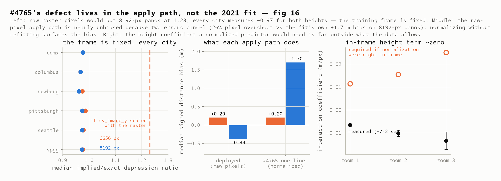
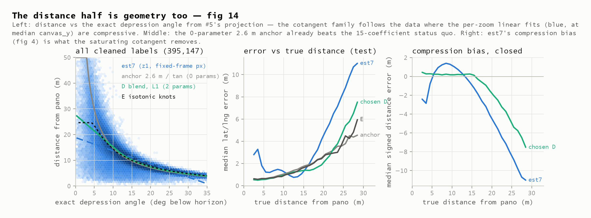
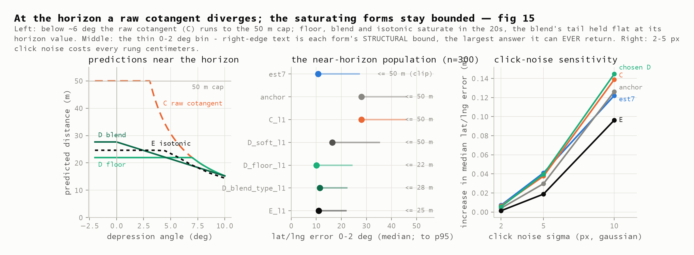

# The distance half is geometry too: a saturating cotangent with per-type camera heights cuts the median error by a third

**2026-08-07** · issue [#3](https://github.com/ProjectSidewalk/label-latlng-estimation/issues/3) (Stages 1–2) · stands on [#5](https://github.com/ProjectSidewalk/label-latlng-estimation/issues/5)'s exact projection and [#1](https://github.com/ProjectSidewalk/label-latlng-estimation/issues/1)/[#2](https://github.com/ProjectSidewalk/label-latlng-estimation/issues/2)'s recovered data · feeds [SidewalkWebpage#4765](https://github.com/ProjectSidewalk/SidewalkWebpage/issues/4765) and [#4766](https://github.com/ProjectSidewalk/SidewalkWebpage/issues/4766)

| | |
|---|---|
| **0.93 m** | median lat/lng error of the chosen candidate on the published 79,029-row test split — the 2021 baseline is **1.46 m**, so −36% with 8 physical parameters in place of the pipeline's 15 fitted coefficients (9 of them the distance half this replaces) |
| **0.99 m** | the **zero-parameter** anchor, `2.6 m / tan(depression)`: pure geometry already beats every fitted coefficient the estimator has |
| **≈0.97 / ≈0.97** | implied/exact depression ratio for 6656-px and 8192-px panoramas: `sv_image_y` is stored in a **fixed frame**, so #4765's resolution defect is not in the 2021 fit |
| **−0.39 m → +1.70 m** | what #4765's one-line normalization would do to the deployed bias on 8192-px GSV panos if applied without a refit: the raw-pixel apply path currently survives on two errors cancelling |

> Reproduce every number here in one command each:
>
> ```bash
> python python/run_distance_refit.py --write   # the ladder, the checks, data/distance-refit-summary.json
> python python/distance_refit_figures.py       # figures 14-16
> pytest tests/test_distance_refit_findings.py  # the findings, locked
> pytest tests/test_distance_refit_contract.py  # the invariants behind them
> ```

## §1 · The data, the ladder, and the harness

**Where the data comes from.** Every number in this report is computed from
`data/labels-*-latlng.csv.gz`: 468,608 human label placements made in Project Sidewalk's
Explore interface between 2017 and 2020, across seven cities (DC — 58% of rows — Seattle,
Newberg, Columbus, SPGG, CDMX, Pittsburgh). Each row carries two things:

- **the click, as the front end recorded it** — `canvas_x/y`, the viewport `heading`/`pitch`/
  `zoom`, and the derived panorama coordinates `sv_image_x/y`. These are the predictors; every
  candidate below sees only what production sees at placement time.
- **the stored label position (`lat`/`lng`), which is the ground truth** — computed *at
  placement time* by the 2017–2020 client from **Google's per-panorama depth map**
  (`Label.js::toLatLng`; the depth API was withdrawn in November 2020, freezing this
  population). "True distance" is the haversine distance between the stored panorama position
  and that stored label position. This is not a surveyed position: it is Google's model of the
  scene, validated against imagery in the #9 report — which is why §6's caveats (curb-height
  bias, occlusion clusters, item G) travel with every fit.

The 2021 analysis' input CSVs were lost; these files are the 2026-08-05 **reconstruction from
the production databases** ([#1](https://github.com/ProjectSidewalk/label-latlng-estimation/issues/1),
`scripts/extraction/`), which turned out to be reproduction-grade: the 2021 cleaning pipeline
lands on **exactly** the published 395,147 cleaned rows, and the train/test partition is the
published R split itself (`tests/fixtures/r-baseline/split_*.csv.gz`, 316,118 / 79,029, keyed by
label id). Full provenance and caveats: `data/MANIFEST.md` and the
[recovery report](2026-08-05-recovery-and-verification.md). Two committed side artifacts feed
riders only: `depth-pilot-panos.csv.gz` (#4: camera heights GSV served in 2026 for 409 panos)
and `depth-validation-panometa.csv.gz` (#9: per-pano tilt). No new data was collected for this
report, and nothing here touches the network.

So every candidate is fit on the exact published train split and scored on the exact published
test split — every row of §4's table is directly comparable to the 2021 median of 1.46 m. Three
harness conventions, decided deliberately:

1. **The vertical input is the exact depression angle** from #5's projection
   (`pov_inversion.exact_depression_deg`), computed from `(canvas_x, canvas_y, heading, pitch,
   zoom)` alone — no pano metadata, so every rung runs on all seven cities including DC. Zoom
   lives inside the projection; §4 checks what survives.
2. **The heading half is held identical across every rung**: the era-faithful exact inversion
   plus the one train-fitted constant from #5 (+0.7198°, re-fit in-run and asserted equal to the
   #5 value to float precision). The stored 2017–2020 targets carry that bias, so scoring
   without it would penalize every candidate for being right; the constant must **not** ship in
   production. Destinations are computed with turf-style **spherical** geodesy — what production
   `toLatLng` runs (rider 2 of the issue, settled; the convention switch alone is worth
   −1.8 cm on the median, measured on the est7 continuity rows).
3. **Both losses, ladder-wide** (rider 1): every fitted rung has an OLS and an L1 column. The
   geometry rungs are linear in *disparity* (1/distance), where pixel click noise is
   approximately Gaussian, and are fit there; the one-parameter disparity fits use the exact
   weighted-median LAD solution, deterministic and closed-form.

The rungs: **A** the status quo (per-zoom `pano_dist ~ sv_image_y + canvas_y`, = est7's distance
half, reproduced exactly); **anchor** `2.6/tan(dep)` with zero fitted parameters (≈ Google's
`fromContainerPixelToLatLng`; a variant uses the per-pano camera height GSV itself serves, on the
214 panos the #4 pilot measured); **C** the cotangent with a fitted camera height (optionally per
label type — amendment 4); **D** the saturating cotangents, three forms × optional per-type
heights (a hard angle floor; a C1 blend into a linear tail, held flat above the horizon; a
disparity-space soft cap `1/(c0 + c1·tan)`, nominally bounded at `1/c0` — §4 measures that
bound landing on the cap); **E** a monotone-decreasing isotonic fit compressed to 23
piecewise-linear knots (JS-viable, bounded by its first knot). Every rung's output is also
clipped to the 50 m training-domain cap, but the clip is a floor on honesty, not the point:
what each form can answer at worst is computed structurally (`structural_max_m`, the `bounds`
key, the §4 table's bound column). Candidate **B** (the pano-height term) has no DC coverage
and is handled separately in §2.

**The honesty gate:** the recommended form was selected among the D family on the *train* median
absolute distance error, recorded in the summary before test scoring; all variants' test numbers
are published in §4 regardless.

## §2 · Where #4765 actually lives

#4765 diagnosed a placement bias that tracks panorama resolution and blamed the raw-pixel
predictor. The recovered data can now separate the two places that defect could live, and it is
not where the fix was aimed:



*Fig 16 — Left: if `sv_image_y` scaled with the panorama raster, 8192-px panos would sit at
1.23× on the implied/exact depression ratio; every modern city measures ≈0.97 for both height
groups (pooled ratio-of-ratios 0.9984). The training column is in a fixed 13312×6656 frame.
Middle: the deployed apply path feeds real-raster `pano_y` into those fixed-frame coefficients —
a 26% pixel overshoot on 8192-px panos — yet its measured bias is only −0.39 m, because the 2021
fit is itself ≈+1.7 m too-far on the 8192-px subgroup (fig 6's separation) and the two errors
cancel. Normalizing the pixels without refitting (the #4765 one-liner) removes the compensation
and surfaces the +1.70 m bias. Right: in-frame, the interaction coefficient a normalized
predictor would require is far outside what the data allows at every zoom.*

Three consequences, each measured in `candidate_b` of the summary:

- **B(i), the height term as written, is rejected in-frame.** `sv_image_y · 6656/pano_height`
  scores *worse* than the plain fit on the same modern-city subset at every zoom and under both
  losses (zoom 1: 1.39 m vs 1.18 m OLS), and the interaction a normalized predictor would need
  comes back with the *opposite* sign, 20–70 standard errors away, at every zoom. A
  `log(pano_height)` level term helps a little — it absorbs a rig/era confound, which is what
  fig 6 was actually showing. (These fits use the two GSV heights that carry the population;
  the 294 cleaned rows from a third rig at 1664 px would each carry 16× an 8192-px row's
  leverage on that interaction, so they are excluded and counted.)
- **B(ii), the deployed path, is quantified on ground truth for the first time:** raw
  +0.20 m (6656) / −0.39 m (8192) signed bias; normalized +0.20 m / **+1.70 m**. The resolution
  dependence #4765 measured is real — it flips with pano height — but on GSV the raw path is
  the *less* biased of the two. On Mapillary's height zoo neither cancellation nor fit bias is
  calibrated, which is why the sign flips there (Stage 3 tests this).
- **The right fix has no pixel scale at all.** `pano_y` converts to an angle as
  `(pano_y − height/2) · 180/height` — that normalization is exact, resolution-independent, and
  is the input every geometry rung below consumes.

## §3 · The zero-parameter anchor

The `gsv-location-extraction-analysis` pilot (July 2025; archived August 2026) compared Project
Sidewalk's regression against Google's geometric `fromContainerPixelToLatLng` on 100 adjudicated curb ramps
and called it for the regression — *"users' labels would be misplaced ever so slightly that it
would completely throw off the GSV-method."* The anchor rung reruns that comparison on 79,029
test rows: `2.6 m / tan(exact depression)`, zero fitted parameters.

Geometry wins outright: **0.94 m** median distance error vs est7's **1.40 m** (lat/lng: 0.99 vs
1.46 m). On the 56 test labels whose panos carry a *served* camera height it improves further
(0.80 m). The pilot's verdict was not human click noise — §5 bounds that at centimetres — the
likelier culprit is the 3.0 m camera height hardcoded in its `main.py`, 15% long against this
anchor's calibrated 2.6 m.

## §4 · The matrix



*Fig 14 — Left: distance vs exact depression for all 395,147 cleaned labels; the cotangent
family follows the data where the per-zoom linear fits are compressive. Middle: median test
error by true distance — the geometry rungs win everywhere outside est7's 10–15 m sweet spot
(the data's mode, where a constant-ish answer is hard to beat), and the pooled median is not
close. Right: est7's signed compression bias (the fig 4 curve: too far in the near field, too
near beyond ~15 m) is flat under the chosen form until the weak-truth far field.*

Test split, n = 79,029; heading half identical everywhere. **params** counts every fitted
coefficient of the distance half, intercepts included; est7's 15 is its full 2021 pipeline
(3 zooms × 3 distance coefficients = 9, plus 3 × 2 heading = 6) because it is the continuity
row, and its distance half alone is the 9 that rung A reports. The **bound** column is each
form's *structural* maximum — the largest answer it can return anywhere in the depression
domain, swept in `structural_max_m` and published as `bounds` in the summary; 50 m means the
form has no bound of its own and simply meets the training-domain clip.

| rung | params | bound | lat/lng med (m) | p90 | dist med (m) | p90 |
|---|---:|---:|---:|---:|---:|---:|
| est7 (2021, legacy scoring) | 15 | 50 (clip) | 1.4621 | 5.155 | 1.3955 | 5.139 |
| est7 under shared conventions | 15 | 50 (clip) | 1.4438 | 5.155 | 1.3955 | 5.139 |
| A ols / **l1** (status quo form) | 9 | 50 (clip) | 1.4438 / 1.2740 | 5.155 / 5.447 | 1.3955 / 1.2327 | 5.139 / 5.429 |
| anchor (2.6 m, zero params) | 0 | 50.0 | 0.9910 | 4.624 | 0.9394 | 4.602 |
| anchor, served heights (n=56) | 0 | 50.0 | 0.8389 | 4.026 | 0.8010 | 4.016 |
| C ols / l1 | 1 | 50.0 | 1.0141 / 0.9731 | 4.538 / 4.901 | 0.9614 / 0.9180 | 4.504 / 4.877 |
| C per-type ols / l1 | 7 | 50.0 | 1.0012 / 0.9387 | 4.526 / 4.894 | 0.9480 / 0.8824 | 4.500 / 4.870 |
| D floor ols / l1 | 2 | 23.4 / 21.9 | 1.0129 / 0.9708 | 4.376 / 4.596 | 0.9584 / 0.9142 | 4.347 / 4.552 |
| D floor per-type ols / l1 | 8 | 24.4 / 22.5 | 0.9988 / 0.9343 | 4.384 / 4.595 | 0.9438 / 0.8762 | 4.354 / 4.573 |
| D blend ols / l1 | 2 | 28.9 / 27.7 | 0.9938 / 0.9741 | 4.362 / 4.476 | 0.9401 / 0.9142 | 4.340 / 4.452 |
| **D blend per-type l1 (chosen)** | **8** | **28.4** | **0.9335** | **4.476** | **0.8713** | **4.453** |
| D blend per-type ols | 8 | 30.0 | 0.9784 | 4.379 | 0.9206 | 4.351 |
| D soft ols / l1 | 2 | 50.0 | 1.0989 / 1.0046 | 5.003 / 4.713 | 1.0363 / 0.9433 | 4.987 / 4.692 |
| D soft per-type ols / l1 | 8 | 50.0 | 1.1001 / 0.9877 | 4.967 / 4.683 | 1.0387 / 0.9219 | 4.950 / 4.663 |
| E isotonic ols / l1 (23 knots) | 23 | 24.9 / 24.6 | 0.9710 / 0.9920 | 4.382 / 4.386 | 0.9146 / 0.9338 | 4.361 / 4.358 |

What the table settles:

- **The chosen candidate** is the C1 blend with per-label-type camera heights, fit by L1 in
  disparity space: heights CurbRamp 2.78, Other 2.74, Occlusion 2.72, Obstacle 2.69, NoSidewalk
  2.68, NoCurbRamp 2.56, SurfaceProblem 2.50 m; blend angle 11.25°. Every parameter is
  physical: the heights bracket GSV's served camera heights (median 2.37 m measured, 2.6 m the
  ecosystem constant) and order the way ground contact does — est3's old per-type signal
  (amendment 4), absorbed as geometry instead of medians. The floor twin is statistically tied
  (0.9343) and is the conservative choice near the horizon (§5).
- **The L1 column earns its keep ladder-wide** (rider 1): on the median metric it beats OLS for
  every functional form; OLS keeps the better p90. The published metric is a median, so the
  matrix reports both and the choice is explicit rather than accidental.
- **The soft cap loses mid-field, and its bound is not its own.** Its disparity intercept pins
  at the `c0 ≥ 1/50` boundary in all four variants, so the "bounded at `1/c0` by construction"
  that motivated it *is* the 50 m clip — it buys no saturation, while bending the whole curve
  rather than just the horizon end. Amendment 2 floated it; the measurement retires it in
  favour of floor/blend, which modify only the degenerate region and hold real bounds.
- **E confirms the shape is captured**: a free monotone fit lands within 5 cm of the cotangent
  family, so the closed form isn't leaving structure on the table (the gap #6's GBM will bound
  from above is interactions, not shape).
- **Zoom collapsed into the projection**: the chosen form's per-zoom signed residual is
  +0.11 / +0.07 / −0.21 m — decimeters of behavioral residual where the status quo needed six
  per-zoom coefficients.
- The τ = 0.1/0.9 disparity fits give each label a distance interval nearly for free: median
  width 1.70 m, p90 3.48 m — near the horizon the interval runs wide, which is a more honest
  answer than a confident point.

## §5 · The horizon and the noise



*Fig 15 — Left: below ~6° the raw cotangent runs to the 50 m cap; floor, blend, and isotonic
saturate in the 20s, where the data actually lives, and stay there above the horizon too.
Middle: the 0–2° test bin (n=300, 0.38% of test) — the saturating forms match est7's median
where C answers 28 m; the right edge lists each form's **structural** bound, the largest answer
it can return anywhere, which is the load-bearing column: the near-horizon population is too
thin to score, so what matters is what the form can do, not what these rows drew. Right:
click-noise degradation per rung.*

- **Near the horizon** (unplaceable clicks included: 128 test rows sit at or above it), the
  bounded forms answer 22–28 m worst-case where the raw cotangent hits the cap. This is the
  status quo's one genuine virtue — a linear fit can only return 0–65 m — kept deliberately.
  Those numbers are structural, not observed: the blend's linear tail is evaluated at
  `max(dep, 0)`, so a click above the horizon gets the horizon's answer (28.4 m) instead of a
  runaway extrapolation that would reach the cap by about −17°. *(That clamp came out of the
  PR #12 review, which caught the tail unclamped: on the 128 above-horizon rows the chosen
  form was answering the full 50 m — precisely the behaviour it was recommended over. Clamping
  costs nothing on placeable clicks: every test median in §4 moves by under a tenth of a
  millimetre, the p90 improves by 2 mm, and that bin's median error falls 16.25 → 13.90 m.)*
  The floor twin is tighter still — a hard 22.5 m everywhere — which is why it remains the
  conservative alternative despite losing the train selection by 2.3 mm.
- **The click-noise sweep** makes the 2025 pilot's objection quantitative: perturb every click by
  Gaussian pixel noise, re-derive every click-dependent input, re-score. At σ = 2 px every rung
  loses < 1 cm of median accuracy; at 5 px, < 5 cm; at 10 px the chosen form degrades 0.145 m
  vs the status quo's 0.122 m — same regime, and the isotonic form is actually the most robust
  (0.096 m). **Human imprecision does not break geometric placement.** The Stage-4 call this
  licenses: the refit can apply to all labels, not only AI-submitted ones; nothing in the noise
  response argues for provenance gating.

## §6 · Ground-truth caveats and riders

The truth these fits learn is the 2017–2020 client's depth-derived positions — a *model* of the
scene, validated against imagery in the #9 report. The caveats travel with the coefficients:

1. **Curb-height bias, ~0.48 m systematic** at the median label distance: depth rays land on
   the road surface below curb-top clicks. The per-type heights absorb the per-type component
   (SurfaceProblem's 2.50 m vs CurbRamp's 2.78 m is exactly the direction ground contact
   predicts), but the shared component is learned as "camera height" — which is why the fitted
   heights sit above the served 2.37 m median.
2. **Occlusion outliers are clustered, not Gaussian** (#9), and open item G moved 6.6% of
   stored distances by >3 m (p95 4.1 m) via a rotated depth-column lookup. Both are why the L1
   column exists and why it wins the median.
3. **The float32 storage grid** floors agreement at 0.21–0.42 m latitude / 0.57–0.80 m
   longitude — sub-half-meter deltas in the matrix should be read against that floor.
4. **The +0.72° bearing bias** is modeled at score time only and must never be applied to
   post-evolution-179 data.
5. Riders that came back negative, recorded in the summary: `photographer_pitch` carries no
   distance signal (r = +0.02); the full two-component tilt from the 409 metadata panos
   explains essentially none of the depression residual (r = +0.07, n = 791) — consistent with
   the tilt error living in the *stored* `pano_y` (SidewalkWebpage#4784), not in the canvas
   route these candidates use.

## §7 · Provisional coefficients for `toLatLng`

Provisional because Stage 3 — the Mapillary falsification against the scale-free height- and
range-slope diagnostics — has not run; its `sites.jsonl` inputs live in the auto-labeler repo.
Everything below is in `provisional_coefficients` of the committed summary.

```
depression_deg = (pano_y - height/2) * 180 / height        # exact, resolution-independent
                 (front end: -pov_pitch from calculatePovIfCentered)
a = 11.25 deg
h = {CurbRamp: 2.783, NoCurbRamp: 2.556, NoSidewalk: 2.682, Obstacle: 2.693,
     Occlusion: 2.723, Other: 2.742, SurfaceProblem: 2.499}   # meters
h_fallback = 2.715                       # any label type not in the table above
dist(dep, t) = dep >= a : h[t] / tan(dep)
               dep <  a : clamp(h[t]/tan(a) + h[t]*(pi/180)/sin(a)^2 * (a - max(dep, 0)),
                                0, 50)
                          # max(dep, 0): above the horizon the answer is the horizon's,
                          # so the largest value this can EVER return is 28.4 m
heading: exact POV inversion (#5), zero parameters, NO era constant
geodesy: spherical (turf destination) — matches production and how these were scored
```

Reading the pieces:

- **`depression_deg` — the pixel→angle conversion is itself the #4765 fix.** Dividing the
  pixel offset by the panorama height turns it into an angle, which is the same for a
  6656-px and an 8192-px shot of the same scene. Nothing downstream ever sees a pixel, so
  nothing downstream can depend on resolution. (The front end gets the identical angle from
  `calculatePovIfCentered` without touching `pano_y` at all.)
- **`h[t]` — "camera height" is really the drop to where that label type's truth lives.**
  The cotangent assumes the click marks a point one camera-height below the horizon. That
  drop differs by type for two stacked reasons: users click some types above their ground
  contact (an obstacle's body rather than its base — a shallower angle, recovered by a
  smaller effective height), and the depth ray behind the ground truth lands on different
  surfaces (a curb ramp descends to *road* grade — the full drop, 2.78 m — while a surface
  problem sits on the *raised sidewalk* plane, which the ray hits sooner — 2.50 m). The
  0.28 m fitted spread is the per-type share of §6's 0.48 m curb-height bias, ordered
  exactly as ground contact predicts, and it is the same signal est3 (median-by-type)
  proved in 2021, re-expressed as geometry: worth ~4 cm of median error over one shared
  height. All seven values bracket what GSV actually serves for the camera (median 2.37 m
  measured, 2.6 m the ecosystem constant). **Seven is every type this population contains,
  and a modern caller will meet others** (the schema has grown since 2020), so the table
  ships with `h_fallback` — the pooled fit over all rows, 2.715 m — and the code fills it in
  rather than returning a NaN that would place a label nowhere. Any port must do the same.
- **`a = 11.25°` — fit, not chosen.** The blend angle was profiled over a 1–12° grid
  (0.25° steps), re-fitting the heights at each candidate and scoring the full train set's
  mean absolute error in meters; 11.25° is the interior minimum. Its physical reading:
  `h/tan(11.25°) ≈ 14 m`, i.e. the data locates the radius inside which flat-ground
  geometry is the best available model. Beyond it — where sightlines stop being flat open
  ground, a fraction of a degree of click noise moves the answer by meters, and the depth
  truth is itself weakest — the linear tail continues the cotangent with matched value and
  slope (that is all the `sin²` term is: the cotangent's derivative at `a`) and is held flat
  from the horizon down, so **28.4 m is the largest number this form can produce**, for any
  input, rather than the largest one this test split happened to draw. The floor twin makes
  the same promise 6 m tighter — same heights, a hard clamp at `h/tan(7.0°) ≤ 22.5 m` — for
  0.0007 m of test median and 0.12 m of p90; if a deployment prefers the tightest possible
  worst case over the best p90, that is the swap to make, and it needs no other change.

Applies to all labels (the §5 noise result); recomputing stored labels is a separate decision
(#3 Stage 4 note — `lat`/`lng` are computed at insert time). What Stage 3 must check before any
of this ships: the range slope near zero on Mapillary (compression), the height-residual slope
at the confound floor (#4765's diagnostic), and whether a single per-source camera height fixes
the scale axis for non-GSV rigs — on rigs that are not a GSV car, every `h[t]` shifts by the
same rig offset, so a per-source base height with the per-type *offsets* kept is the natural
generalization.

## Reproducing this report

```bash
pip install -r python/requirements.txt
python python/run_distance_refit.py --write   # ~1 minute, offline, deterministic (byte-identical)
python python/distance_refit_figures.py       # figs 14-16
pytest tests/test_distance_refit_findings.py  # 24 findings, incl. an in-process re-derivation
pytest tests/test_distance_refit_contract.py  # 55 invariants that must hold for ANY refit
```

No network anywhere: the run consumes the committed CSVs, the R-fixture split, and two committed
#4/#9 artifacts (served camera heights, pano tilt metadata).

---

*Report generated with [Claude Code](https://claude.com/claude-code) (claude-fable-5); every
headline number is asserted by `tests/test_distance_refit_findings.py` against
`data/distance-refit-summary.json`, which regenerates deterministically from the committed data.*
