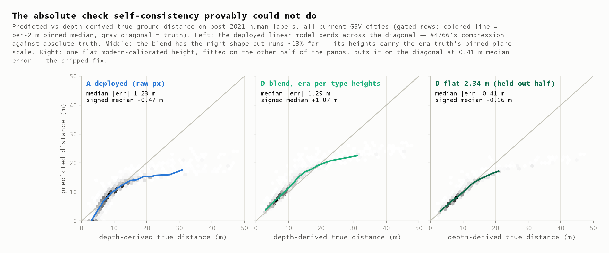
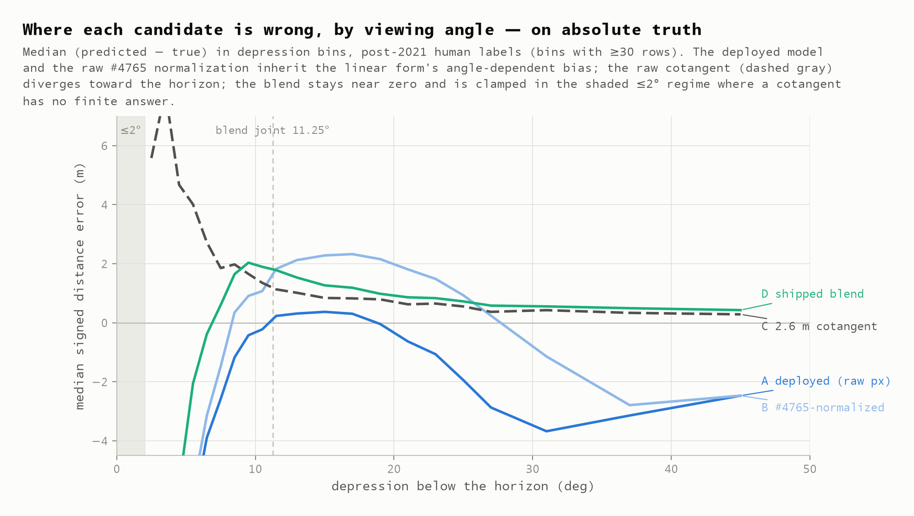
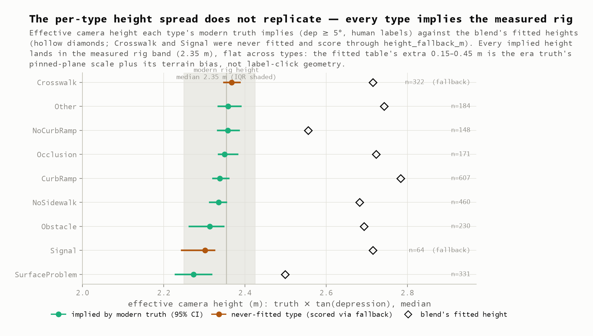

# Modern truth: the blend's geometry is right, its scale is the old fleet's — and one constant fixes it

**2026-08-07** · issue [#3](https://github.com/ProjectSidewalk/label-latlng-estimation/issues/3) (the absolute-scale close-out) · scores the candidate shipped by [Stages 1–2](2026-08-07-distance-refit.md) after the [Mapillary falsification](2026-08-07-mapillary-falsification.md) · feeds [SidewalkWebpage#4765](https://github.com/ProjectSidewalk/SidewalkWebpage/issues/4765) and [#4766](https://github.com/ProjectSidewalk/SidewalkWebpage/issues/4766)

| | |
|---|---|
| **0.41 m** | held-out median distance error of the blend after ONE flat height replaces its per-type table, against fresh-depth truth on post-2021 human labels — on the same disjoint half the deployed model scores 1.17 m and the blend as shipped 1.28 m |
| **+1.09 m** | the shipped blend's signed bias on modern truth — same direction in all 13 scoreable cities (+0.37 to +1.99) and every capture year: a pure scale error, not a shape error |
| **2.35 m** | the measured modern camera height — and the effective height every one of the nine label types' modern truth implies (2.27–2.37, flat). The fitted 2.50–2.78 m table is the era truth's pinned-plane scale plus its terrain bias, not click geometry |
| **+1.78 m** | what SidewalkWebpage#4765's one-line normalization alone does on modern truth — the refit predicted +1.70 from era data alone; the one-liner and the refit still have to travel together |
| **97.6% / 75.6%** | of stored post-2021 positions that reproduce from their own era's formula (±0.5 m; real-pixels / fixed-frame eras) — stored lat/lng is the estimator's own echo everywhere, and any "validation" against it is self-grading |

> Reproduce every number here (offline, from the committed artifacts):
>
> ```bash
> python python/run_modern_truth.py build --write   # cache/artifacts -> summary (~15 min)
> python python/modern_truth_figures.py             # figures 20-23
> pytest tests/test_modern_truth_findings.py        # the findings, locked
> ```
>
> Only `run_modern_truth.py fetch` touches the network; its 1,106 depth payloads are
> committed verbatim in `data/modern-truth-payloads.jsonl.gz`, so everything above replays
> from a fresh checkout.

## §1 · Goal

The Mapillary falsification certified the blend's *shape* with scale-free diagnostics and said
plainly what it could not do: self-consistency provably cannot see a shared scale error
(its §8). This report supplies the missing **absolute** check, on the population every prior
stage lacked: **real human clicks, placed by the modern front end, on modern imagery, across
every current GSV city** — scored against ground truth that owes nothing to any estimator:
fresh GSV depth sampled at the stored click pixel.

Three facts make that population uniquely clean. Post-evolution-179 `pano_x/pano_y` replays
the front-end projection at 100.0000% (`data/pov-inversion-summary.json`), so the stored pixel
is a trustworthy anchor. Both that pixel and the depth raster are heading-centred
(the [conventions report](2026-08-06-depth-coordinate-conventions.md) §1), so the lookup needs
no mirror and no yaw rotation — the open-item-G ambiguity that clouds the era ground truth
does not exist here. And no era heading-bias correction applies. **No parameter is fitted
anywhere in the main comparison**: blend D is scored exactly as committed in
`data/distance-refit-summary.json`.

## §2 · Questions

- **Q1 — Is the depth lookup's frame right?** → **§4**: proven three ways — a synthetic
  payload where the cotangent is exact, a pixel-level cross-check on the 409 committed pilot
  payloads (rows agree within one everywhere, mirrored formula agrees *nowhere*), and
  wrong-frame controls on the modern data itself (fig 23).
- **Q2 — Are stored positions usable as truth?** → **§5**: no, and now it's measured: they are
  estimator echoes in both eras — with a previously undocumented **2 m-scale era
  discontinuity** at evolution 179, plus the discovery that production applies **per-zoom**
  coefficients (`PanoDataService.scala`), not the zoom-1 triple alone.
- **Q3 — The deployed model against absolute truth?** → **§6**: on the pooled human column,
  median |err| 1.23 m, p90 5.24 m, range slope −0.44 m/m — #4766's compression, reproduced
  against ground truth instead of self-consistency. Its small bias on the headline stratum
  (−0.28 m) is the known two-error cancellation on 8192-px panos, not calibration.
- **Q4 — Would #4765's one-liner alone have sufficed?** → **§6**: no — +1.78 m bias on modern
  truth, the overcorrection the era analysis predicted at +1.70. The normalization is only
  correct *inside* the refit.
- **Q5 — The blend against absolute truth?** → **§6–§7**: the shape survives (flat bias curve
  where the linear models dive, best p90 — 3.07 m on the headline stratum, 3.98 m pooled),
  but the whole curve sits **+1.09 m high — a uniform ~13% scale error** across every
  scoreable city and capture year.
- **Q6 — Where does the +13% come from?** → **§7**: the era ground truth's payload
  generation. 68% of 2017–2020 payloads pin the ground plane at exactly 2.50 m (a default,
  not a measurement — [depth pilot](2026-08-05-depth-pilot.md) §5); modern payloads mostly
  measure it (median 2.35 m). Within this one dataset, pinned-plane panos imply 2.42 m and
  measured-plane panos 2.28 m. The blend's fitted heights absorbed the era scale; the
  per-type spread (0.28 m) **does not replicate** — all nine types imply 2.27–2.37 m and the
  era ordering is gone (Spearman ρ = 0.46, p = 0.29 over the seven fitted types; fig 22).
- **Q7 — Do the never-fitted types survive `height_fallback_m`?** → **§7**: yes — Crosswalk
  (n=319) and Signal (n=64) imply 2.37/2.30 m, indistinguishable from the fitted seven; the
  fallback rule is exactly as wrong as the rest of the table, no worse.
- **Q8 — Real near-horizon clicks?** → **§8**: 0.8% of human labels sit at ≤2° depression,
  where truth is far and every bounded model undershoots. The blend beats the deployed model
  there (median −12.3 m vs −17.5 m); against the raw cotangent (+12.2 m the other way) it is
  a wash in magnitude at n=20, and its advantage is structural — a finite largest answer.
- **Q9 — What fixes the scale?** → **§9**: one constant. A single flat height (2.34 m,
  fitted on half the panos, scored on the disjoint half) takes the blend from 1.28 m to
  **0.41 m** median and +1.09 to −0.16 m bias; a global rescale of the whole table
  (k = 0.865) does the same (0.44 m) — the per-type table earns nothing on modern truth.
  **Decision recorded 2026-08-07: the flat height ships**; §9 articulates what that
  trades away.

## §3 · Dataset

**Labels.** A new read-only extraction (`scripts/extraction/extract-modern-labels.{sh,sql}`,
run against production 2026-08-07) of every post-2021, non-deleted, non-tutorial label with
stored `pano_x/pano_y` on a GSV-sourced pano: **1,206,523 rows across 49 city schemas** —
six of the seven 2021 cities plus 43 the estimator has since been deployed to. (DC is the
missing seventh: it has no schema in this database, running as a separate legacy deployment,
so it is out of scope here rather than filtered out.) Excluded with reasons: richmond
(Mapillary), the infra3d schemas, the validation-study schema, and two superseded/backup
schemas — 55 schemas discovered, 6 excluded, none empty. Three provenance facts pinned
during discovery: every non-tutorial post-2021 row is `computation_method = 'approximation2'`
(the only post-2021 'depth' rows are tutorial labels on the fixed legacy pano); AI-submitted
labels are exactly the `SidewalkAI` user's (64,814 rows, all vancouver) — carried as an
`is_ai` flag; and **`label_id` is a per-schema serial, not a key** — 911,878 of the 1.2 M
concatenated rows share one with another city (up to 33 ways), so every join here is on
`label_uid = city:label_id`. The raw extraction is regenerable and stays uncommitted;
sampling-frame gates (in-raster pixels, finite stored coordinates, the 2021 cleaning's
≤20-labels-per-pano guard) leave 1,135,427 rows / 486,547 panos.

**Sampling and fetch.** Stratified pano selection (seed 666, each stratum oversampled 2×):
700 *representative* panos (uniform over human panos, 150-per-city cap — the headline
population), 200 *near-horizon* panos (≥1 label at ≤2°), rarest-first per-type top-ups to
200 labels/type (the first real exercise of the never-fitted types), and 100 SidewalkAI
panos. The fetch walked 1,911 candidates: **1,106 still resolve and serve depth** (58%
resolve — attrition is almost entirely id-gone panos, concentrated in older captures; of the
1,112 that resolve, 6 have metadata streetlevel's parser rejects and the other 99.5% yield a
usable payload). All three *pano*-count strata met their budgets exactly. The type strata are
*label*-count budgets and eight of nine met theirs; **NoCurbRamp landed at 156 of 200**,
because the plan's 2× oversample assumed attrition it under-shot for that type. Per-type
delivery is recorded in `fetch.type_label_coverage` so a shortfall cannot pass unnoticed.
65% of fetched panos are 2022+ captures; fetched origins sit 0.24 m median (p90 0.69 m) from
the extraction's `pano_data` origins, so re-registration drift is a minor term here.

**Truth.** For each label, the depth raster cell is
`col = round(pano_x/width·512) % 512`, `row = clamp(round(pano_y/height·256))` — no mirror
against `gsv_depth`'s payload-order arrays (the conventions report's `511 − …` recipe is for
streetlevel's mirrored output), no yaw shift. Truth is the ray's horizontal ground distance
(`depth_validation.classify_depth_pixel`, the refactored core the legacy v6 path now shares
bit-for-bit) — camera-relative, so immune to origin drift, and independent of camera height.
Gates: ray lands on ground/terrain (facade/sky/oblique excluded — 382 rows, 11.6%), 3×3
neighbourhood agreement (0 further exclusions), truth finite and under the 50 m cap (46).
**3,286 labels on fetched panos → 2,858 scored (2,655 human, 203 AI).** Every one of those
truth values re-reads identically from the committed payload bytes (`RUN_SLOW=1` runs the
exhaustive sweep; the default test covers a 250-pano slice).

Committed artifacts: `data/modern-truth-payloads.jsonl.gz` (verbatim base64, 5.3 MB),
`modern-truth-panos.csv.gz`, `modern-truth-labels.csv.gz`, `modern-truth-summary.json`;
the fetch cache is gitignored. Provenance in `data/MANIFEST.md`.

## §4 · The frame, proven three ways

The one genuinely dangerous step is reading a depth map at a stored pixel — the pilot showed
wrong frames produce 7–17 m medians. Three independent checks, all locked by tests:

1. **Synthetic exactness** (`test_modern_truth_contract.py`): on a constructed payload with
   one ground plane at height *h*, the sampler returns `h/tan(depression)` to float
   precision, and the mirrored formula provably reads a different world.
2. **The 409-payload cross-check** (`test_modern_truth_findings.py`): recovered-era labels
   carry both the legacy north-referenced pixel and the evolution-179 heading-centred
   recompute. On the committed pilot payloads (n=555 labels), the modern lookup and the
   yaw-corrected era lookup land **within one raster row every time** — exactly equal 68%,
   the rest being the era `ceil` vs modern `round` half-pixel — and on the same-or-adjacent
   column 83% (93.5% within two; the residual tail is the documented legacy camera-heading
   drift). The **mirrored column formula agrees exactly nowhere**: 0% within two columns,
   and the closest any label comes is 4 columns off, because `col → 511−col` only lands near
   the truth for labels near column 255 and this population has none.
3. **Wrong-frame controls on this dataset** (fig 23): re-reading every label under the
   pilot's null hypotheses annihilates the vertical conventions (1% of rays still hit
   ground; 9.7–12.9 m median errors). The x-mirror is only weakly separated by ground
   *distance* — a road is nearly left-right symmetric in range — which is precisely why
   check 2 exists.


## §5 · The circularity guard — and two things it found

Stored post-2021 `lat/lng` had to be disqualified as truth *by measurement*, and the
recompute needed to be exact. Getting it exact surfaced two undocumented facts:

- **Production applies per-zoom coefficients.** `PanoDataService.toLatLng` selects one of
  three published triples by `round(zoom)`; a zoom-1-only recompute (all the prior analyses'
  convention, correct for the auto-labeler) leaves 0.90/2.79 m median residuals on the
  zoom-2/3 populations, which the per-zoom selection collapses to 0.16/0.15 m.
  `modern_truth.DEPLOYED_DIST_COEF` now carries all three, verbatim from the Scala source.
- **Stored positions have an era discontinuity at evolution 179 (2023-03-29).** Labels placed
  before it were computed by the old front end from **fixed-frame** `sv_image_y` — the
  coefficients' own frame, i.e. *without* the #4765 apply-path defect. Labels after it feed
  real pixels into fixed-frame coefficients — the defect population. Each era reproduces from
  its own formula and not the other's: fixed-frame era median |diff| 0.29 m (wrong era:
  1.96 m), real-pixels era 0.10 m (wrong era: 1.43 m); 97.6% of real-pixels rows sit within
  0.5 m of their recompute (75.6% for the older era, whose panos have had longer to drift).

The consequence for everything downstream: stored positions are the estimator's own output
throughout — a database-wide echo — so the deployed model's predictions here are always the
**recomputed** apply path, and no comparison in this report touches stored coordinates except
this guard.

## §6 · The absolute comparison

Median signed/absolute error against depth truth. The headline is the representative human
stratum (n=1,484, an approximately proportional draw); the pooled column (n=2,655) includes
the deliberately oversampled near-horizon and rare-type strata, so the two are reported
separately rather than mixed:

| model | median \|err\| | signed median | p90 \|err\| | range slope (m/m) | *pooled* median / p90 / slope |
|---|---:|---:|---:|---:|---:|
| A deployed (per-zoom, real px) | 1.08 | −0.28 | 3.78 | −0.29 | 1.23 / 5.24 / −0.44 |
| B #4765-normalized only | 2.07 | +1.78 | 3.94 | −0.36 | 2.11 / 5.00 / −0.50 |
| C 2.6 m cotangent | 1.02 | +1.02 | 3.31 | +0.19 | 1.10 / 4.34 / +0.19 |
| D blend as shipped | 1.19 | +1.09 | 3.07 | −0.20 | 1.29 / 3.98 / −0.34 |



Reading it (fig 21 shows the same by viewing angle):

- **The deployed model's compression is now measured against ground truth**: too far in the
  near field, increasingly too near beyond ~12 m (−0.44 m/m pooled; p90 5.24 m), ending in
  the −17.5 m median undershoot at ≤2°. Its flattering headline bias is the era report's
  two-error cancellation on 8192-px panos, observed almost exactly (−0.28 m here vs −0.39
  predicted); on any other resolution it has no such luck.
- **B confirms the standing warning numerically**: era analysis predicted the bare one-liner
  would overcorrect to +1.70 m; modern truth says +1.78 m. #4765 must not ship without the
  refit.
- **The blend's *form* does what it was designed to do** — flat bias where both linear models
  dive (fig 21), best p90, bounded near-horizon behaviour — but the whole curve floats
  ~+1.09 m, and the float is *uniform*: +0.37 to +1.99 m across all 13 scoreable cities,
  +0.77 to +1.41 across every capture year, +1.85 on the AI stratum. A shape error varies
  with geometry; a scale error doesn't. This is a scale error.
  "Scoreable" means ≥50 gated human rows: 36 cities contribute rows, 13 clear that bar, and
  the 23 below it hold 369 rows (14% of the pooled human column) at 1–46 rows each — too
  thin to read a median from, and a handful of them do sit the other side of zero. The
  capture-year cut is the independent check on the same claim, and it has no such tail.



## §7 · Where the +13% lives: the era truth's payload generation

The blend takes exactly one physical input family — per-type camera heights. Modern truth
lets each type vote on its own effective height, `median(truth · tan(depression))`:



Three mutually consistent measurements pin the mechanism:

- **The pin.** Google's payloads either *measure* the ground plane or *pin* it at exactly
  2.50 m (a default the pilot established structurally). 2017–2020 payloads: 68% pinned
  ([depth pilot](2026-08-05-depth-pilot.md) §5). This fetch: 31% pinned overall, 88% for
  pre-2017 captures, 27% for 2018+ — the pilot's own modern figure was 27%.
- **The split.** Within this one dataset, labels on pinned-plane panos imply 2.416 m; labels
  on measured-plane panos imply 2.277 m. The truth's scale tracks the payload generation.
- **The consistency check.** Crosswalk labels are road paint — zero height offset, never
  fitted, immune to the era table. Their implied height is 2.369 m; the independently
  measured rig height median is 2.354 m. Fifteen millimetres apart.

So the era ground truth the blend was fitted on — 395k labels whose depth came from the
pinned-heavy payload generation — carries a ~+6% default-plane scale, plus the terrain-model
overshoot that report documented (~0.5 m on curb ramps). The fitted heights absorbed both;
that was the *correct* fit to that truth. Modern payloads measure the plane instead, and the
curb overshoot has largely vanished too: correcting modern CurbRamp truth by the classic
`curb·d/h` term now *worsens* the blend's bias (+1.49 → +2.12 m), i.e. the modern terrain
model already hugs the ramp. And with both era artifacts gone, **the per-type structure goes
with them**: all nine types, including the two scored through `height_fallback_m`, land in
2.271–2.369 m, and the era table's *ordering* does not survive either — Spearman ρ = 0.46
(p = 0.29) over the seven fitted types, with CurbRamp falling from the table's highest height
to 4th of 7. The residual 0.098 m of spread is under half of the 0.246 m a rescaled table
would assert and is comparable to the per-type bootstrap CIs (±0.018–0.045).

## §8 · Real near-horizon clicks

The era analysis could only characterize the near-horizon regime on era clicks; the
falsification's fuse gate excluded it entirely. Here it is on modern human labels (median
signed error, pooled human):

| depression | n | A deployed | C cotangent | D blend |
|---|---:|---:|---:|---:|
| ≤ 0° (above horizon) | 2 | −26.3 | +4.4 | −18.2 |
| 0–2° | 20 | −17.5 | +12.2 | −12.3 |
| 2–5° | 145 | −13.9 | +5.6 | −8.9 |
| 5–11.25° | 811 | −1.1 | +2.0 | +1.5 |
| > 11.25° | 1,677 | −0.1 | +0.8 | +1.1 |

0.8% of human labels sit at ≤2°, 6% under 5° — mostly genuinely distant things (signals,
road ends). There, truth routinely exceeds any bounded answer and every capped model
undershoots. The blend beats the deployed model clearly (−12.3 vs −17.5 m); against the raw
cotangent, which misses by +12.2 m in the other direction, it is a **wash in magnitude**, and
at n=20 the two are not distinguishable. Read the first two rows as direction only — the ≤0°
row is n=2 and carries no weight at all.

What actually separates the blend near the horizon is structural rather than empirical: its
answer is bounded by construction (`max_answer_m`, 23.85 m under the shipped constants),
where the raw cotangent runs to the 50 m clip. That is the property worth keeping, and
nothing here argues for revisiting the clamp policy.

## §9 · One constant — the held-out remedy check

Because the gap is a uniform scale, the candidate fixes are one-parameter. Fitted on a
random half of the panos, scored on the disjoint half (`modern_truth.remedy_check`; the
falsification's held-out discipline), human gated rows:

| candidate | median \|err\| | signed median | p90 |
|---|---:|---:|---:|
| A deployed (reference, same rows) | 1.17 | −0.43 | — |
| D as shipped | 1.28 | +1.09 | 3.60 |
| D × k, whole height table rescaled (k = 0.865) | 0.44 | −0.15 | 3.56 |
| D flat, one height for every type (2.34 m) | **0.41** | −0.16 | 3.55 |

The rescale and the flat variant are statistically indistinguishable here — which is itself
the finding: **the per-type table buys nothing on modern truth** (it bought 4 cm of era-test
median: 0.9335 vs 0.9741). The residual −0.16 m and the surviving p90 tail are the honest
remainder: near-horizon undershoot plus whatever the modern terrain model still overstates.

### The decision (recorded 2026-08-07): the flat height ships

Both remedies fix the scale; choosing between them is a judgment about what deserves to
survive, so the tradeoffs are stated in full rather than implied.

**What the flat height gives up.**

- *The per-type structure the era fit chose.* On the era-frame test it was worth 4 cm of
  median (0.9335 vs 0.9741) — but this report shows that frame's scale is inflated by the
  pinned planes, and the two frames cannot both be satisfied. The per-type table remains on
  record as the era fit's own answer (`era_fit_coefficients` in
  `distance-refit-summary.json`); it stops being a production artifact.
- *A physically-plausible story.* "Obstacles are clicked above their ground contact" was a
  reasonable mechanism for the era spread (est3 seemed to corroborate it). Modern truth had
  the power to see it: a rescaled table would assert a 0.246 m spread against per-type
  bootstrap CIs of ±0.018–0.045. What it measured is 0.098 m, under half of that — and,
  more damning for the mechanism than the magnitude, in the *wrong order*: Spearman ρ = 0.46
  (p = 0.29) against the fitted heights, with CurbRamp dropping from the table's tallest to
  4th of 7. A mechanism that only appears under the payload generation with defaulted planes
  was the payload generation, not the clicks.

**What the flat height buys.**

- Held-out accuracy at least as good as the rescale (0.41 vs 0.44 m median; both −0.16 m
  bias). The two are within noise of each other; the flat variant is not worse.
- A two-parameter model: one height, one blend angle. Every shipped number is now a
  physical quantity a future analysis can re-measure.
- `label_type` leaves the distance path entirely — and with it the **unseen-type fallback
  rule**, the shipped table's least-evidenced policy. A modern caller meets label types the
  2017–2020 population never contained (this dataset scored 433 of them — Crosswalk and
  Signal); under the flat height they need no rule at all, and the server/client ports lose
  a table, a lookup, and a failure mode.
- Nothing modern truth cannot support ships. The rescale would preserve structure at
  exactly the confidence level this report just measured to be absent.

**What either option accepts, stated once.** The calibration target is Google's *measured*
ground planes — internally consistent to 15 mm (the Crosswalk check) and free of the
documented default-plane artifact, but not anchored to any external geodetic reference;
bearing-only triangulation (#7) remains the independent path if one is wanted. The −0.17 m
residual (the modern terrain model's remaining overshoot) rides along, as does a
by-construction ~4 cm degradation on era-frame metrics. And shipping *as-is* was rejected
on the same grounds either remedy is accepted: a +1.09 m uniform bias with a one-constant
fix is not a defensible thing to deploy.

**The shipped constants** (committed as `final_coefficients` in
`modern-truth-summary.json`; the full-sample height — the held-out check's train-half value
is 2.3416, under half a centimetre away, and the disjoint-half 0.41 m is the honest error
estimate):

```
height_m   = 2.341219672825709      # median(truth·tan(dep)), 2,488 human rows, dep ≥ 5°
blend_deg  = 11.25                  # unchanged; joint now at h/tan(11.25°) ≈ 11.8 m
max answer = 23.848261259830384 m   # the tail's structural bound (was 28.35)
clip 0–50 m; tail evaluated at max(dep, 0); spherical geodesy; exact POV heading;
no label_type input; no era constant
```

The height is fitted on the pooled human rows rather than the representative stratum alone.
The quota strata pull it by 5 mm (2.3412 vs 2.3357 representative-only) and the pooled value
scores marginally *better* on the representative stratum, so pooling is the larger sample at
no measurable cost — but it is a pooled median, and that is why it is stated here.

The SidewalkWebpage integration
([#4819](https://github.com/ProjectSidewalk/SidewalkWebpage/pull/4819)) consumes these in
place of the per-type table.

## §10 · Deliberately not claimed

- **An absolute verdict beyond GSV's own geometry.** Everything here is calibrated to
  Google's depth planes — measured ones, cross-checked internally, but Google's nonetheless.
- **Mapillary absolute scale.** Unchanged from the falsification's §8: no depth exists
  there; the per-source-height recipe plus the panorama-tools depth store remain the route.
- **AI-label behaviour in general.** The AI stratum is one city, one importer (n=203); its
  larger bias (+1.85 m) is confounded with vancouver's rig and is noted, not interpreted.
- **A backfill recommendation.** Stored positions carry the era discontinuity (§5) and both
  eras' model biases; recomputing them under the final coefficients is feasible from stored
  pixels and is a separate product decision, unchanged from the Stage 4 note.
