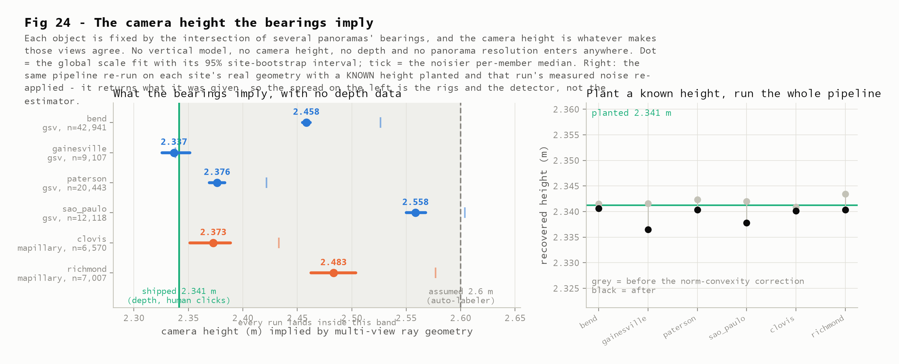
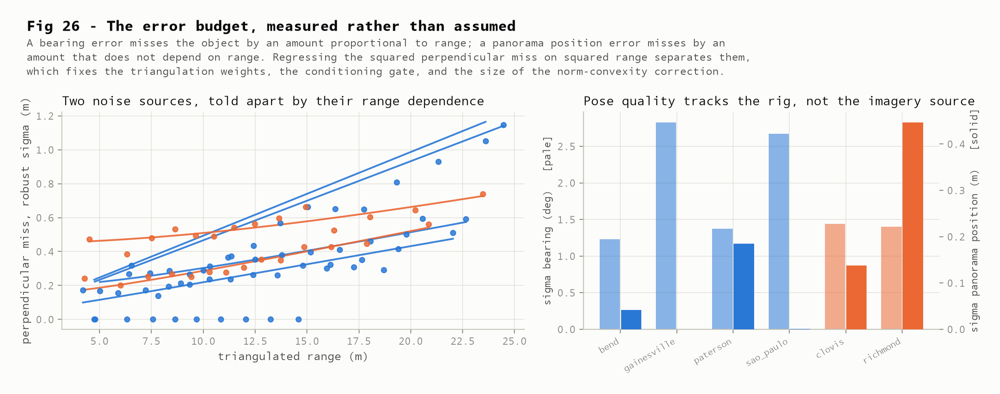
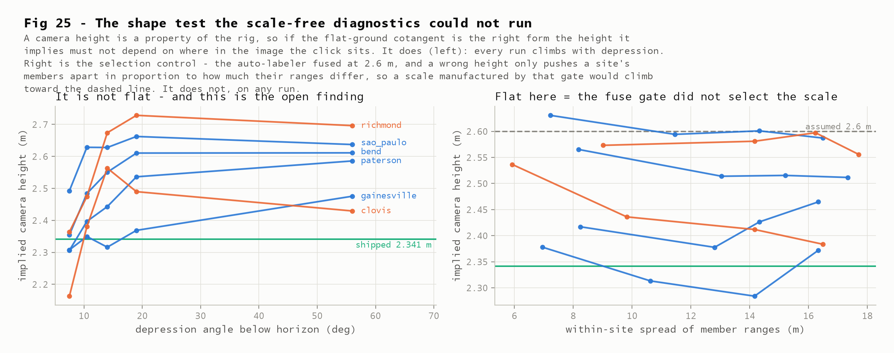
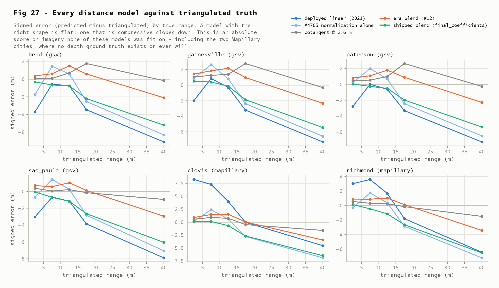

# Bearing-only triangulation: an external anchor for a chain calibrated on Google's depth

**2026-08-08** · issue [#7](https://github.com/ProjectSidewalk/label-latlng-estimation/issues/7) ·
the independent path named in `final_coefficients`' own caveats ·
follows the [modern-truth close-out](2026-08-07-modern-truth.md) and the
[Mapillary falsification](2026-08-07-mapillary-falsification.md)

| | |
|---|---|
| **0.899–0.984** | the scale on the ecosystem's assumed 2.6 m camera height that makes multi-view ray geometry self-consistent — **below 1.0 on all six runs**, GSV and Mapillary alike. Measured with no vertical model, no camera height, no ground plane, no depth and no panorama resolution |
| **2.337 / 2.376 m** | what the bearings imply for gainesville and paterson, against the shipped **2.3412 m**. bend (2.458) and sao_paulo (2.559) sit 5–9% above. The anchor confirms the shipped scale to ~8% and rejects 2.6 m outright — it does not confirm it to better than that |
| **0.998–1.000** | planted-height recovery: plant a known height on each run's *own* site geometry, re-apply that run's *measured* noise, run the identical pipeline. It returns what it was given, so the spread above is rigs and detector, not method |
| **1.138** | triangulated range ÷ depth-derived range **at the very same detection pixels** (2,639 detections, 480 panoramas, four GSV cities). Systematic — it survives every quality gate — and **multiplicative**: the ratio is flat in range while the metre gap grows to 2.4 m, which excludes a fixed-extent detector-centroid cause and is the signature of a depth model restating its own ground plane. **The central finding of this report; not adjudicated absolutely (§8)** |
| **4.80 m → 1.47 m** | clovis median distance error, deployed 2021 linear model → shipped blend, scored against a truth built from bearings. [#4765](https://github.com/ProjectSidewalk/SidewalkWebpage/issues/4765)'s sign-flip measured against *absolute* truth on imagery no candidate was fit on |

> Reproduce every number here. Only `fetch` touches the network, and its 480 depth
> payloads are committed verbatim, so everything else replays from a fresh checkout:
>
> ```bash
> python python/run_triangulation.py build --write   # ~12 min, offline
> python python/triangulation_figures.py             # figures 24-27
> pytest tests/test_triangulation_contract.py        # the estimator, on known geometry
> pytest tests/test_triangulation_findings.py        # the findings, locked
> ```

## §1 · Goal

Every distance estimate in this repository — the 2021 linear fit, the 2026 refit's
cotangent family, the shipped `final_coefficients` — turns a **vertical** click angle into
a ground distance. That conversion needs a flat-ground assumption and a camera height, and
the camera height was ultimately measured against Google's own depth rasters. The shipped
artifact says so in its own caveats:

> "the absolute reference is Google's measured ground planes — internally consistent
> (Crosswalk vs measured rig: 15 mm) but **externally unanchored**; bearing-only
> triangulation (#7) is the independent path"

This report is that path. Two panoramas that see the same object give two bearings, and
bearings intersect. The range that falls out uses **no vertical click angle, no camera
height, no ground plane, no depth data and no panorama resolution** — so it shares no
assumption with the thing it is checking.

It is worth being precise about what "independent" buys, because it is not "absolute".
There is no survey-grade control anywhere in this chain. Triangulation replaces *trust
Google's depth planes* with *trust the reported camera positions* — a genuinely different
and much weaker dependency, but not zero. §11 keeps that distinction.

## §2 · Questions

- **Q1 — Does the estimator work, and how would we know?** → **§4**: exact on noise-free
  geometry; the frame pinned against the auto-labeler's own stored positions to 0.033 m;
  and, load-bearing, a planted known height recovered to 0.2% on each run's real geometry
  under that run's measured noise.
- **Q2 — What is the error budget?** → **§5**: bearing and panorama-position noise
  separated by their range dependence, cross-checked model-free by split-half agreement.
  Also a finding in its own right: pose quality tracks the **rig**, not the imagery source.
- **Q3 — What camera height do the bearings imply?** → **§6**: 2.337–2.559 m across four
  GSV cities and 2.373/2.483 m on the two Mapillary ones. 2.6 m is too tall everywhere.
- **Q4 — Is the flat-ground cotangent's *shape* right, absolutely?** → **§7**: no — the
  implied height climbs with depression angle on every run. Four candidate explanations
  are tested; three are killed, one survives and is not resolved here.
- **Q5 — Do bearings and depth agree on the same pixels?** → **§8**: they disagree by
  13.8%, consistently, in all four GSV cities — and the disagreement is *multiplicative*
  (a scale, not a click offset), which points at the depth side.
- **Q6 — How do the distance models score against this truth?** → **§9**: absolute scoring
  on imagery none of them was fit on, *including the two Mapillary cities where no depth
  ground truth exists or ever will*.
- **Q7 — Can triangulation serve as an estimator?** → **§10**: for the 47–83% of objects
  seen from ≥3 panoramas, yes, and the conditioning is excellent.

## §3 · Dataset

The auto-labeler's fused multi-view runs, imported and committed for
[Stage 3](2026-08-07-mapillary-falsification.md) and reused verbatim here — no new
extraction, no database.

| run | imagery | sites with ≥3 panos | members analysed | median panos/site (≥3 subset) | median intersection angle |
|---|---|---:|---:|---:|---:|
| bend | GSV | 9,709 | 42,941 | 4 | 85° |
| paterson | GSV | 4,810 | 20,443 | 4 | 84° |
| sao_paulo | GSV | 3,258 | 12,118 | 4 | 83° |
| gainesville | GSV | 2,790 | 9,107 | 3 | 81° |
| clovis | Mapillary | 1,135 | 6,570 | 5 | 87° |
| richmond | Mapillary | 945 | 7,007 | 7 | 88° |

(The per-site pano count is the median over the ≥3-pano sites the analysis actually uses —
`applicability.median_panos_per_site_3plus`. An earlier draft quoted the median over all
multiply-observed sites, which read as an impossible "2" for gainesville in a table about
sites with at least three.)

**22,647 sites, 98,186 member observations.** Three panoramas is the minimum, because a
member's range truth is triangulated from the *others* — leave-one-out, so the observation
being scored never contributes to its own truth, and no member's vertical angle contributes
to any of it.

One inherited property matters and is not hidden: **cluster membership comes from the
auto-labeler's fuse**, which matched detections using positions projected at an assumed
2.6 m camera height (`max_match_m` 8 m, `residual_per_dof_max` 3.0). Triangulation inherits
whatever that clustering got wrong, and it is conceivable that the gate selected a
population already consistent with 2.6 m. §7 tests exactly that and finds it did not.

The depth anchor in §8 adds 480 freshly fetched GSV depth payloads (120 per GSV run),
committed verbatim as `data/triangulation-depth-payloads.jsonl.gz`.

## §4 · The estimator, and why to believe it

The estimator minimises the summed squared *perpendicular* distance from a point to each
bearing ray. Leave-one-out is computed by subtracting each member's rank-1 term from its
site's normal equations, which turns one 2×2 solve per member into groupby sums over the
whole table.

Four checks, in increasing strength (`tests/test_triangulation_contract.py`):

| check | result |
|---|---|
| noise-free synthetic geometry | recovers the planted point to 1e-9; recovers a planted camera height exactly, for every leave-one-out member |
| frame convention vs the auto-labeler's own stored member positions | max **0.033 m** over 7,711 richmond members — that is the sites file's coordinate rounding. A sign flip or an axis swap fails by tens of metres |
| leave-one-out really is blind | perturbing member *i*'s bearing by 12° moves member *i*'s own truth by **0**, and moves its neighbours' |
| **planted height, real geometry, measured noise** | **bias factor 0.998–1.000 on all six runs** |

That last row is the one the report stands on. For each run: take every site, plant an
object at its own leave-one-out consensus, give it depressions implied by a *known* camera
height, corrupt the panorama positions and bearings at that run's *measured* noise, and run
the identical pipeline. It returns 2.337–2.341 m from a planted 2.3412 m.

One noise source is deliberately not simulated: the vertical click angle enters both
checks exactly, not corrupted. That is a safe omission for the *estimator* claim — the
estimand is a median of `r_tri · tan(depression)`, which is first-order immune to
zero-mean angular noise, and the depression never enters the triangulation itself — but
it means these checks validate the geometry pipeline, not the detector's vertical
convention. The detector's convention is exactly what §7 and §8 then interrogate.

So the estimator does not manufacture camera height, and the between-run spread in §6 is
not an artefact of the method. Fig 24 (right panel) shows this alongside the headline.

One correction is applied and is not cosmetic. A range is a *norm*, `|X̂ − p|`, so
cross-ray error in the triangulated point inflates it by `σ_c²/(2r)` — positive, and larger
at short range, which is exactly the shape that would otherwise read as a taller camera.
The analytic correction is validated by simulation at three noise levels — at the harshest
(σ_bearing 1.4°, σ_pos 1.0 m) it turns a raw bias of **+0.072 m** into **−0.008 m** — and
is worth 3–10 mm of implied height on the real runs: real, small, and removed rather than
assumed away.



## §5 · The error budget

A bearing error misses the object by an amount proportional to range; a panorama position
error misses by an amount independent of it. Regressing the robust squared perpendicular
miss on squared range separates them (fig 26).

| run | σ bearing | σ panorama position | split-half separation | implied point σ |
|---|---:|---:|---:|---:|
| bend | 1.23° | 0.04 m | 0.57 m | 0.29 m |
| paterson | 1.38° | 0.19 m | 0.76 m | 0.38 m |
| gainesville | 2.83° | ~0 | 0.92 m | 0.46 m |
| sao_paulo | 2.67° | ~0 | 1.19 m | 0.59 m |
| clovis | 1.44° | 0.14 m | 0.55 m | 0.28 m |
| richmond | 1.40° | 0.45 m | 0.93 m | 0.47 m |

Split-half — triangulate each site from two disjoint halves of its panoramas and measure
how far apart the two answers land — is model-free and agrees with the propagated
covariance, so the two routes to "how precise is a triangulated position" corroborate.

**A finding, not just plumbing: pose quality tracks the rig, not the imagery source.**
richmond's four-rig Mapillary zoo has the worst positions by a factor of ~2.4 (0.447 m),
but clovis — one creator, one GoPro Fusion, disciplined sequences — comes in at 0.138 m,
*better than paterson's GSV* (0.185 m). "Mapillary is noisier" is false as a blanket claim.

**An identifiability limit, recorded rather than buried.** On gainesville and sao_paulo the
fit puts essentially all the miss in the bearing term (σ_pos → 0, σ_bearing 2.7–2.8°). The
two components are told apart only by their range dependence, so when one is genuinely
small the split is weakly identified. The contract tests reproduce this failure mode on
synthetic data *and* show the height estimate is unaffected by it — and empirically these
two runs land on opposite sides of the shipped constant (2.337 and 2.559), so the
degeneracy is not what produces the spread.

**The bearings carry no systematic yaw error.** A global rotation fitted per run lands
within 0.15° of zero everywhere and buys under 1% of the residual. This mattered enough to
check: a yaw bias would corrupt every range in the report.



## §6 · The headline: absolute scale, with no depth data

Two estimators of the same quantity:

- **global scale fit** (quoted here) — the single multiplier `k` on the 2.6 m cotangent
  that minimises within-site placement disagreement. Scaling every range slides each
  placement along a *different* ray, so the scatter is a quadratic in `k` with one minimum.
- **per-member median** of `r_tri · tan(depression)` — noisier, because it divides by a
  noisy triangulated range. It runs 0.003–0.091 m higher everywhere, the expected direction.

| run | imagery | k | implied height | 95% CI | per-member median |
|---|---|---:|---:|---|---:|
| gainesville | GSV | 0.899 | **2.337 m** | 2.326–2.351 | 2.338 |
| paterson | GSV | 0.914 | **2.376 m** | 2.369–2.384 | 2.422 |
| bend | GSV | 0.946 | **2.458 m** | 2.455–2.462 | 2.527 |
| sao_paulo | GSV | 0.984 | **2.559 m** | 2.550–2.568 | 2.604 |
| clovis | Mapillary | 0.913 | **2.373 m** | 2.351–2.389 | 2.433 |
| richmond | Mapillary | 0.955 | **2.483 m** | 2.463–2.504 | 2.577 |

(Interval note: the estimate and every bootstrap replicate are the parabolic vertex of
the scatter's minimum, not the nearest sweep grid point. The first build's intervals were
argmin grid points, quantised to 13 mm — bend's printed as the width-zero "2.457–2.457",
excluding its own estimate. `test_bootstrap_intervals_are_nondegenerate_and_contain_their_estimates`
now locks the repair.)

Read plainly:

1. **The ecosystem's 2.6 m is too tall on every run.** `k < 1` for all six, and the fitted
   scale genuinely improves multi-view agreement in every case. This needs no reference
   height at all and is the most directly actionable result here — the auto-labeler's fuse
   constant is wrong in a knowable direction on both imagery sources. The margin is wide on
   four runs (placement scatter 1.42 → 1.70 m on gainesville if 2.6 m is assumed) and
   **thin on sao_paulo**, whose `k = 0.984` buys only 0.6% — that run rejects 2.6 m only
   barely, and the report does not lean on it.
2. **Every run lands in the band from the shipped 2.3412 m up to 2.6 m** — with the one
   qualifier stated rather than rounded away: gainesville sits 5 mm *below* the shipped
   value, well inside its own interval (2.326–2.351), so "at the shipped value" is the
   honest reading there. The independent measurement brackets the shipped constant
   rather than contradicting it.
3. **But it does not confirm it tightly.** gainesville and paterson sit within 0.2% and
   1.5%; bend and sao_paulo sit 5.0% and 9.3% above. The bootstrap intervals are far too
   narrow to absorb that, so the between-city spread is real structure, not sampling error.

**Also delivered, and new: absolute Mapillary camera heights.** What triangulation measures
is `H_rig − δ`, where δ is however far above the ground contact the detector's click point
sits. δ is a property of the detector, and the auto-labeler ran the *same* detector on every
run — so it cancels in a *difference* between runs even though it is not identifiable within
one. Calibrating δ once on the GSV runs (δ = −0.076 m) transfers absolute heights to
Mapillary: **clovis 2.297 m, richmond 2.407 m**. Stage 3 could only ever produce *relative*
per-sequence scales; these are absolute. The calibration step borrows the depth-measured
2.34 m back, so this particular number is anchored, not independent — labelled as such in
`cross_source.detector_click_offset_note`.

Two consequences of that anchoring, quantified rather than left implicit:

- **δ = −0.076 m is physically impossible taken at face value** — it says the detector's
  click point sits *below* the object's ground contact. A real detection cannot do that,
  so a negative δ is itself evidence of strain between the two systems being combined,
  and in exactly the direction §8 measures: if the depth-measured rig is ~14% short (the
  §8 shape reading), the true modern rig is ≈ 2.66 m, δ flips to a physically sensible
  ≈ +0.25 m, and both Mapillary absolutes above move **up by ≈ 0.32 m** with it. These
  transfers are conditional on the depth chain's scale in a way the bearings themselves
  are not.
- **One pooled δ treats four GSV cities as one rig**, while item 3 above says the
  between-city spread is real structure. The pooled median is the best single transfer
  available, but a per-city δ spans +0.005 m (gainesville) to −0.217 m (sao_paulo), so
  the transfer inherits that spread as an unmodelled uncertainty.

Robustness (all in `robustness.sensitivity`): the answer moves by <0.05 m across a
conditioning-gate sweep from 0.75 m to 4.0 m, and across minimum site sizes of 3, 4 and 5
panoramas.

## §7 · What is *not* flat — and four hypotheses

If the flat-ground cotangent were the right form, the implied height would be a constant:
a property of the rig, independent of where in the image the click sits. It is not. On
every run it climbs with depression angle — gainesville 2.31 → 2.48, paterson 2.31 → 2.59,
richmond 2.36 → 2.70 (fig 25, left).

This is a claim Stage 3's diagnostics could not make either way. Their consensus was built
from each model's own predicted ranges and then demeaned within site, which makes them
scale-invariant by construction. Fixing the consensus with bearings breaks the demeaning,
and shape becomes testable in absolute terms. It fails.

Four explanations, tested:

| hypothesis | test | verdict |
|---|---|---|
| **The fuse gate selected a population consistent with 2.6 m** | A wrong height pushes a site's members apart only in proportion to how much their ranges differ, so the gate can only bite where the within-site range spread is large. Stratify on it. | **Killed.** On five of six runs the highest-spread stratum sits *below* the lowest-spread one; the one exception rises 0.048 m, an order of magnitude too little (fig 25, right) |
| **Triangulation noise** (norm convexity under-corrected) | The correction scales as σ_c²/2r; producing the observed climb (0.14–0.33 m across the runs) would need σ_c ≈ 1.7–2.0 m, against 0.28–0.59 m measured two independent ways | **Killed** on magnitude |
| **Uncorrected camera tilt** — the auto-labeler fused with `apply_pose: false`, and rig tilt displaces the horizon by a sinusoid in azimuth, biting hardest at small depression: exactly the observed shape | Apply the committed per-panorama `camera_pitch`/`camera_roll` under all four sign conventions | **Killed, decisively and against expectation.** Every convention leaves the trend *larger* than leaving it alone (paterson 0.28 → 0.89; gainesville 0.17 → 0.68). The recorded pose adds noise here rather than removing a systematic |
| **A range-dependent detector click convention** — if the detector's reported point sits higher above ground contact at long range (minimum box size, blur), then `H − δ` shrinks with range, which is the observed trend | Not separable from the camera height by bearings alone; §8 was built to test it | **Survives.** Not resolved here |

The tilt result is worth stating plainly because it was the leading hypothesis and it is
the one most likely to be assumed true by a future reader. Uncorrected tilt is real —
[SidewalkWebpage#4784](https://github.com/ProjectSidewalk/SidewalkWebpage/issues/4784)
documents it in production — but the pose GSV serves for these panoramas does not explain
this trend, and applying it naively would make placements worse.



## §8 · The depth anchor: two independent systems, identical pixels

The click-convention confound (δ) is what stops §6's number being compared straight against
the depth-measured 2.34 m rig, which was calibrated on *human* clicks. Removing it needs a
comparison where δ is common to both sides — so: read Google's depth raster **at the very
same detection pixel that produced the bearing**.

480 GSV panoramas, 2,639 comparable detections. The lookup goes through the same shared
`modern_truth.classify_modern_label` path the modern-truth close-out used, with the
heading-centred column derived from the detection's absolute bearing.

| run | median r_depth | median r_tri | ratio | median abs diff |
|---|---:|---:|---:|---:|
| bend | 10.21 m | 11.10 m | 1.108 | 1.04 m |
| paterson | 8.82 m | 10.60 m | 1.144 | 1.23 m |
| gainesville | 10.09 m | 11.60 m | 1.144 | 1.45 m |
| sao_paulo | 9.38 m | 11.57 m | 1.173 | 1.64 m |
| **pooled** | **9.93 m** | **11.16 m** | **1.138** | **1.27 m** |

**The two systems disagree by 13.8%, and the disagreement is systematic.** It survives
every quality gate, and the sweep is computed into the summary
(`depth_anchor.quality_gates`) and locked by the findings tests rather than asserted:
tightening the bearing-residual gate sixteen-fold (≤4° → ≤0.25°) leaves the ratio at
1.132 → 1.133; tightening the conditioning gate from the headline's 1.5 m to 0.5 m moves
it 1.138 → 1.133; restricting to 5+ panorama sites moves it to 1.133. No stratum of any
sweep leaves the 1.13s. So it is not mis-clustering, not conditioning, and not noise.
(An earlier draft quoted sweep numbers from an exploratory session that the committed
build did not produce; review caught it, and the sweep now regenerates offline with
everything else.)

Two supporting facts:

- **The depth side reproduces prior work.** Read at these detection pixels, Google's depth
  implies 2.271 m — a little below the 2.3412 m the modern-truth close-out measured on
  human clicks, in the direction a detector clicking slightly above ground contact predicts.
- **The panorama positions are not the culprit.** The auto-labeler's stored positions match
  freshly fetched photometa to a median of **0.000 m** (max 0.10 m) across all 480, so the
  baselines triangulation stands on are the ones Google serves. Computed as
  `depth_anchor.position_drift` and locked by the findings tests.

**A discriminating test: is the gap a ratio or an offset?** The two candidate causes make
different predictions across range. A detector centroid that corresponds to different
physical points from different viewpoints is an *additive* error on a fixed-size object —
capped by the object's extent (a curb ramp is ~1–2 m), and a *radial* displacement (each
camera seeing the object's near face) cannot bias the triangulated range at all, because
it leaves every bearing unchanged (proven as a contract test). A depth model whose scale
is set by its own assumed ground plane is a *multiplicative* error: flat ratio, metre gap
growing in proportion. `depth_anchor.gap_range_profile`:

| r_tri bin | n | median gap (m) | ratio | depth-implied height (m) |
|---|---:|---:|---:|---:|
| 1–5 m | 169 | 0.36 | 1.094 | 2.266 |
| 5–8 m | 537 | 0.81 | 1.145 | 2.265 |
| 8–11 m | 583 | 1.27 | 1.162 | 2.271 |
| 11–14 m | 458 | 1.29 | 1.118 | 2.287 |
| 14–18 m | 570 | 1.77 | 1.131 | 2.267 |
| 18–25 m | 318 | 2.44 | 1.134 | 2.262 |

The shape is unambiguous: the **ratio is flat** from 4 m to 20 m while the **metre gap
grows in proportion to range**, ending at 2.4 m — larger than the objects themselves. The
depth side's implied height is the same constant in every bin, which is exactly what a
near-flat model restating its own plane produces (its flatness is a property of the model,
not evidence about the world). A capture-era cut (`depth_anchor.gap_by_capture_year`) adds
that the modern bulk of the sample carries the full ratio while the small pre-2016 stratum
runs hotter — the direction the modern-truth close-out's era-dependent plane scale
predicts — so the gap is not inherited from old imagery either.

The two candidates are therefore no longer symmetric:

1. **Google's depth is a coarse *model*** — terrain plus building footprints,
   near-flat-earth under a label ([depth validation](2026-08-06-depth-validation.md)) —
   and **every shape diagnostic lands on this side**: multiplicative gap, flat per-bin
   implied height, era dependence in the direction already documented.
2. **A viewpoint-dependent detector centroid** survives only in a proportional-in-range
   form: the centroid would have to sit ~12% of the range in front of the object at
   *every* range — 2.4 m at 20 m, beyond the physical object — and its fixed-extent form
   is excluded twice over, by the flat ratio and by the bearings' proven blindness to
   radial displacement.

What this stops short of is absolute adjudication: there is no survey-grade control
anywhere in this chain, and "the depth model's scale is ~14% short at these pixels" is an
inference from shape, not from an external standard.

**A caveat on the frame controls.** The wrong-frame controls behave asymmetrically: a
row-flipped or 180°-rotated lookup reads sky and loses >99.9% of the population, but the
x-mirror control scores nearly as well as the correct lookup (1.345 m vs 1.273 m). That is
expected — the depth model is nearly flat-earth, so range is set by the *row* and barely by
the column — and it means this comparison is a strong test of the vertical convention and a
**weak** test of the horizontal one. Claimed no more strongly than that.

## §9 · Models against a truth that shares none of their assumptions

Median absolute distance error against the leave-one-out triangulated range. Every model is
scored exactly as committed; nothing is fitted here.

| run | deployed linear (2021) | #4765 normalization alone | cotangent @2.6 | era blend (#12) | **shipped blend** |
|---|---:|---:|---:|---:|---:|
| bend | 1.636 | 1.562 | 0.819 | 1.026 | **1.058** |
| paterson | 1.694 | 1.881 | 1.375 | 1.521 | **1.266** |
| gainesville | 1.765 | 2.190 | 1.703 | 1.913 | **1.342** |
| sao_paulo | 2.331 | 1.846 | 1.147 | 1.197 | **1.697** |
| clovis (Mapillary) | **4.803** | 1.934 | 1.630 | 1.767 | **1.467** |
| richmond (Mapillary) | 2.761 | 2.004 | 1.679 | 1.690 | **1.864** |

- **The shipped blend beats the deployed 2021 model on all six runs**, and on clovis by
  3.3× — 4.80 m → 1.47 m. clovis is uniform 2880-px Mapillary, 2.3× below the calibration
  height, and the deployed model's signed error there is **+4.63 m**: #4765's sign-flip,
  now measured against an absolute truth rather than a self-consistency diagnostic.
- **#4765's normalization alone is not the fix** — it beats the deployed model on the
  Mapillary cities but *loses* on three of four GSV ones, reproducing the refit's
  "the one-liner and the refit have to travel together" conclusion from an independent
  direction.
- **The compression signature is confirmed once more**: the deployed model's range slope is
  −0.29 to −0.78 on every run, against −0.17 to +0.03 for the pure 2.6 m cotangent (five
  runs negative, bend at a flat +0.03 — an order of magnitude off the deployed model's).
  A technical footnote: the slope regresses error on the *measured* truth, whose own noise
  attenuates it by roughly σ²ᵣ/Var(r_tri) ≈ 0.01–0.02 — negligible against every slope
  read as compression here, but the same order as the flattest cotangent slopes, whose
  exact sign should not be over-read.
- **The shipped blend under-predicts against this truth** (signed median −0.57 to −1.54 m),
  which is §8's 13.8% restated: a truth reading ~14% longer will make any depth-calibrated
  model look short. This is the one column that should not be read as a verdict on the
  blend until §8 is resolved — and the same caveat covers the *median-absolute* column:
  the cotangent@2.6 posts the table's best figure on three runs precisely because a taller
  assumed camera stretches every prediction toward a truth §8 says is stretched. The table
  is not evidence for 2.6 m; §6 measured that height directly and rejected it.



## §10 · Triangulation as an estimator, and how far it reaches

#7's scope item 3 asks for applicability honestly, before any accuracy is quoted.

- **47–83% of multiply-observed objects** are seen from ≥3 panoramas (bend 83%, richmond
  80%, clovis 73%, paterson 69%, sao_paulo 52%, gainesville 47%).
- **Conditioning is excellent and is not the limiting factor.** Error scales as 1/sin of
  the intersection angle; the median is 81–88° and under 1.7% of sites fall below 20° on
  any run.
- **Precision is sub-metre**: split-half separations of 0.55–1.19 m imply per-site position
  σ of 0.28–0.59 m.

So for the multiply-observed subset, triangulation is a viable estimator whose accuracy is
set by panorama pose quality rather than by geometry — but it is a *subset* estimator, it
requires server-side clustering, and it cannot serve a label the moment a user places it.
It does not replace the closed form; it audits it.

## §11 · What this settles, and what it deliberately does not

**Settled:**

- **The external anchor exists and works.** The caveat in `final_coefficients` — "externally
  unanchored" — is now answered by a measurement that shares none of the depth chain's
  assumptions and is validated to 0.2% on planted heights under real geometry and measured
  noise.
- **2.6 m is too tall on every run**, GSV and Mapillary, by 1.6–10.1%. Directly actionable
  for the auto-labeler's fuse, and it needs no reference height.
- **The shipped 2.3412 m is bracketed, not contradicted**: the independent measurement lands
  in the band from 5 mm below it (gainesville, inside its own interval) up to 2.6 m on all
  six runs, and within 1.5% of it on the two cities with the most favourable geometry.
- **Absolute Mapillary camera heights** (clovis 2.297 m, richmond 2.407 m), which nothing
  else here can produce — Stage 3's were relative by construction. Anchored on the
  depth-measured GSV rig, not independent: §6 quantifies the two ways that anchoring can
  move them, including +0.32 m together if §8 resolves against the depth scale.
- **Three candidate artefacts killed**: fuse-gate selection, norm-convexity under-correction,
  and uncorrected camera tilt. The tilt result is the surprising one and is committed as a
  negative finding rather than dropped.
- **The §8 gap is multiplicative, not additive** — a scale disagreement, not a
  click-geometry offset. The fixed-extent detector-centroid explanation is excluded on
  shape (flat ratio), on magnitude (a 2.4 m gap at 20 m exceeds the objects), and on
  geometry (bearings are provably blind to radial displacement).
- **Pose quality is per-rig, not per-source**, contradicting the natural assumption.

**Deliberately not claimed:**

- **That the shipped 2.3412 m is confirmed to better than ~8%.** bend and sao_paulo sit
  5–9% above it and that spread is real. A single pooled number would be a nicer headline
  and would misrepresent the evidence.
- **That either measurement system is absolutely right where they disagree.** §8's shape
  evidence — flat ratio, proportional metre gap, flat depth-side implied height — points
  at the depth model's scale, and the fixed-extent centroid alternative is excluded. But
  that is an inference from shape, not from an external standard; absolute adjudication
  still needs survey truth.
- **That the flat-ground cotangent's shape is vindicated.** §7 says the opposite — the
  implied height climbs with depression on every run — with the surviving explanation being
  a detector-borne click convention that bearings alone cannot separate from camera height.
- **That any of this transfers directly to human clicks.** These are AI detections with
  their own click convention. Production serves human clicks, whose convention was measured
  separately in the modern-truth close-out. The estimands differ by δ, and δ is not
  identifiable here.
- **An absolute geodetic anchor.** Everything still rests on the camera positions Google and
  Mapillary report. That is a much weaker dependency than trusting their depth planes, and
  it is not none.

**The next measurement that would settle §8** is a small set of objects with surveyed
positions — a few dozen GNSS-measured curb ramps would adjudicate depth against bearings
outright, and would convert every "bracketed" claim above into a calibrated one.
