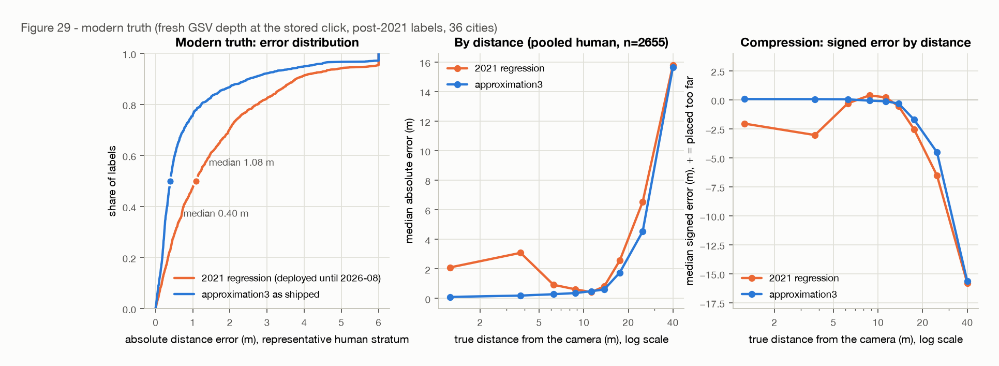

# Production sign-off: the geometric estimator as shipped, scored in both truth frames

**2026-09-02** · [SidewalkWebpage#5084](https://github.com/ProjectSidewalk/SidewalkWebpage/issues/5084) (the second experiment gate of Immersive Explore, [SidewalkWebpage#5085](https://github.com/ProjectSidewalk/SidewalkWebpage/issues/5085)) · scores what [SidewalkWebpage#4819](https://github.com/ProjectSidewalk/SidewalkWebpage/pull/4819) shipped as `approximation3` with the constants of the [modern-truth close-out](2026-08-07-modern-truth.md) · stands on the [distance refit](2026-08-07-distance-refit.md) and the [POV inversion](2026-08-06-pov-inversion.md)

| | |
|---|---|
| **0.40 m vs 1.08 m** | median distance error of the shipped estimator vs the 2021 per-zoom regression against fresh-depth truth, representative human stratum (n=1,484); pooled 0.44 vs 1.23 m. It wins at every zoom, every label type, both panorama resolutions, every capture year, and all 13 scoreable cities |
| **0.445 m [0.416, 0.470]** | the honest held-out number: re-calibrate the one height on a random half of the panoramas, score the other half, 200 times — it beats the regression in every split, and a height fitted on every *other* city beats the regression in every city |
| **1.38 m vs 1.46 m** | on the regression's own 720×480-era held-out split (n=79,029) the shipped estimator still edges it (cluster-bootstrap CI on the median difference [−0.10, −0.06] m) — carrying a −1.03 m bias that is the era truth's inflated scale, not the click geometry: that truth implies a 2.64 m camera height (2.80 m in DC), the shipped constant is 2.34 m. With the same one-parameter budget *in that frame* it wins by 0.49 m (0.98 vs 1.46) |
| **≤ 11 cm** | the geodesy decision, quantified: the 6371 km sphere every implementation uses sits at most 10.7 cm from the WGS84 geodesic at the estimator's 23.85 m largest answer (2.2 cm at the median label), and the client's turf sphere is 0.03 mm from the server's — the sphere stays, and a 58-case fixture now pins Scala, JS and SQL to it at 1e-9° |
| **0 m / 6.2 m** | the frame contract Immersive Explore needs: a click projected through its *own* viewport frame reproduces the position to the bit at any size or aspect; a 1920×1080 click read through today's 720×480 constant misses by 6.2 m at p90 |

> Reproduce every number here (offline, from the committed artifacts):
>
> ```bash
> python python/run_signoff.py build --write   # both frames, geodesy, frame contract, fixture (~2.5 min)
> python python/signoff_figures.py             # figures 29-38
> pytest tests/test_signoff_findings.py        # the findings, locked
> ```
>
> Only `run_signoff.py fetch` touches the network; its 128 imagery tiles are committed verbatim
> in `data/signoff-tiles.jsonl.gz`, so the worked examples replay from a fresh checkout.

## §1 · What is being signed off, and a correction to the premise

The issue asks for a production-adoption sign-off of the geometric estimator against the 2021
regression, framed as "new labels move to the geometric estimator; the regression stays frozen
as the method behind historical labels' estimates." **That premise is stale.** The geometric
estimator has been production since 2026-08-08:

- [SidewalkWebpage#4819](https://github.com/ProjectSidewalk/SidewalkWebpage/pull/4819) (merged
  2026-08-08) replaced the estimator for crowd and AI labels alike — `Label.js#toLatLng` on the
  client, `PanoDataService.toLatLng` on the server — stamping `computation_method =
  'approximation3'` (evolution 349). Its constants are this repo's `final_coefficients`, injected
  into the client from the backend so the browser holds no copy.
- Evolution 352 ([SidewalkWebpage#4818](https://github.com/ProjectSidewalk/SidewalkWebpage/issues/4818),
  shipped in v11.8.1 on 2026-08-13) **recomputed every stored `'approximation2'` position with
  the same formula in SQL** — a statement-for-statement port, backed up row-for-row — so
  historical crowd labels are *not* frozen on the regression. 'depth' rows (positions measured
  from GSV depth at label time, 2017–2020) were left alone because they are better than any
  estimate; evolution 366 later brought the 3,654 labels 179 had skipped onto the same path.
- A dev-database census confirms the shape: Teaneck holds 23,895 `approximation3` rows and 2
  `approximation2`; Seattle 197,330 `approximation3`, 120,094 `depth`, 499 `approximation2`.

So the estimator this report scores is the one already running, and the three items the issue
lists become: (1) the accuracy record, in both frames, sliced the way the issue asks; (2) the
geodesy decision, with the implementations pinned to it; (3) the integration contract — where
it runs, its exact inputs, and the one invariant Immersive Explore's frame decoupling must
keep. The gate's real question is whether anything in (1)–(3) argues against building on it.
Nothing does.

**Two truth frames, deliberately.** Per this repo's rule that structure fitted in one truth
frame does not count until scored in another: the *modern* frame is fresh GSV depth sampled at
the stored click pixel for 2,655 post-2021 human labels across 36 cities (the modern-truth
set, gated as in that report); the *era* frame is the 2021 regression's own published test
split, 79,029 labels whose truth is the 2017–2020 client's depth-derived positions — the
regression's home turf, and the frame the issue names. The shipped constant was calibrated on
the modern frame, which is why §3's in-sample headline is paired with §4's held-out checks and
§5's era-frame result.

## §2 · Questions

- **Q1 — Head-to-head on modern truth?** → §3: 0.40 vs 1.08 m median, better p90, a 72% paired
  win rate, and the compression curve flat where the regression's bends (fig 29). Every slice
  favours the shipped estimator (fig 31).
- **Q2 — Is the modern number honest, and does one constant generalize?** → §4: 200 pano-half
  re-calibrations land at 0.445 m [0.416, 0.470] and beat the regression in every split; a
  height fitted on the other twelve cities beats the regression in each held-out city, with the
  fitted height inside ±2 cm of the shipped one every time (fig 32).
- **Q3 — Head-to-head on the regression's home turf?** → §5: still ahead overall (1.38 vs
  1.46 m, CI excludes zero), behind on the subpopulations whose era truth implies a 2.8 m camera
  (DC, 6656-px panos), ahead by a wide margin on 8192-px panos (0.52 vs 2.25 m). The era truth's
  own scale explains the pattern (fig 30 right); at equal budget in that frame the form wins by
  0.49 m everywhere.
- **Q4 — Sphere or ellipsoid, and which sphere?** → §6: the 6371 km sphere, pinned. Centimetres
  everywhere (fig 33); the three radii in play are documented and their spread quantified.
- **Q5 — Do the three implementations agree?** → §7: a 58-case fixture, Scala and JS within
  1e-9° and 1e-8° respectively, the SQL backfill formula within 1.4e-14°.
- **Q6 — What must Immersive Explore preserve?** → §8: project the click through the frame it
  was made in. Own-frame error is 0 m on five frames from 4:3 to 21:9; the two plausible wrong
  conventions cost 0.5–2 m and 5–13 m at p90 (fig 34).
- **Q7 — What does it look like on real labels?** → §9: four rule-picked worked examples with
  imagery, depth raster and plan view (figs 35–38).

## §3 · Modern truth: the head-to-head the issue asked for

Same rows, same truth, same gates as the modern-truth report; the regression column is the
deployed per-zoom apply path recomputed from stored pixels (`A_deployed`), the shipped column
is `final_coefficients` through the production formula (the port in `signoff.py` agrees with
the harness's depression angle to 9e-15°). Median absolute distance error, signed median, p90,
paired win rate:

| population | n | 2021 regression | approximation3 as shipped | win rate |
|---|---:|---:|---:|---:|
| representative human stratum | 1,484 | 1.08 / −0.28 / 3.78 | **0.40** / −0.10 / 2.52 | 72% |
| pooled human (incl. near-horizon & rare-type quotas) | 2,655 | 1.23 / −0.47 / 5.24 | **0.44** / −0.17 / 4.13 | 72% |

The cluster-bootstrap CI (resampling panoramas, 1,000 draws) on the representative median
difference is [−0.78, −0.60] m. Bearing cannot be scored in this frame — the truth is a distance
along the ray — and is instead the exact POV inversion the [POV report](2026-08-06-pov-inversion.md)
verified against production to ≤1 px.



By slice (fig 31, left column; medians in metres, regression → shipped):

| slice | | | |
|---|---|---|---|
| **zoom** | 1: 1.12 → 0.39 (n=1,702) | 2: 1.35 → 0.54 (636) | 3: 1.68 → 0.78 (317) |
| **resolution** | 6656 px: 1.84 → 0.40 (193) | 8192 px: 1.15 → 0.45 (2,462) | |
| **label type** | CurbRamp 1.18 → 0.45 · NoCurbRamp 0.99 → 0.29 · Obstacle 1.29 → 0.58 · SurfaceProblem 1.10 → 0.42 · NoSidewalk 1.09 → 0.42 · Crosswalk 1.50 → 0.42 · Signal 3.67 → 2.42 · Occlusion 1.81 → 0.89 · Other 1.00 → 0.27 | | |
| **true distance** | 0–5 m: 2.94 → 0.18 · 5–10: 0.76 → 0.32 · 10–15: 0.62 → 0.53 · 15–20: 2.56 → 1.75 · 20–30: 6.53 → 4.53 · 30–50: 15.8 → 15.7 | | |
| **capture year** | every year 2015–2026 favours the shipped estimator; the widest gap is 2018 (1.77 → 0.55) | | |
| **city** (≥50 rows) | all 13: from cdmx 0.69 → 0.33 to taipei 2.85 → 0.59; the narrowest is paterson 1.90 → 1.48 | | |

Two things worth reading off the table. The regression's error is *not* uniform in distance:
under 5 m it places labels 2–3 m too near (the near-field of the linear compression), and its
10–15 m bin is its best because that is where the 2021 fit's constant-ish answer lands on the
data's mode — the shipped estimator's advantage is smallest exactly there (0.62 → 0.53). And
the far field (>20 m) is where *both* undershoot, because both are bounded and the truth is
not: the tail is the terrain, not the model (§8 of the modern-truth report).

Near the horizon, the same picture as before (median signed error): ≤2°: −16.3 m (regression
−19.7); 2–5°: −12.0 (−13.9); 5–11.25°: −0.67 (−1.14); 11.25–20°: −0.05 (+0.28); >20°: −0.02
(−2.02). The bounded tail's `max_answer_m` of 23.85 m is doing what it was designed to do.

## §4 · Is the modern number honest, and does one constant travel?

The shipped height is the median implied height over all 2,488 gated human rows at ≥5°, so
§3's in-sample 0.40 m is optimistic by construction. Two checks, both new here:

**Repeated hold-out.** Split the 922 panoramas in half at random, fit the height on one half
(the shipped recipe), score the other; 200 splits. The held-out median is **0.445 m** (5–95%
band 0.416–0.470), p90 4.06 m; the regression on the same held-out halves is 1.228 m
(1.141–1.335), and the shipped estimator is ahead in **all 200 splits**. The re-fitted height is
2.3405 m (2.331–2.349) — the shipped 2.3412 sits in the middle of it.

**Leave one city out.** Calibrate on every other city, score the held-out one (13 cities with
≥50 rows). The height fitted elsewhere is within 2 cm of the shipped one in every case (2.328 m
without kaohsiung, 2.347 without seattle), and the held-out-city median is below the
regression's in all 13:

| city | n | h fitted elsewhere | approx3 (LOCO) | regression |
|---|---:|---:|---:|---:|
| chicago | 462 | 2.345 | 0.385 | 1.200 |
| kaohsiung | 435 | 2.328 | 0.525 | 1.149 |
| seattle | 346 | 2.347 | 0.440 | 1.138 |
| cdmx | 230 | 2.336 | 0.336 | 0.687 |
| columbia | 165 | 2.341 | 0.355 | 1.067 |
| st_louis | 123 | 2.343 | 0.447 | 0.768 |
| taipei | 99 | 2.339 | 0.583 | 2.851 |
| teaneck | 91 | 2.342 | 0.925 | 1.918 |
| paterson | 90 | 2.343 | 1.470 | 1.899 |
| spgg | 71 | 2.342 | 0.511 | 1.949 |
| pittsburgh | 66 | 2.342 | 0.443 | 1.190 |
| mendota | 57 | 2.341 | 0.514 | 1.007 |
| amsterdam | 51 | 2.340 | 0.286 | 1.946 |


Paterson and Teaneck are the weak cities (1.47 and 0.93 m) under either estimator; they are
also the two New Jersey towns whose modern truth includes the most 'terrain'-class hits at
long range, and nothing in the calibration singles them out — the fitted height is the same
there. That is a truth-quality tail, not a rig effect, and it is the honest remainder.

## §5 · The regression's home turf

The issue's own bar: at least as accurate "on the regression's own home turf." The frame is
the published 79,029-row test split, truth = the 2017–2020 depth positions, scored exactly as
the [refit report](2026-08-07-distance-refit.md) scored its ladder (the regression as published
is the 1.4621 m continuity row; under the shared spherical scoring conventions it is 1.4438).
Lat/lng error median, signed distance median, p90, win rate vs the regression:

| model | params | median (m) | signed | p90 | win rate |
|---|---:|---:|---:|---:|---:|
| 2021 regression, as published | 15 | 1.4621 | +0.55 | 5.15 | — |
| **approximation3 as shipped** (exact heading, no era constant) | 2 | **1.3803** | −1.03 | 4.85 | 50.9% |
| approximation3, heading with the era truth's +0.72° removed | 2 | 1.3737 | −1.03 | 4.85 | 51.2% |
| same form, one height fitted on the era *train* split (2.635 m) | 1 | **0.9750** | −0.15 | 4.44 | 63.9% |
| the refit's chosen 8-parameter era rung (continuity) | 8 | 0.9335 | +0.08 | 4.48 | 66.3% |
| zero-parameter anchor, 2.6 m/tan | 0 | 0.9910 | −0.07 | 4.62 | 60.9% |

Cluster-bootstrap CIs on the median difference vs the regression: shipped [−0.103, −0.061] m;
era-calibrated [−0.502, −0.473] m. So the bar is met as stated — the shipped estimator is more
accurate on the regression's own split — but the interesting number is the −1.03 m bias, and
the interesting slices are the ones the shipped estimator *loses*:

| slice | regression | shipped | era-calibrated |
|---|---:|---:|---:|
| zoom 1 (n=57,612) | 1.387 | 1.287 | 0.918 |
| zoom 2 (14,468) | 1.637 | 1.562 | 1.069 |
| zoom 3 (6,949) | 1.982 | **2.247** | 1.421 |
| DC, no pano metadata (46,543) | 1.109 | **1.687** | 0.978 |
| 6656-px panos (7,460) | 1.177 | **1.629** | — |
| 8192-px panos (24,964) | 2.251 | 0.521 | — |
| CurbRamp (37,924) | 1.253 | **1.448** | — |
| SurfaceProblem (6,515) | 1.710 | 0.837 | — |
| seattle (19,871) | 2.245 | 0.536 | 1.035 |
| newberg (3,229) | 1.004 | **1.803** | 0.881 |

The pattern is one number: **the era truth's own scale.** Following the rule this repo adopted
after the GBM episode — ask what the truth's scale does along the axis the model leans on — the
camera height the era truth *implies* (median of truth × tan depression, ≥5°) is 2.64 m
overall, and it is not one value: **2.80 m for DC**, 2.79 m for 6656-px panoramas, 2.86 m for
newberg, but **2.35 m for 8192-px panoramas** and 2.35 m for seattle. The modern-truth report
traced this to the era payloads' pinned 2.50 m ground planes (68% of 2017–2020 payloads) plus
the terrain model's curb overshoot; modern payloads measure the plane at 2.35 m. The shipped
constant is 2.34 m. So on the subpopulations whose era truth is on the modern scale (8192-px
panos, seattle, cdmx, columbus, pittsburgh, spgg) the shipped estimator wins by a factor of
two to four; on the ones whose truth carries the pinned-plane scale (DC, 6656-px, newberg) it
reads ~13% too near and loses. **The two frames cannot both be satisfied, and the modern one is
the measured one** — that was the close-out's decision and this report does not reopen it. What
the era frame adds is the equal-budget row: given the *same* one parameter fitted the same way
on the era train split, the form beats the regression by half a metre on every slice, which is
the cleanest statement that the form, not the calibration, is what carries the accuracy.


One more check this frame allows and the modern one does not: the **production record path**.
For the 32,486 test rows that carry evolution 179's `pano_x/pano_y` and pano metadata, running
the stored record through `calculatePovFromPanoXY` → blend → destination (what 352.sql does)
lands within **1.0 cm median, 2.7 cm p90** of the harness path from the canvas click, and the
depression angles agree to 3e-5° median. Whatever position the SQL backfill wrote, it is the
same position the client would have computed.

## §6 · Geodesy: the decision, quantified and pinned

Three sphere radii are in play and the repo's notes flagged sphere-vs-ellipsoid as open:

| where | model | radius |
|---|---|---:|
| `CommonUtils.calculateDestination` (Scala, AI labels) and 352.sql (the backfill) | sphere | 6371.000 km |
| `turf.destination` (the Explore client, every crowd label) | sphere | 6371.0088 km |
| this repo's `spherical_dest` / `haversine_m` (every report's scoring) | sphere | 6378.137 km |
| `geosphere::destPoint` (the 2021 R analysis) | WGS84 ellipsoid | — |

Measured over every deployed city's latitude (19° to 52°), every bearing, and every distance
the estimator can return (fig 33):

- **Sphere vs WGS84 geodesic**, worst bearing: 2.2 cm at 5 m, **10.7 cm at the 23.85 m largest
  answer** (cdmx, the lowest-latitude city; 7.7 cm at amsterdam), 22 cm at the 50 m cap that
  cannot bind. The mechanism is the closed form in fig 33's right panel: 6371 km vs the local
  meridional radius (−0.07% at amsterdam to +0.45% at cdmx north–south) and prime-vertical
  radius (−0.15% to −0.32% east–west).
- **turf vs the production sphere**: 1.4 ppm of radius → **0.03 mm** at the largest answer. The
  client and the server agree to far below anything stored.
- **This repo's scoring sphere vs production**: 0.11% → 2.7 cm at the largest answer, 5.6 cm at
  50 m. It affects how a *reported* error converts to metres by ~0.1%, i.e. 0.4 mm on a 0.4 m
  median; no published number moves.

**Decision: spherical, on the 6371 km mean radius, everywhere.** The justification is the
budget: the largest geodesy term the estimator can incur is an order of magnitude under its own
0.4 m median error and under the near-horizon tail it lives with, and a geodesic destination
would buy that back only by making three implementations carry an ellipsoid (turf's
`rhumbDestination`/geodesic variants, a Scala port, and Vincenty in SQL) for a change no
consumer could see — `label_point.lat/lng` are consumed by PostGIS geography operations that
are themselves ellipsoidal, and a 10 cm placement offset at 24 m is well inside the street
attachment and clustering tolerances. It is pinned two ways in SidewalkWebpage: the parity
fixture (§7) is generated on 6371 km and every implementation must reproduce it, and
`LatLngEstimationParitySpec` asserts `EARTH_RADIUS_KM == 6371.0` with the reasoning attached.


## §7 · Three implementations, one fixture

`python/run_signoff.py fixture` writes 58 cases — the seam at `pano_x = 0` and `width − 1`, a
negative unwrapped heading, the blend angle from both sides, the horizon and a click above it
(the bounded tail, 23.848261259830384 m), the nadir, both hemispheres and the antimeridian side,
plus 48 random clicks over four panorama resolutions and eight city locations — with reference
outputs from the Python port of the production formula on the 6371 km sphere. Against it, on
2026-09-02:

| implementation | held to | result |
|---|---|---|
| Scala `PanoDataService.calculatePovFromPanoXY` → `estimateDistanceFromPanoM` → `toLatLng` | 1e-9° / 1e-9 m | `LatLngEstimationParitySpec`, 3 tests, all 58 cases pass |
| JS `Label#toLatLng` with the real vendored turf 7.3.4 | 1e-8° (the turf radius gap is 3e-10°) | `latLngEstimationParity.test.js`, 58/58 pass |
| SQL: 352.sql's `angles`/`distances`/`new_latitudes`/`new_positions` CTEs on the fixture | measured | max |Δlat| = 1.4e-14°, max |Δlng| = 1.4e-14°, max |Δdist| = 8.9e-15 m |

The fixture is regenerated from `final_coefficients` rather than committed here; the Scala spec
also asserts the fixture's constants equal `LatLngEstimation`'s, so a refit that changes them
fails the spec until the fixture is regenerated in the same change.

## §8 · The frame contract Immersive Explore must keep

The estimator's only inputs are two angles — the bearing and the depression of the stored
pano pixel — so a viewport of any size gives the same answer *if the click is turned into that
pixel through the frame it was made in*. `canvasCoordToCenteredPov(pov, x, y, width, height)`
already takes the frame as parameters; today every caller passes the 720×480 constants
(`util.EXPLORE_CANVAS_WIDTH/HEIGHT`), and the Scala port `calculatePovIfCentered` hardcodes
`LabelPointTable.canvasWidth/Height`. That constant is the thing SidewalkWebpage#5085's
workstream B replaces with a per-label `canvas_width/canvas_height`.

The sweep (fig 34): 387 label directions at placeable depressions, projected onto five frames
from 4:3 to 21:9, then inverted three ways.

| frame | own frame | scaled axis-by-axis into 720×480 (p50 / p90) | scaled by width, read as 720×480 (p50 / p90) |
|---|---:|---:|---:|
| 720×480 (today) | 0 m | 0 / 0 | 0 / 0 |
| 1280×720 | 0 m | 0.65 / 0.77 | 4.19 / 6.17 |
| 1920×1080 | 0 m | 0.65 / 0.77 | 4.19 / 6.17 |
| 2560×1080 (21:9) | 0 m | 1.70 / 2.09 | 8.57 / 12.9 |
| 1440×1080 (4:3) | 0 m | 0.46 / 0.53 | 1.93 / 4.90 |

Read it as three facts. **Uniform scaling is free**: 1280×720 and 1920×1080 give identical
numbers because focal length, `du` and `dv` all scale with the frame, which is why the existing
`--ui-scale` zoom of the boxed tool has never needed a correction. **Aspect is not**: the
axis-by-axis convention keeps the horizontal field right (GSV pins horizontal FOV per zoom —
[#5083](https://github.com/ProjectSidewalk/SidewalkWebpage/issues/5083)) but stretches the
vertical one, so pitch is wrong by the aspect ratio's worth and the label moves 0.5–2 m. And
the **height-mismatch convention is catastrophic**: a width-scaled 16:9 click has 405 rows of
frame but is read against a 480-row one, a 37.5 px vertical offset at f = 360 px is 5.9° of
pitch, and at a 10° depression that is metres. Storing the frame per label and threading it
through every consumer, exactly as the issue plans, reduces all of this to the zero column.
(The clamp regime #5083 characterised — portrait shapes, and beyond 21:9 at zoom 3 — changes the
effective horizontal FOV rather than the frame math, and is that report's three-line model to
apply before the projection; it does not touch anything here.)


## §9 · Worked examples

Four labels, picked by rule from the representative stratum (2022+ captures so the imagery is
still served, regression error > 1 m, shipped error < 0.5 m where such a row exists): a close
curb ramp, a mid-range surface problem, a far near-horizon label, and a zoom-3 label. Each
figure shows the stored click on the panorama, a crop, the depth raster the truth was read
from, and a plan view along the label's bearing.

| # | label | zoom | depression | truth | regression | shipped | stored (pre-352) |
|---|---|---:|---:|---:|---:|---:|---:|
| 1 | kaohsiung 63747, CurbRamp | 3 | 21.0° | 6.16 m | 0.30 m | **6.10 m** | 0.21 m |
| 2 | burnaby 1654, SurfaceProblem | 1 | 13.5° | 9.26 m | 10.34 m | **9.76 m** | 10.34 m |
| 3 | paterson 37127, CurbRamp | 1 | 3.7° | 22.30 m | 16.32 m | **19.91 m** | 15.95 m |
| 4 | gainesville 26759, Crosswalk | 3 | 21.3° | 6.13 m | 0.00 m | **6.00 m** | 0.00 m |

Examples 1 and 4 are the zoom-3 failure the regression's per-zoom intercept produces: at zoom
3 the linear fit's answer for a steep click goes *negative* and is floored at zero, so the label
was stored on the camera (the "stored" column is the pre-352 position, 0.21 m and 0.00 m from
the panorama). Example 3 is the honest limit: at 3.7° both are bounded and the truth is 22 m
away; the shipped estimator's 19.9 m is its tail, 2.4 m short, where the regression is 6 m short.


## §10 · The sign-off, and what is deliberately not claimed

**Signed off.** The estimator SidewalkWebpage runs as `approximation3` is at least as accurate
as the 2021 regression on the regression's own held-out split (1.38 vs 1.46 m, CI excludes
zero) and under half its error against measured modern truth (0.40 vs 1.08 m; 0.445 m honest
held-out), with no slice on modern truth where it loses and a calibration that transfers city
to city. Its geodesy is settled and pinned, its three implementations agree to floating-point
noise on a committed fixture, and the only integration invariant Immersive Explore has to keep
is the one its design already states: the click is projected through the frame it was made in.
Historical labels are already on this estimator (352), so nothing about the frame decoupling
needs a second code path for old rows — they have a 720×480 frame, and once `canvas_width/
canvas_height` exist that is simply the value they carry.

**Not claimed.**

- *An absolute reference beyond GSV's geometry.* Both frames are Google's depth planes
  (measured or pinned); bearing-only triangulation ([#7](2026-08-08-bearing-only-triangulation.md))
  remains the independent path, and it brackets the shipped height to ~8% without confirming it
  more tightly.
- *Bearing accuracy on modern truth.* The depth truth is a range along the ray; the bearing half
  rests on the POV report's ≤1 px replay of production, not on this report's data.
- *The far field.* Beyond ~15 m every bounded estimator undershoots and the truth itself is
  weakest; the tail's 23.85 m bound is a policy, and this report finds no reason to revisit it.
- *A DC verdict.* DC's era truth implies a 2.80 m camera, its panoramas carry no metadata, and it
  has no schema in the current production database; the loss there is the era frame's scale,
  and there is no modern truth for DC to settle it against.
- *Anything about non-GSV imagery.* Mapillary and Infra3D rigs need a per-source height (the
  falsification's §8 recipe); every number here is GSV.

## Reproducing this report

```bash
pip install -r python/requirements.txt
python python/run_signoff.py build --write   # ~2.5 min, offline, deterministic
python python/signoff_figures.py             # figs 29-38 (reads data/signoff-cache/ from build)
pytest tests/test_signoff_findings.py        # 13 findings, incl. an in-process re-derivation
python python/run_signoff.py fixture <path>  # the parity fixture SidewalkWebpage's tests consume
```

---

*Report generated with [Claude Code](https://claude.com/claude-code) — Fable 5.1, claude-fable-5-1;
every headline number is asserted by `tests/test_signoff_findings.py` against
`data/signoff-summary.json`, which regenerates deterministically from the committed data.*
