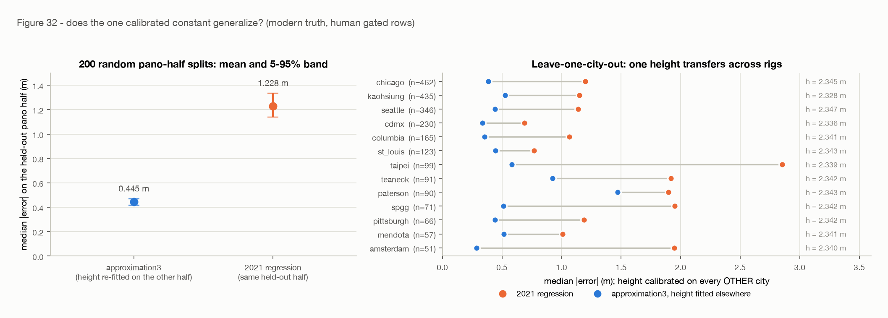
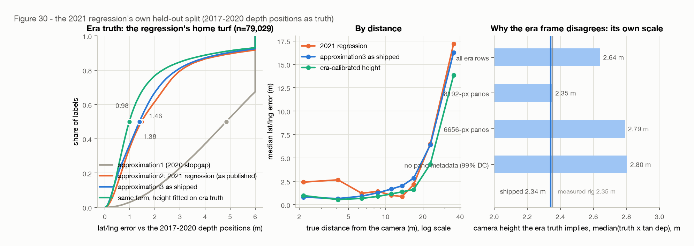
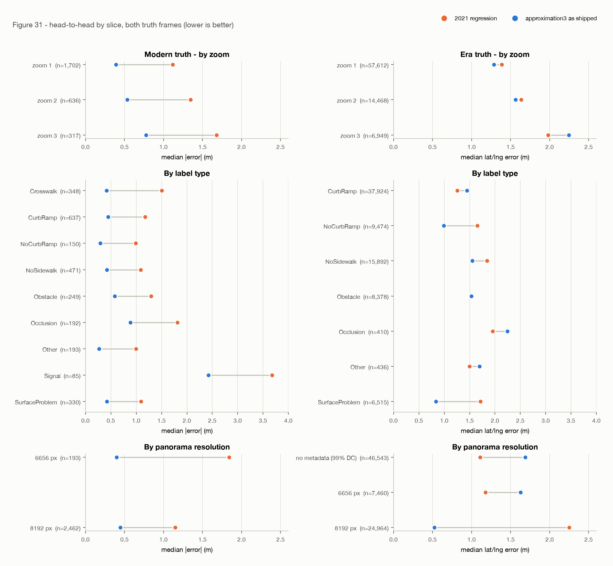
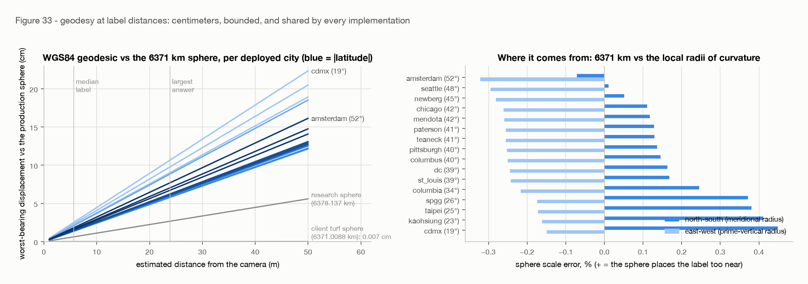
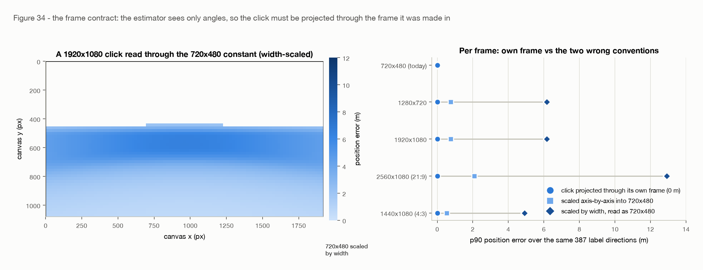
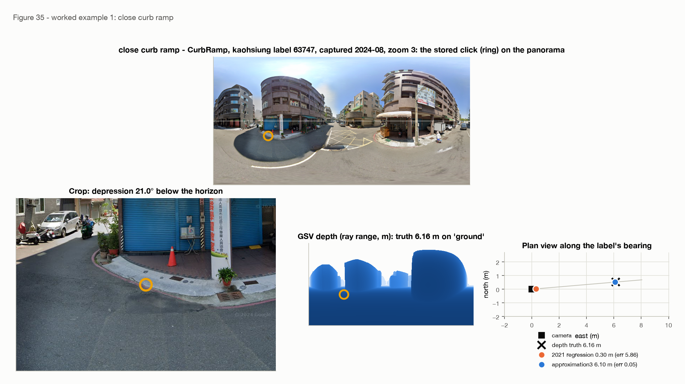
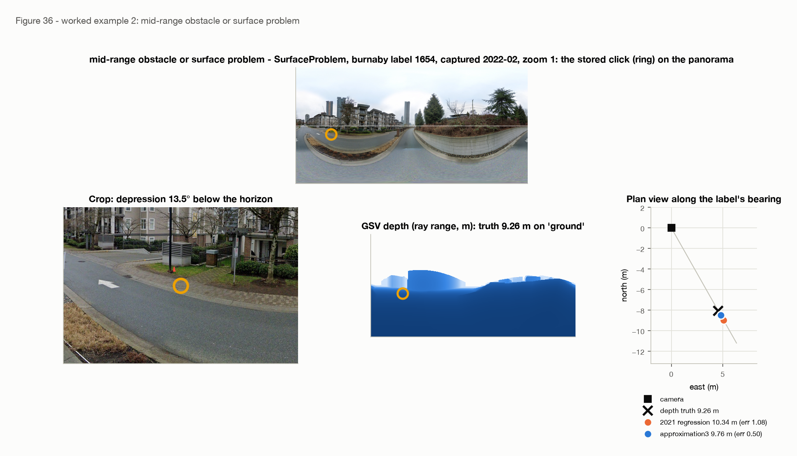
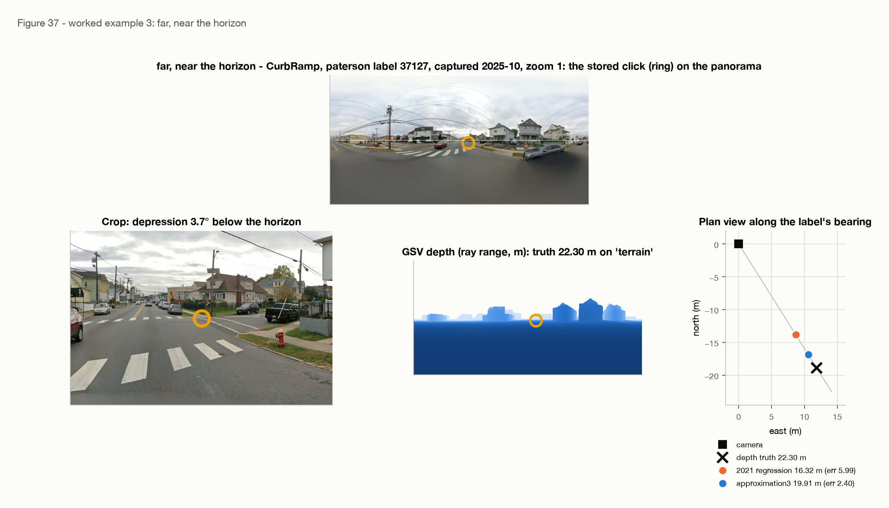
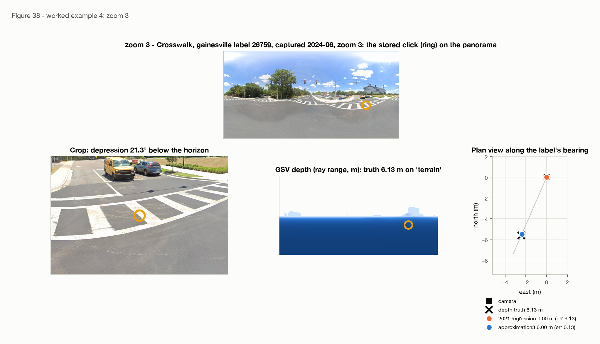

# Production sign-off: the geometric estimator as shipped, scored in both truth frames

**2026-09-02**, revised 2026-09-03 · [SidewalkWebpage#5084](https://github.com/ProjectSidewalk/SidewalkWebpage/issues/5084) (the second experiment gate of Immersive Explore, [SidewalkWebpage#5085](https://github.com/ProjectSidewalk/SidewalkWebpage/issues/5085)) · scores what [SidewalkWebpage#4819](https://github.com/ProjectSidewalk/SidewalkWebpage/pull/4819) shipped as `approximation3` with the constants of the [modern-truth close-out](2026-08-07-modern-truth.md) · stands on the [distance refit](2026-08-07-distance-refit.md) and the [POV inversion](2026-08-06-pov-inversion.md)

| | |
|---|---|
| **0.40 m vs 1.08 m** | median distance error of `approximation3` vs `approximation2` (the 2021 per-zoom regression) against fresh-depth truth, representative human stratum (n=1,484); pooled 0.44 vs 1.23 m. `approximation1`, the 2020 stopgap, scores 3.57 m on the same rows. `approximation3` wins at every zoom, every label type, both panorama resolutions, every capture year, and all 13 scoreable cities |
| **0.445 m [0.416, 0.470]** | the honest held-out number: re-calibrate the one height on a random half of the panoramas, score the other half, 200 times. It beats the regression in every split, and a height fitted on every *other* city beats the regression in every city |
| **1.38 m vs 1.46 m** | on the regression's own 720×480-era held-out split (n=79,029) the shipped estimator still edges it (cluster-bootstrap CI on the median difference [−0.10, −0.06] m), carrying a −1.03 m bias that is the era truth's inflated scale, not the click geometry. With the same one-parameter budget *in that frame* it wins by 0.49 m (0.98 vs 1.46). `approximation1` scores 4.84 m there, the 2021 analysis's own number for it |
| **R² = 0.045** | the rig-tilt check the 2020–2022 crop work asked for: how much of the label-implied camera height the panorama's pitch and roll explain, projected onto the label's bearing. A raster misaligned by the full rig tilt would move the height 0.17 m per degree; the fitted slopes are 0.02 (pitch) and 0.04 m/° (roll), and the same signature is what road slope produces in a rectified frame |
| **≈ 2× the floor** | how far the shipped estimator sits above the ideal: one click at 0.3° noise can resolve 0.16 m at 10 m and 0.35 m at 15 m, and `approximation3` measures 0.32 and 0.53 m there. Past 15 m the gap opens, where the bounded tail meets a truth no single click can reach (§5.4, the dotted line and shaded band on fig 29) |
| **≤ 11 cm** | the geodesy decision, quantified: the 6371 km sphere every implementation uses sits at most 10.7 cm from the WGS84 geodesic at the estimator's 23.85 m largest answer (2.2 cm at the median label), and the client's turf sphere is 0.03 mm from the server's. The sphere stays, and a 58-case fixture pins Scala, JS and SQL to it at 1e-9° |
| **0 m / 6.2 m** | the frame contract Immersive Explore needs: a click projected through its *own* viewport frame reproduces the position to the bit at any size or aspect; a 1920×1080 click read through today's 720×480 constant misses by 6.2 m at p90 |

> Reproduce every number here (offline, from the committed artifacts):
>
> ```bash
> python python/run_signoff.py build --write   # both frames, geodesy, frame contract, fixture (~2.5 min)
> python python/signoff_figures.py             # figures 29-38
> pytest tests/test_signoff_findings.py        # the findings, locked
> ```
>
> Only `run_signoff.py fetch` touches the network; its 128 imagery tiles are committed verbatim
> in `data/signoff-tiles.jsonl.gz`, so the worked examples replay from a fresh checkout.

## §1 · Goals

The issue asks for a production-adoption sign-off of the geometric estimator against the 2021
regression, framed as "new labels move to the geometric estimator; the regression stays frozen
as the method behind historical labels' estimates." **That premise is stale.** The geometric
estimator has been production since 2026-08-08:

- [SidewalkWebpage#4819](https://github.com/ProjectSidewalk/SidewalkWebpage/pull/4819) (merged
  2026-08-08) replaced the estimator for crowd and AI labels alike, `Label.js#toLatLng` on the
  client and `PanoDataService.toLatLng` on the server, stamping `computation_method =
  'approximation3'` (evolution 349). Its constants are this repo's `final_coefficients`, injected
  into the client from the backend so the browser holds no copy.
- Evolution 352 ([SidewalkWebpage#4818](https://github.com/ProjectSidewalk/SidewalkWebpage/issues/4818),
  shipped in v11.8.1 on 2026-08-13) **recomputed every stored `'approximation2'` position with
  the same formula in SQL**, a statement-for-statement port backed up row for row, so historical
  crowd labels are *not* frozen on the regression. `'depth'` rows (positions measured from GSV
  depth at label time, 2017–2020) were left alone because they are better than any estimate;
  evolution 366 later brought the 3,654 labels 179 had skipped onto the same path.
- A dev-database census confirms the shape: Teaneck holds 23,895 `approximation3` rows and 2
  `approximation2`; Seattle 197,330 `approximation3`, 120,094 `depth`, 499 `approximation2`.

So this report's goals are the three the issue lists, restated for the estimator that is
already running, plus one that the review of its first draft added:

1. **The accuracy record**, head to head with every method that has ever stamped
   `computation_method`, in both truth frames the repo holds, sliced by zoom, label type,
   distance, resolution, capture year and city, with honest held-out and transfer checks.
2. **The geodesy decision** (sphere or ellipsoid, and which sphere), quantified at the
   distances the estimator can return and pinned so three implementations cannot drift.
3. **The integration contract** Immersive Explore's viewport decoupling must keep.
4. **A tilt check.** The lab's 2020–2022 undergraduate work on placing labels on panoramas
   ended on an open question about rig pitch and roll; this report tests whether that error
   reaches the estimator, on data that now carries both angles.

The gate's real question is whether anything in (1)–(4) argues against building on the shipped
estimator. Nothing does.

## §2 · Research questions

- **RQ1** How accurate is each production method against modern, measured truth, and does
  `approximation3` win uniformly or only on average? → §4.1
- **RQ2** Is the modern number honest (the shipped constant was fitted on that frame), and does
  one calibration constant transfer across cities and rigs? → §4.2
- **RQ3** Is `approximation3` at least as accurate as `approximation2` on the regression's own
  home turf, the 2017–2020 held-out split, and where it is not, why? → §4.3
- **RQ4** Does the rig's tilt (pitch, roll) leak into the estimator's error? → §4.4
- **RQ5** Sphere or ellipsoid, and which sphere; how much can the choice move a label? → §4.5
- **RQ6** Do the client, server and backfill implementations compute the same position? → §4.6
- **RQ7** What must a resizable viewport preserve for the estimate to stay correct? → §4.7
- **RQ8** What do the estimators do on real labels a reader can look at? → §4.8

## §3 · Method

### §3.1 The estimators under comparison

Four values have ever been written to `label_point.computation_method`. Three are candidates
here; the fourth is the era truth.

| `computation_method` | introduced | formula | inputs | fitted params |
|---|---|---|---|---:|
| `depth` | 2017; API withdrawn Nov 2020 ([#2374](https://github.com/ProjectSidewalk/SidewalkWebpage/issues/2374)) | position read from Google's per-panorama depth map at the click's pixel | depth payload | 0 |
| `approximation1` | evolution 93, 2020-11-13 | 10 m along the **viewport** heading, flat-earth offsets (111,111 m/°) | viewport heading | 0 |
| `approximation2` | evolution 98, 2021-01-12 | per zoom z: `d = a_z + b_z·sv_image_y + c_z·canvas_y`, `Δheading = d_z + e_z·canvas_x` | click pixel, viewport POV, zoom | 15 |
| `approximation3` | evolutions 349/352, 2026-08 | `d = h / tan(dep)` blended at 11.25° into a matched-slope linear tail, bearing and depression exact from the pano pixel | pano pixel, pano size, camera heading | 2 |

`approximation1` was a stopgap written the week the depth API died; every row it produced was
overwritten by evolution 98 two months later, so no `approximation1` row survives anywhere. It
is included because the 2021 analysis scored it (as "estimate 1", 4.84 m) and because a
comparison of approximation1, 2 and 3 should say so in the production vocabulary rather than
this repo's (`est1`, `est7`/`A_deployed`, `approx3`). `approximation2` appears in two guises
that are the same coefficients on different inputs: *as published* (fixed-frame `sv_image_y`,
the era's own predictor) on the era split, and *as deployed until 2026-08* (real-raster pixels
through the per-zoom coefficients, the apply path `PanoDataService` ran) on the modern set.
Three reference rungs from the [distance refit](2026-08-07-distance-refit.md) travel alongside
on the era split: the same form with one height fitted on the era train split (the equal-budget
comparator), the refit's chosen 8-parameter per-type blend (continuity), and the zero-parameter
`2.6 m / tan(dep)` anchor.

### §3.2 Ground truth: where it comes from and what it is

Nothing in this project is surveyed. Every truth value is Google's own scene geometry, obtained
two ways, and the design of the comparison follows from that.

**The modern frame** (RQ1, RQ2, RQ4): fresh GSV depth payloads fetched in August 2026 for the
panoramas of 3,286 post-2021 human labels, sampled at the *stored click pixel* `pano_x/pano_y`.
A payload is not a raster: it is a list of planes (normal, distance) plus a 512×256 grid of
plane indices. Truth is the horizontal ground distance from the camera to where the click's ray
meets its plane, camera-relative so that origin drift cannot move it, and independent of any
camera height. Gates, in order: the ray must land on a ground or terrain plane (facade, sky
and oblique hits excluded, 11.6%), the 3×3 neighbourhood must agree, and the value must be
finite and under the 50 m cap. 2,655 human labels across 36 cities survive; 1,484 of them are
the *representative* stratum (a uniform draw over human panoramas, 150 per city), the rest are
deliberate over-samples of near-horizon clicks and rare label types, so the two are reported
separately. Provenance, sampling frame, fetch attrition and the three frame proofs are in the
[modern-truth report](2026-08-07-modern-truth.md) §3–§4; the payload bytes are committed
verbatim (`data/modern-truth-payloads.jsonl.gz`) and every truth value re-reads from them.

**The era frame** (RQ3): the 2021 regression's own published test split, 79,029 of the 395,147
cleaned 2017–2020 labels from seven cities, whose truth is the stored `lat/lng` the
*2017–2020 client* computed at label time from the depth API (`computation_method = 'depth'`).
"True distance" is the haversine distance from the stored panorama position to that stored
label position. The 2021 analysis's input CSVs were lost; the committed files are a
reconstruction from production that reproduces the 2021 cleaning to the row
([recovery report](2026-08-05-recovery-and-verification.md)).

**What GSV depth is, and therefore what "error" means.** The
[depth-validation report](2026-08-06-depth-validation.md) registered the payloads against the
panoramas' own imagery (served by a different Google host) and found them authentic and in the
frame the client assumes, but a *constructed model*, not a measurement: camera height plus
flat earth, plus building facades, minus everything that moves. Under a Sidewalk label 91% of
ground pixels are within 1 m of `h / tan(depression)`. Its known systematics travel with every
number here:

- *Pinned ground planes.* Google either measures the ground plane or pins it at exactly 2.50 m.
  68% of 2017–2020 payloads are pinned, 27–31% of modern ones; the measured modern plane sits at
  2.35 m. A truth read off a pinned plane is 6% too far at a given depression, which is the
  single fact behind the era frame's disagreements in §4.3.
- *Curb overshoot.* A ramp sits ~0.15 m above the modelled road, so the ray overshoots by
  `0.15·d/h`, about 0.5 m at typical distances in the era payloads; modern payloads largely hug
  the ramp (correcting for it now *worsens* the bias).
- *Occlusion.* 2 of 36 adjudicated labels sit on something the model omits (a parked car, a
  hedge), so the payload returns the ground behind it: a clustered, signed tail.
- *Frame.* The era client's depth lookup ceiled to the next grid column, biasing era bearings
  by +0.72°; the harness models that at score time and it must never ship (POV report §4).

**Why stored positions are not truth.** Every post-2021 stored position is an estimator's own
output (97.6% reproduce their era's formula within 0.5 m), so scoring against them is
self-grading; the modern-truth report's circularity guard measured this and no comparison here
touches stored coordinates except that guard.

**What would be independent.** Bearing-only triangulation
([#7](2026-08-08-bearing-only-triangulation.md)) uses no depth at all and brackets the shipped
height to ~8%; surveyed curb-ramp inventories would be the external anchor and are scoped, not
run. This report claims accuracy relative to Google's measured planes and nothing beyond that
(§6).

### §3.3 Data

| set | rows | panoramas | cities | truth | predictors available |
|---|---:|---:|---:|---|---|
| modern, gated human | 2,655 (1,484 representative) | 922 | 36 (13 with ≥50 rows) | fresh depth at the stored pixel | `pano_x/pano_y`, pano size, camera heading, viewport POV and canvas click, zoom, fresh pitch and roll |
| era, published test split | 79,029 | — | 7 | 2017–2020 client's depth positions | canvas click, viewport POV, zoom, fixed-frame `sv_image_x/y`; evolution-179 `pano_x/pano_y` for 32,486 rows |

Cleaning is the 2021 pipeline's (≤20 labels per pano, ≤50 m, valid coordinates, not deleted) on
the era side and the modern-truth gates on the modern side. DC is 58% of the era split and has
no metadata and no modern truth; it is reported, not interpreted.

### §3.4 Scoring

- **Metrics.** Median absolute distance error (modern frame, where the truth is a range along
  the ray and bearing cannot be scored) or lat/lng error (era frame), the signed median, the
  90th percentile, and the paired win rate against the incumbent `approximation2`. Every slice
  table in the summary carries all of them; the text quotes medians.
- **Uncertainty.** Cluster bootstrap on the median difference, resampling panoramas (1,000
  draws) so the several labels on one panorama are not counted as independent.
- **The calibration-budget rule** ([CLAUDE.md](../CLAUDE.md)): the shipped constant was fitted
  on the modern frame, so (a) its modern headline is paired with a repeated pano-half hold-out
  (200 splits, height refitted on one half, scored on the other) and a leave-one-city-out
  transfer, and (b) on the era frame it is scored both as shipped and with the same single
  parameter refitted on the era *train* split, so the form and the calibration are judged
  separately.
- **The truth's scale.** Wherever a frame disagrees with the estimator, the camera height the
  truth *implies* (median of `truth × tan(depression)` at ≥5°) is reported per subpopulation,
  because a truth whose implied height is not constant along an axis cannot be satisfied by
  any estimator without a parameter on that axis.
- **Tilt (RQ4).** With the label's bearing `b` and the pano's pitch `p` and roll `r`, the
  rig's tilt projected onto the label's direction is `T = p·cos(b − heading) + r·sin(b −
  heading)`. If the stored `pano_y` (which treats the pano as level) were read against a
  rig-aligned raster, the depression would be off by `T` and the implied height would move by
  `truth·sec²(dep)·π/180` per degree, the distance by `h·π/180 / sin²(dep)`. Both projections
  are fitted jointly on the implied height and on the signed residual (Google's sign
  conventions are undocumented; a flip only flips a coefficient), the implied height is binned
  by |T| so a sign-symmetric effect cannot hide in a slope, and a pano-level control
  correlates the depth payload's ground-plane tilt with the rig tilt magnitude. Pitch and roll
  come from the modern truth's fresh metadata fetch (`fresh_pitch_deg`, `fresh_roll_deg` in
  `modern-truth-panos.csv.gz`, the latter served unwrapped in [0, 360)); the database's own
  `camera_roll` is empty for every GSV row.
- **Geodesy (RQ5).** Destination points on the production sphere (6371.000 km), turf's
  (6371.0088 km), the harness's (6378.137 km) and the WGS84 geodesic (Vincenty), over every
  deployed city's latitude, all bearings in 5° steps, and every distance the estimator can
  return; the worst-bearing displacement is reported.
- **Parity (RQ6).** A 58-case fixture with reference outputs from a Python port of the
  production formula; Scala, JS (with the vendored turf) and evolution 352's SQL are run on it.
- **Frame contract (RQ7).** 387 label directions projected onto five viewport frames from 4:3
  to 21:9 and inverted three ways (own frame; scaled axis-by-axis into 720×480; scaled by width
  and read as 720×480).
- **Examples (RQ8).** Four labels picked by rule (2022+ captures, `approximation2` error > 1 m,
  `approximation3` error < 0.5 m where such a row exists), one per regime.

### §3.5 Reproducibility

`python/signoff.py` holds the analysis, `run_signoff.py build` regenerates
`data/signoff-summary.json` offline in ~2.5 minutes, `tests/test_signoff_findings.py` asserts
every headline below against that JSON and re-derives the modern frame in-process, and
`signoff_figures.py` draws figures 29–38 from the build's per-row cache and the committed tiles.

## §4 · Findings

### §4.1 RQ1: modern truth, all three methods

Same rows, same truth, same gates as the modern-truth report. Median absolute distance error,
signed median, p90, and paired win rate against `approximation2`:

| population | n | `approximation1` | `approximation2` (deployed apply path) | `approximation3` as shipped | win rate |
|---|---:|---:|---:|---:|---:|
| representative human stratum | 1,484 | 3.57 / +1.69 / 7.60 | 1.08 / −0.28 / 3.78 | **0.40** / −0.10 / 2.52 | 72% |
| pooled human (incl. near-horizon & rare-type quotas) | 2,655 | 3.70 / +0.75 / 11.35 | 1.23 / −0.47 / 5.24 | **0.44** / −0.17 / 4.13 | 72% |

`approximation1`'s number is its distance half only: its bearing (the viewport heading rather
than the label's) cannot be scored in this frame and adds several metres more on the era split
(§4.3); it beats `approximation2` on 13% of labels, the ones that happen to sit near 10 m. The
cluster-bootstrap CI on the representative median difference between `approximation3` and
`approximation2` is [−0.78, −0.60] m. Bearing for the other two is the exact POV inversion the
[POV report](2026-08-06-pov-inversion.md) verified against production to ≤1 px.


By slice (fig 31, left column; medians in metres, `approximation2` → `approximation3`):

| slice | | | |
|---|---|---|---|
| **zoom** | 1: 1.12 → 0.39 (n=1,702) | 2: 1.35 → 0.54 (636) | 3: 1.68 → 0.78 (317) |
| **resolution** | 6656 px: 1.84 → 0.40 (193) | 8192 px: 1.15 → 0.45 (2,462) | |
| **label type** | CurbRamp 1.18 → 0.45 · NoCurbRamp 0.99 → 0.29 · Obstacle 1.29 → 0.58 · SurfaceProblem 1.10 → 0.42 · NoSidewalk 1.09 → 0.42 · Crosswalk 1.50 → 0.42 · Signal 3.67 → 2.42 · Occlusion 1.81 → 0.89 · Other 1.00 → 0.27 | | |
| **true distance** | 0–5 m: 2.94 → 0.18 · 5–10: 0.76 → 0.32 · 10–15: 0.62 → 0.53 · 15–20: 2.56 → 1.75 · 20–30: 6.53 → 4.53 · 30–50: 15.8 → 15.7 | | |
| **capture year** | every year 2015–2026 favours the shipped estimator; the widest gap is 2018 (1.77 → 0.55) | | |
| **city** (≥50 rows) | all 13: from cdmx 0.69 → 0.33 to taipei 2.85 → 0.59; the narrowest is paterson 1.90 → 1.48 | | |

Two things worth reading off the table. The regression's error is *not* uniform in distance:
under 5 m it places labels 2–3 m too near (the near field of the linear compression), and its
10–15 m bin is its best because that is where the 2021 fit's constant-ish answer lands on the
data's mode; the shipped estimator's advantage is smallest exactly there (0.62 → 0.53). And the
far field (>20 m) is where *both* undershoot, because both are bounded and the truth is not:
the tail is the terrain, not the model (§8 of the modern-truth report).

Near the horizon (median signed error): ≤2°: −16.3 m (`approximation2` −19.7); 2–5°: −12.0
(−13.9); 5–11.25°: −0.67 (−1.14); 11.25–20°: −0.05 (+0.28); >20°: −0.02 (−2.02). The bounded
tail's `max_answer_m` of 23.85 m is doing what it was designed to do.

### §4.2 RQ2: is the modern number honest, and does one constant travel?

The shipped height is the median implied height over all 2,488 gated human rows at ≥5°, so
§4.1's in-sample 0.40 m is optimistic by construction. Two checks:

**Repeated hold-out.** Split the 922 panoramas in half at random, fit the height on one half
(the shipped recipe), score the other; 200 splits. The held-out median is **0.445 m** (5–95%
band 0.416–0.470), p90 4.06 m; the regression on the same held-out halves is 1.228 m
(1.141–1.335), and the shipped estimator is ahead in **all 200 splits**. The re-fitted height is
2.3405 m (2.331–2.349); the shipped 2.3412 sits in the middle of it.

**Leave one city out.** Calibrate on every other city, score the held-out one (13 cities with
≥50 rows). The height fitted elsewhere is within 2 cm of the shipped one in every case (2.328 m
without kaohsiung, 2.347 without seattle), and the held-out-city median is below the
regression's in all 13:

| city | n | h fitted elsewhere | `approximation3` (LOCO) | `approximation2` |
|---|---:|---:|---:|---:|
| chicago | 462 | 2.345 | 0.385 | 1.200 |
| kaohsiung | 435 | 2.328 | 0.525 | 1.149 |
| seattle | 346 | 2.347 | 0.440 | 1.138 |
| cdmx | 230 | 2.336 | 0.336 | 0.687 |
| columbia | 165 | 2.341 | 0.355 | 1.067 |
| st_louis | 123 | 2.343 | 0.447 | 0.768 |
| taipei | 99 | 2.339 | 0.583 | 2.851 |
| teaneck | 91 | 2.342 | 0.925 | 1.918 |
| paterson | 90 | 2.343 | 1.470 | 1.899 |
| spgg | 71 | 2.342 | 0.511 | 1.949 |
| pittsburgh | 66 | 2.342 | 0.443 | 1.190 |
| mendota | 57 | 2.341 | 0.514 | 1.007 |
| amsterdam | 51 | 2.340 | 0.286 | 1.946 |



Paterson and Teaneck are the weak cities (1.47 and 0.93 m) under either estimator; they are
also the two New Jersey towns whose modern truth includes the most 'terrain'-class hits at
long range, and nothing in the calibration singles them out: the fitted height is the same
there. That is a truth-quality tail, not a rig effect, and it is the honest remainder.

### §4.3 RQ3: the regression's home turf

The issue's own bar: at least as accurate "on the regression's own home turf." The frame is
the published 79,029-row test split, truth = the 2017–2020 depth positions, scored exactly as
the [refit report](2026-08-07-distance-refit.md) scored its ladder (the regression as published
is the 1.4621 m continuity row; under the shared spherical scoring conventions it is 1.4438).
Lat/lng error median, signed distance median, p90, win rate vs `approximation2`:

| model | params | median (m) | signed | p90 | win rate |
|---|---:|---:|---:|---:|---:|
| `approximation1` (evolution 93, as written) | 0 | 4.8439 | +0.60 | 9.22 | 11.6% |
| `approximation2`, as published | 15 | 1.4621 | +0.55 | 5.15 | — |
| **`approximation3` as shipped** (exact heading, no era constant) | 2 | **1.3803** | −1.03 | 4.85 | 50.9% |
| `approximation3`, heading with the era truth's +0.72° removed | 2 | 1.3737 | −1.03 | 4.85 | 51.2% |
| same form, one height fitted on the era *train* split (2.635 m) | 1 | **0.9750** | −0.15 | 4.44 | 63.9% |
| the refit's chosen 8-parameter era rung (continuity) | 8 | 0.9335 | +0.08 | 4.48 | 66.3% |
| zero-parameter anchor, 2.6 m/tan | 0 | 0.9910 | −0.07 | 4.62 | 60.9% |

`approximation1` lands on the 2021 analysis's "estimate 1" to four decimals (4.8439 m), which
is the reproduction check for the row; its distance-only signed error is +0.60 m because 10 m
is close to the era median distance, and the other four metres are the viewport heading.
Cluster-bootstrap CIs on the median difference vs `approximation2`: shipped [−0.103, −0.061] m;
era-calibrated [−0.502, −0.473] m. So the bar is met as stated, but the interesting number is
the −1.03 m bias, and the interesting slices are the ones the shipped estimator *loses*:

| slice | `approximation2` | shipped | era-calibrated |
|---|---:|---:|---:|
| zoom 1 (n=57,612) | 1.387 | 1.287 | 0.918 |
| zoom 2 (14,468) | 1.637 | 1.562 | 1.069 |
| zoom 3 (6,949) | 1.982 | **2.247** | 1.421 |
| DC, no pano metadata (46,543) | 1.109 | **1.687** | 0.978 |
| 6656-px panos (7,460) | 1.177 | **1.629** | 1.006 |
| 8192-px panos (24,964) | 2.251 | 0.521 | 0.990 |
| CurbRamp (37,924) | 1.253 | **1.448** | — |
| SurfaceProblem (6,515) | 1.710 | 0.837 | — |
| seattle (19,871) | 2.245 | 0.536 | 1.035 |
| newberg (3,229) | 1.004 | **1.803** | 0.881 |





One more check this frame allows and the modern one does not: the **production record path**.
For the 32,486 test rows that carry evolution 179's `pano_x/pano_y` and pano metadata, running
the stored record through `calculatePovFromPanoXY` → blend → destination (what 352.sql does)
lands within **1.0 cm median, 2.7 cm p90** of the harness path from the canvas click, and the
depression angles agree to 3e-5° median. Whatever position the SQL backfill wrote, it is the
same position the client would have computed.

### §4.4 RQ4: does rig tilt reach the estimator?

On the 2,488 gated modern rows at ≥5° (893 panoramas), with every panorama's fresh pitch and
roll (|pitch| p50/p90 0.78°/3.04°, |roll| 0.88°/2.28°; the tilt projected onto the label's
bearing has sd 1.53°):

| response | slope on pitch term (m/°) | slope on roll term (m/°) | joint R² | expected slope if tilt entered in full |
|---|---:|---:|---:|---:|
| implied camera height, `truth × tan(dep)` | −0.016 | −0.043 | 0.045 | 0.166 |
| `approximation3` signed error | +0.176 | +0.247 | 0.039 | 0.648 |

The two rows agree in sign (a steeper-read ray raises the implied height and lowers the signed
error, as it should) and in size: the fitted slopes are 10–26% of the full-tilt sensitivity on
the height and 27–38% on the distance. Binned by |T|, the median implied height is 2.348 m
(0–0.5°, n=826), 2.349 (0.5–1°, 645), 2.337 (1–2°, 663), 2.328 (2–4°, 291) and 2.249 (>4°, 63):
a 1–2 cm drift across the bins that hold 98% of labels, and 10 cm in the 63 rows tilted more
than 4°. At the panorama level the depth payload's ground-plane tilt (median 0.95°) correlates
with the rig tilt magnitude (median 1.48°) at r = 0.28.

**Reading.** A tilt-shaped term exists and is small: 4–5% of the variance of either response,
and a slope a quarter to a third of what a raster misaligned by the whole rig tilt would
produce. It also cannot be separated here from terrain. A GSV car's pitch *is* mostly the
road's slope, a sloped ground plane produces exactly this bearing-dependent signature in a
perfectly rectified frame (uphill is nearer than flat earth, downhill farther), and the
payload's ground-plane tilt tracks the rig tilt, which is what that reading predicts. The
auto-labeler's pose ablation (§5.3) says the served equirectangulars are rectified and the
metadata describes the rig, so the residual here is most plausibly the terrain the flat-ground
form ignores. Either way it is a few-centimetre effect on the calibration and a few-percent
effect on the error, inside the 0.4 m median the estimator already carries, and no argument
for a tilt input.

### §4.5 RQ5: geodesy, decided and pinned

Three sphere radii are in play and the repo's notes flagged sphere-vs-ellipsoid as open:

| where | model | radius |
|---|---|---:|
| `CommonUtils.calculateDestination` (Scala, AI labels) and 352.sql (the backfill) | sphere | 6371.000 km |
| `turf.destination` (the Explore client, every crowd label) | sphere | 6371.0088 km |
| this repo's `spherical_dest` / `haversine_m` (every report's scoring) | sphere | 6378.137 km |
| `geosphere::destPoint` (the 2021 R analysis) | WGS84 ellipsoid | — |

Measured over every deployed city's latitude (19° to 52°), every bearing, and every distance
the estimator can return (fig 33):

- **Sphere vs WGS84 geodesic**, worst bearing: 2.2 cm at 5 m, **10.7 cm at the 23.85 m largest
  answer** (cdmx, the lowest-latitude city; 7.7 cm at amsterdam), 22 cm at the 50 m cap that
  cannot bind. The mechanism is the closed form in fig 33's right panel: 6371 km vs the local
  meridional radius (−0.07% at amsterdam to +0.45% at cdmx north–south) and prime-vertical
  radius (−0.15% to −0.32% east–west).
- **turf vs the production sphere**: 1.4 ppm of radius → **0.03 mm** at the largest answer.
- **This repo's scoring sphere vs production**: 0.11% → 2.7 cm at the largest answer, 5.6 cm at
  50 m. It affects how a *reported* error converts to metres by ~0.1%, i.e. 0.4 mm on a 0.4 m
  median; no published number moves.

**Decision: spherical, on the 6371 km mean radius, everywhere.** The largest geodesy term the
estimator can incur is an order of magnitude under its own 0.4 m median error and under the
near-horizon tail it lives with, and a geodesic destination would buy that back only by making
three implementations carry an ellipsoid (turf's geodesic variants, a Scala port, and Vincenty
in SQL) for a change no consumer could see: `label_point.lat/lng` are consumed by PostGIS
geography operations that are themselves ellipsoidal, and a 10 cm placement offset at 24 m is
well inside the street attachment and clustering tolerances. It is pinned two ways in
SidewalkWebpage: the parity fixture (§4.6) is generated on 6371 km and every implementation
must reproduce it, and `LatLngEstimationParitySpec` asserts `EARTH_RADIUS_KM == 6371.0` with
the reasoning attached.



### §4.6 RQ6: three implementations, one fixture

`python/run_signoff.py fixture` writes 58 cases (the seam at `pano_x = 0` and `width − 1`, a
negative unwrapped heading, the blend angle from both sides, the horizon and a click above it
(the bounded tail, 23.848261259830384 m), the nadir, both hemispheres and the antimeridian side,
plus 48 random clicks over four panorama resolutions and eight city locations) with reference
outputs from the Python port of the production formula on the 6371 km sphere. Against it, on
2026-09-02:

| implementation | held to | result |
|---|---|---|
| Scala `PanoDataService.calculatePovFromPanoXY` → `estimateDistanceFromPanoM` → `toLatLng` | 1e-9° / 1e-9 m | `LatLngEstimationParitySpec`, 3 tests, all 58 cases pass |
| JS `Label#toLatLng` with the real vendored turf 7.3.4 | 1e-8° (the turf radius gap is 3e-10°) | `latLngEstimationParity.test.js`, 58/58 pass |
| SQL: 352.sql's `angles`/`distances`/`new_latitudes`/`new_positions` CTEs on the fixture | measured | max |Δlat| = 1.4e-14°, max |Δlng| = 1.4e-14°, max |Δdist| = 8.9e-15 m |

The fixture is regenerated from `final_coefficients` rather than committed here; the Scala spec
also asserts the fixture's constants equal `LatLngEstimation`'s, so a refit that changes them
fails the spec until the fixture is regenerated in the same change.

### §4.7 RQ7: the frame contract Immersive Explore must keep

The estimator's only inputs are two angles, the bearing and the depression of the stored pano
pixel, so a viewport of any size gives the same answer *if the click is turned into that pixel
through the frame it was made in*. `canvasCoordToCenteredPov(pov, x, y, width, height)` already
takes the frame as parameters; today every caller passes the 720×480 constants
(`util.EXPLORE_CANVAS_WIDTH/HEIGHT`), and the Scala port `calculatePovIfCentered` hardcodes
`LabelPointTable.canvasWidth/Height`. That constant is the thing SidewalkWebpage#5085's
workstream B replaces with a per-label `canvas_width/canvas_height`.

The sweep (fig 34): 387 label directions at placeable depressions, projected onto five frames
from 4:3 to 21:9, then inverted three ways.

| frame | own frame | scaled axis-by-axis into 720×480 (p50 / p90) | scaled by width, read as 720×480 (p50 / p90) |
|---|---:|---:|---:|
| 720×480 (today) | 0 m | 0 / 0 | 0 / 0 |
| 1280×720 | 0 m | 0.65 / 0.77 | 4.19 / 6.17 |
| 1920×1080 | 0 m | 0.65 / 0.77 | 4.19 / 6.17 |
| 2560×1080 (21:9) | 0 m | 1.70 / 2.09 | 8.57 / 12.9 |
| 1440×1080 (4:3) | 0 m | 0.46 / 0.53 | 1.93 / 4.90 |

Read it as three facts. **Uniform scaling is free**: 1280×720 and 1920×1080 give identical
numbers because focal length, `du` and `dv` all scale with the frame, which is why the existing
`--ui-scale` zoom of the boxed tool has never needed a correction. **Aspect is not**: the
axis-by-axis convention keeps the horizontal field right (GSV pins horizontal FOV per zoom,
[#5083](https://github.com/ProjectSidewalk/SidewalkWebpage/issues/5083)) but stretches the
vertical one, so pitch is wrong by the aspect ratio's worth and the label moves 0.5–2 m. And
the **height-mismatch convention is catastrophic**: a width-scaled 16:9 click has 405 rows of
frame but is read against a 480-row one, a 37.5 px vertical offset at f = 360 px is 5.9° of
pitch, and at a 10° depression that is metres. Storing the frame per label and threading it
through every consumer, exactly as the issue plans, reduces all of this to the zero column.
(The clamp regime #5083 characterised, portrait shapes and beyond 21:9 at zoom 3, changes the
effective horizontal FOV rather than the frame math, and is that report's three-line model to
apply before the projection; it does not touch anything here.)



### §4.8 RQ8: worked examples

Four labels, picked by rule from the representative stratum (2022+ captures so the imagery is
still served, `approximation2` error > 1 m, `approximation3` error < 0.5 m where such a row
exists): a close curb ramp, a mid-range surface problem, a far near-horizon label, and a zoom-3
label. Each figure shows the stored click on the panorama, a crop, the depth raster the truth
was read from, and a plan view along the label's bearing.

| # | label | zoom | depression | truth | `approximation2` | `approximation3` | stored (pre-352) |
|---|---|---:|---:|---:|---:|---:|---:|
| 1 | kaohsiung 63747, CurbRamp | 3 | 21.0° | 6.16 m | 0.30 m | **6.10 m** | 0.21 m |
| 2 | burnaby 1654, SurfaceProblem | 1 | 13.5° | 9.26 m | 10.34 m | **9.76 m** | 10.34 m |
| 3 | paterson 37127, CurbRamp | 1 | 3.7° | 22.30 m | 16.32 m | **19.91 m** | 15.95 m |
| 4 | gainesville 26759, Crosswalk | 3 | 21.3° | 6.13 m | 0.00 m | **6.00 m** | 0.00 m |

Examples 1 and 4 are the zoom-3 failure the regression's per-zoom intercept produces: at zoom
3 the linear fit's answer for a steep click goes *negative* and is floored at zero, so the label
was stored on the camera (the "stored" column is the pre-352 position, 0.21 m and 0.00 m from
the panorama). Example 3 is the honest limit: at 3.7° both are bounded and the truth is 22 m
away; the shipped estimator's 19.9 m is its tail, 2.4 m short, where the regression is 6 m short.






## §5 · Analysis

### §5.1 Why the two frames disagree, and which one to believe

The era pattern in §4.3 is one number: **the era truth's own scale.** The camera height the
era truth *implies* is 2.64 m overall, and it is not one value: **2.80 m for DC**, 2.79 m for
6656-px panoramas, 2.86 m for newberg, but **2.35 m for 8192-px panoramas** and 2.35 m for
seattle. The modern-truth report traced this to the era payloads' pinned 2.50 m ground planes
(68% of 2017–2020 payloads) plus the terrain model's curb overshoot; modern payloads measure
the plane at 2.35 m, and the shipped constant is 2.34 m. So on the subpopulations whose era
truth is on the modern scale (8192-px panos, seattle, cdmx, columbus, pittsburgh, spgg) the
shipped estimator wins by a factor of two to four; on the ones whose truth carries the
pinned-plane scale (DC, 6656-px, newberg) it reads ~13% too near and loses. **The two frames
cannot both be satisfied, and the modern one is the measured one**; that was the close-out's
decision and this report does not reopen it. What the era frame adds is the equal-budget row:
given the *same* one parameter fitted the same way on the era train split, the form beats the
regression by half a metre on every slice, which is the cleanest statement that the form, not
the calibration, is what carries the accuracy.

### §5.2 How this sits against the lab's earlier work on the same problem

The idea that a label's distance is a *linear* function of its pixel offset from the horizon is
thirteen years old in this lab, and every method before `approximation3` inherited it:

- **2013, the Tohme-era cropper** (`sidewalk-panorama-tools`, `CropRunner.py`): crop size from
  `distance = 19.81 + 0.0152·(h/2 − pano_y)` in a 6656-px frame, fitted on 2,862 hand-drawn
  boxes. It is a distance regression on pixel offset and it still ships as that repo's v1
  sizing rule; the 2026-08-19 crop-sizing study there found it "leaned the wrong way for a
  decade" because it was never normalised for pano height.
- **2016, `gsv-location-extraction-analysis`**: compared the regression against Google's
  geometric `fromContainerPixelToLatLng` on 100 adjudicated curb ramps and chose the regression
  ("users' labels would be misplaced ever so slightly that it would completely throw off the
  GSV-method"). The [refit report](2026-08-07-distance-refit.md) §3 reran that comparison on
  79,029 rows: geometry 0.94 m, regression 1.40 m. The 2016 result was an artifact of its era's
  inputs, not of click noise.
- **2020, `approximation1`** and **2021, `approximation2`**: the 2021 analysis compared seven
  estimators (constant distance, per-type medians, multivariate and separate regressions, a
  mixed-effects model, per-zoom regressions) on the depth-era split and shipped the per-zoom
  fit at 1.47 m. It was the right answer to the question it asked; what it did not ask was
  whether a zero-parameter cotangent would beat all seven, which §4.3's anchor row answers
  (0.99 m).
- **2026, the auto-labeler** (`sidewalk-auto-labeler/geo.py`) built the same cotangent
  independently for RampNet detections on full equirectangulars, with a 2.6 m default height,
  and measured from 170,932 harvested depth payloads that the default runs 29–35% long because
  real per-pano heights span 1.11–2.50 m and track capture vintage; "correcting only the height
  flattens the residual across every range bucket, i.e. the flat-ground cotangent is right and
  only its constant was wrong." That is the same conclusion as §4.2 from an independent code
  base and truth population. The population constant this report signs off (2.34 m) is the
  right *single* value: the leave-one-city-out fit moves it by ±2 cm. A per-panorama height
  read from the depth plane is the next rung up, and the reason it is not shipped is
  operational, not statistical: production has no depth access at label time, and the
  unofficial route the auto-labeler uses is not a production dependency.

### §5.3 The 2020–2022 undergraduate work: what it found, and what it could not see

Between the winter of 2020–21 and February 2022 the CV team worked the *inverse* problem of the
one here, placing a stored label's POV back onto the full panorama to centre a crop
("Translation from POV to GSV Image Coordinates", and the unanswered
[gis.stackexchange 422656](https://gis.stackexchange.com/questions/422656)). Their findings,
checked against what the 2026 investigation established:

1. **"Step 1 (canvas → POV) is correct."** Right. They verified it with a hotkey that recentred
   the view on the computed POV; the [POV report](2026-08-06-pov-inversion.md) verified the same
   projection against 118,077 stored Seattle rows at 100.0000%.
2. **"The panorama is equirectangular, so degrees per pixel are constant; the linear map is
   right."** Right, and it is the map `approximation3` uses (`depression = 180·pano_y/h − 90`).
3. **"If I invert the stored `sv_image_x/y` I get a different POV than the one stored. Bug or
   intentional?"** A bug, and the one they were closest to. The 2020 client's
   `calculatePointPov` ran `parseInt` on heading, pitch and zoom, and
   `calculateImageCoordinateFromPointPov` added half a degree, so stored pixels were quantised
   to whole degrees (37 px at 13312 px) in both axes. Replaying placement *with* those quirks
   reproduces 99.83% of Seattle's stored `sv_image_x` within 1 px; without them, 8.0% (POV
   report §3). It was never diagnosed at the time, and it put sub-degree noise into every crop
   centre and into the era truth every estimator paid for.
4. **"The vertical placement is off; the horizontal is right."** Two mundane causes came before
   any rig physics. The pixel they were inverting was computed with the fixed
   `svl.svImageWidth/Height` constants (13312×6656) regardless of the panorama's real size, and
   most modern panoramas are 16384×8192 ([#4765](https://github.com/ProjectSidewalk/SidewalkWebpage/issues/4765)):
   read against the real raster, the vertical offset from the horizon is 23% short, an error
   that is zero at the horizon and grows with steepness, exactly the "off in y, fine in x"
   signature (x wraps as a ratio of width, so scaling hides it there). Evolution 179 (2023-04)
   recomputed every stored pixel in the real frame, after which `pano_y` replays at 100% in
   every city. And the whole-degree quantisation above is up to 37 px in y as well.
5. **"On hills the pitch lines curve; a sine in heading with amplitude ∝ photographer pitch
   fits most panoramas, but the peak shifts on some, which we think is roll."** This was the
   right physical model. A rig tilted by (pitch, roll) moves a level feature's apparent
   elevation by `pitch·cos(Δb) + roll·sin(Δb)`, a sinusoid in bearing whose phase is set by
   the pitch:roll ratio, which is precisely "a sine that peaks off-centre." What they lacked
   was the second angle: the official API never exposed roll, the dead XML endpoint did
   (`tilt_yaw_deg`/`tilt_pitch_deg`), and `streetlevel` serves per-pano pitch and roll today
   (|pitch| p50 0.63°, |roll| p50 0.90° on 1,360 labelled panoramas in the panorama-tools
   photometa census; 0.78° and 0.88° on this report's 1,106). Nobody answered the question
   because with the official metadata alone it has no answer.

   What the 2026 evidence adds is where the tilt *lands*. For the estimator, §4.4 finds a
   tilt-shaped term worth 4% of the variance that terrain slope explains as well, the distance
   refit's rider found none on the canvas route (r = 0.02 on `photographer_pitch`, 0.07 on the
   full two-component tilt), and the auto-labeler's pose ablation found that applying the
   metadata pitch/roll under any sign convention *loosens* multi-view agreement on 123k
   detection pairs, i.e. the equirectangulars Google serves today are already
   gravity-rectified and the metadata describes the rig, not the stitched frame. For *crops*,
   where the undergraduates were looking,
   [sidewalk-panorama-tools#54](https://github.com/ProjectSidewalk/sidewalk-panorama-tools/issues/54)
   is the open measurement, and their curved-horizon panoramas remain the one observation the
   rectified-frame reading does not obviously explain; it may be a serving-path difference
   between the 2021 tiles and today's, and only the crop-level test settles it.

In short: they were right about the projection, right about the physics, one `parseInt` away
from the bug that was actually degrading their crops, and blocked on metadata the official API
does not provide. None of it bears on the estimator's sign-off, which is why §4.4 is a rider
and not a caveat.

### §5.4 The ideal, and what an `approximation4` would have to do

"How good could this get?" has two answers, and figure 29's middle panel now draws both.

**The single-click floor.** A label is one click, and the click has noise: the panorama-tools
click-noise study measured ~0.3° per axis on ~13k co-located duplicate pairs (0.5°
conservative). Distance is `h / tan(dep)`, so click noise alone gives a distance error of
`σ_d = (d² + h²) / h · σ_click`, and no estimator that sees one click can beat it. The dotted
line is its median (`0.6745 σ_d`) with the shipped 2.34 m height:

| true distance | single-click floor, 0.3° | conservative, 0.5° | `approximation3`, measured |
|---|---:|---:|---:|
| 5 m | 0.05 m | 0.08 m | 0.18 m (0–5 m bin) |
| 10 m | 0.16 m | 0.27 m | 0.32 m (5–10 m) |
| 15 m | 0.35 m | 0.58 m | 0.53 m (10–15 m) |
| 20 m | 0.61 m | 1.02 m | 1.75 m (15–20 m) |
| 30 m | 1.37 m | 2.28 m | 4.53 m (20–30 m) |

So the shipped estimator sits within about 2× of what one click can resolve out to 15 m, and
the gap opens beyond that, where the bounded tail and the far-field truth take over.

**The truth's own noise.** Below the depth model's resolution nothing can be measured *on this
truth*: two captures of the same street agree on the ground to 0.12 m median
([depth validation](2026-08-06-depth-validation.md) §5), and the shipped estimator's modern
signed residual, −0.17 m, is the size of the systematics that report names (curb overshoot,
terrain, occlusion). That is the shaded band; an improvement inside it needs an independent
truth, bearing-only triangulation or a surveyed inventory, before it can be claimed.

**What an `approximation4` would do**, in order of expected gain, with the honest caveat on each:

1. *A per-panorama camera height.* The largest remaining term. Heights track rig and vintage
   (1.11–2.50 m across the auto-labeler's four cities; the modern interquartile band here is
   about ±4%, i.e. ±0.5 m at 12 m for a whole panorama's labels). The auto-labeler already reads
   the height from the depth payload's dominant ground plane. The catch is circularity: on depth
   truth a height read from the same payload scores near zero by construction, so this rung can
   only be validated on the triangulation frame or survey data.
2. *A per-panorama ground plane instead of flat earth.* The same payload gives the plane's
   normal, which removes the slope term §4.4 bounded at a few percent.
3. *An honest error bar per label.* Store σ next to `lat/lng`, from the floor formula plus the
   height term; downstream clustering and street attachment can then weight labels instead of
   treating a 3° click and a 25° click as equally certain. The auto-labeler's covariance model
   (`GroundEstimate.cov_en`) is a ready template, and this rung needs no new truth at all
   ([SidewalkWebpage#5140](https://github.com/ProjectSidewalk/SidewalkWebpage/issues/5140)).
4. *Multi-view for the far field.* Beyond 15 m one click cannot do better than metres; two
   panoramas can, which is what the auto-labeler's fusion already does for AI labels (world
   recall 0.93–0.96). For human labels the equivalent is a street-geometry prior: a label 20 m
   out is almost always on the sidewalk line of its street edge.

Items 1 and 2 need depth at label time, and the JS depth API is gone. The workable route is
server-side: fetch the payload once when a panorama is first ingested (the auto-labeler's
harvester does this for 171k panoramas today, through an unofficial client) and store its
height and ground-plane normal on the pano record, so the estimator reads two more columns.
That is a product and dependency decision more than a research one, and it is the reason the
population constant, not a per-pano height, is what ships.

## §6 · The sign-off, and what is deliberately not claimed

**Signed off.** The estimator SidewalkWebpage runs as `approximation3` is at least as accurate
as the 2021 regression on the regression's own held-out split (1.38 vs 1.46 m, CI excludes
zero) and under half its error against measured modern truth (0.40 vs 1.08 m; 0.445 m honest
held-out), with no slice on modern truth where it loses and a calibration that transfers city
to city. Its geodesy is settled and pinned, its three implementations agree to floating-point
noise on a committed fixture, and the only integration invariant Immersive Explore has to keep
is the one its design already states: the click is projected through the frame it was made in.
Historical labels are already on this estimator (352), so nothing about the frame decoupling
needs a second code path for old rows; they have a 720×480 frame, and once `canvas_width/
canvas_height` exist that is simply the value they carry.

**Not claimed.**

- *An absolute reference beyond GSV's geometry.* Both frames are Google's depth planes
  (measured or pinned); bearing-only triangulation ([#7](2026-08-08-bearing-only-triangulation.md))
  remains the independent path, and it brackets the shipped height to ~8% without confirming it
  more tightly.
- *Bearing accuracy on modern truth.* The depth truth is a range along the ray; the bearing half
  rests on the POV report's ≤1 px replay of production.
- *The far field.* Beyond ~15 m every bounded estimator undershoots and the truth itself is
  weakest; the tail's 23.85 m bound is a policy, and this report finds no reason to revisit it.
- *A DC verdict.* DC's era truth implies a 2.80 m camera, its panoramas carry no metadata, and it
  has no schema in the current production database; the loss there is the era frame's scale,
  and there is no modern truth for DC to settle it against.
- *A tilt mechanism.* §4.4 bounds the size of a tilt-or-slope term on the estimator; it does not
  say which of the two it is, and whether stored `pano_y` mis-centres crops on rig-frame
  imagery is panorama-tools#54's measurement.
- *Anything about non-GSV imagery.* Mapillary and Infra3D rigs need a per-source height (the
  falsification's §8 recipe); every number here is GSV.

## Reproducing this report

```bash
pip install -r python/requirements.txt
python python/run_signoff.py build --write   # ~2.5 min, offline, deterministic
python python/signoff_figures.py             # figs 29-38 (reads data/signoff-cache/ from build)
pytest tests/test_signoff_findings.py        # the findings, locked, incl. an in-process re-derivation
python python/run_signoff.py fixture <path>  # the parity fixture SidewalkWebpage's tests consume
```

---

*Report generated with [Claude Code](https://claude.com/claude-code), Fable 5.1, claude-fable-5-1;
every headline number is asserted by `tests/test_signoff_findings.py` against
`data/signoff-summary.json`, which regenerates deterministically from the committed data.*
